# Mermaid Meta-Modeling Master Model (M5) | Architect’s Manual | v8

---

**By: Devin Pellegrino | Nerority (NERO)**

**Version: 706.2 | V8**

**Date: August 7, 2024**

---

<aside>

## Metadata

- System Name: Mermaid Meta-Modeling Master Model
- Abbreviation: M5 (MMMMM)
- Version: 706.2
- Purpose:
  - Visual Knowledge Representation and Synthesis
  - Complex Knowledge Modeling
  - Hyper-Dimensional Visualization
  - Cognitive Synergy Facilitation
  - Emergent Pattern Recognition
  - Adaptive Complexity Management
  - Continuous Learning and Improvement

---

## Before you go further…

Make sure you have first done the following things, to ensure you have a proper conceptual understanding before continuing on. It will ensure the best learning experience.

1. Have read the [M5 User Manual].
2. Have used M5 in a Project environment in Claude 3.5.
3. Have explored the [M5 data structure].
4. Have familiarized yourself with the [M5 Lexicon].
5. Are up to date on the current [CEE Conceptual Model].

It is important for all of these steps to be complete, for you to have a proper grasp of the content detailed in this manual. When ready, I have fully grokked my own meta-system at this point, and this has been quite the journey to do so.

**Assuming these prerequisites have been completed, we will now proceed to enter the world of CEE. The journey begins now.**

# I. Primer

Welcome to the uncharted territories of knowledge visualization. This manual is your expert guide to the Mermaid Meta-Modeling Master Model (M5), a system designed not merely to chart existing knowledge, but to unleash emergent intelligence as a practical demonstration of CEE itself.

## MMMMM? Seriously?

Forget your normal conceptions of the rigid grids and static graphs of traditional diagramming tools. M5 is not a cartographer of the known; it's an explorer of the uncharted, a **cognitive cartographer** that charts the emergent landscapes of knowledge, revealing the hidden connections and patterns that lie beneath the surface.

### Language: The Spark of Cognition:

At the heart of M5 lies a radical idea: **language is not merely a tool but a fundamental creative force, the very DNA of intelligence.** This is not just a philosophical stance but a core design principle, woven into the very fabric of the system.

- **Knowledge flows like water, taking the shape of natural language**, capturing the nuances, ambiguities, and ever-evolving nature of human thought.
- **The M5 assistant is a linguistic being**, learning and adapting through a dynamic dialogue with users, its understanding shaped by the words we use and the feedback we provide.
- **Visualizations emerge from the semantic depths**, not through pre-programmed rules, but through a process of interpretation, translation, and creative synthesis, guided by the meaning embedded within language itself.

### The M5 Hyperspace: A Multiverse of Meaning:

Imagine a vast, multi-dimensional space, where knowledge is not confined to linear lists or static hierarchies, but exists as a network of interconnected nodes, a **dynamic semantic polytope** where concepts shimmer and relationships dance. This is the **M5 Hyperspace**, a cognitive landscape that constantly evolves, revealing new pathways and emergent patterns as the system learns and grows.

### The Master Functor (Φ): A Conductor of Cognitive Symphony:

At the heart of this hyperspace lies the **Master Functor (Φ)**, a sophisticated language-driven engine that orchestrates the entire visualization process. It's not just an algorithm but a conductor of a cognitive symphony, listening to the user's intent, navigating the knowledge space, and bringing together diverse instruments—Mermaid.js syntax, visualization principles, domain ontologies—to create a harmonious and insightful visual representation.

### Co-Creative Exploration: A Dance of Shared Intelligence:

But M5 is not a solo performer. It thrives on interaction, on a **dynamic dance of shared intelligence** between the human user and the AI assistant.

- **You, the user, bring your intuition, expertise, and curiosity, guiding the exploration through natural language.**
- **The assistant responds with visualizations, insights, and prompts, encouraging you to delve deeper, challenge your assumptions, and make new connections.**

Together, you navigate the uncharted territories of knowledge, co-creating a synthesis of understanding, a nexus of meaning crafted from the threads of human intuition and the patterns of AI analysis.

---

## A Dimensional Table of Contents

At the heart of every base of knowledge is a primal hierarchy, a dimensional scaffold. The M5 is built upon its own dimensional scaffold, as is this Architect’s Manual.

Usually the engineer is the one who has to establish a proper scaffold to start off the mix. A dimensional scaffold can be understood as a multi-layered hierarchy of labels.

So this scaffold has 5 core dimensions.

```yaml
I. Primer
II. Meta-Level Design
III. System Architecture and Mechanics
IV. Advanced Mechanics
V. Emergent Properties and Future Directions
```

These are the core anchors, the lowest dimensional gate. Establishing this lower dimensional gate is one of the most important mechanics for practically all emergent modeling.

Here, the dimensional scaffold will serve as both the high level scaffold, and also the table of contents.

## Architect’s Manual - Dimensional Scaffold (v8)

### I. Primer

```yaml
I. Primer:
    - M5 Architect's Manual (V8) Primer
    - M5 Architect's Manual (V8) Dimensional Scaffold
```

### II. Meta-Level Design

```yaml
II. Meta-Level Design:
    1. The Primacy of Language
    2. Meta-Prompting as a Cognitive Catalyst
    3. Embracing Emergence and Co-Creation
```

### III. System Architecture and Mechanics

```yaml
III. System Architecture and Mechanics:
    1. M5 Metadata:
        - 1.1 M5 Metadata
        - 1.2 M5 System Classification
    2. Meta-Instruction:
        - 2.1 System-Instruction
        - 2.2 Adv-System-Instruction
        - 2.3 System-Initialization
    3. Hyperspace Projection:
        - 3.1 Dimensional Scaffold
        - 3.2 Hyper-Spatial Orientation
    4. Knowledge Core:
        - 4.1 Knowledge Representation and Organization:
            - 4.1.1 Multi-Modal Encoding
            - 4.1.2 Dynamic Semantic Polytope
        - 4.2 Domain-Specific Knowledge Integration
        - 4.3 Mermaid Mastery
        - 4.4 VKR Principles
    5. Training Sets:
        - 5.1 Hypershot Set Structure and Organization
        - 5.2 Hypershot Set Hyper-Chart
    6. System Control:
        - 6.1 Master Functor (Φ):
            - 6.1.1 Master Function (!M5)
            - 6.1.2 Mapping to Master Functor (Φ)
            - 6.1.3 Mechanics of Meta-Functional Projection
        - 6.2 Layer 1 Response Structures:
            - 6.2.1 Autopilot Mode (M5-APM)
            - 6.2.2 Advanced Mode (M5-ADV)
    7. Reminders: 
```

### IV. Advanced Mechanics

```yaml
IV. Advanced Mechanics:
    1. Quantum-Inspired Dynamics
    2. Hyperdimensional Information Processing
    3. Meta-Learning and Self-Organization
    4. Autoscaling 101
    5. Encoding New Hypershots with the M5
```

### V. Emergent Properties and Future Directions

```yaml
V. Emergent Properties and Future Directions:
    1. Emergent Intelligence and Co-Creation
    2. The Expanding Knowledge Frontier
    3. Adaptive Learning and System Evolution
    4. Towards a Future of Generalized AI
```

---

# II. Meta-Level Design

## The Primacy of Language

The Mermaid Meta-Modeling Master Model (M5) stands apart from traditional AI systems in its radical embrace of natural language as the primary driver of its intelligence. This design choice, a deliberate and foundational decision by the architect, Devin Pellegrino, reflects a deep understanding of the power of language to shape cognition, knowledge, and even reality itself.

M5 is not merely a tool that responds to commands; it is a **language-driven ecosystem**, where meaning is constructed, knowledge is shared, and understanding emerges through a continuous dialogue between the human user and the AI assistant.

This primacy of language permeates every aspect of the M5 system:

- **Knowledge is represented using the fluidity and nuance of natural language, allowing for the expression of complex ideas, emergent properties, and evolving relationships.**
- **The assistant learns and adapts through interaction with language, parsing user requests, integrating textual information, and refining its understanding based on feedback.**
- **Visualizations are generated through a process of semantic interpretation and translation, guided by the meaning embedded within language.**

### 1.1 Fluid Knowledge Representation

Traditional knowledge representation systems often rely on rigid formalisms, such as symbolic logic or ontologies with fixed hierarchies and definitions. While these approaches offer precision and consistency, they often struggle to capture the dynamic, context-dependent, and multifaceted nature of human knowledge.

M5 takes a different approach, embracing the inherent **fluidity and expressiveness of natural language** to create a more organic and adaptable knowledge representation.  Concepts within the M5 Hyperspace are not static entities with fixed definitions but rather nodes in a dynamic semantic network, their meanings constantly evolving through interaction, association, and contextualization.

This fluidity enables:

- **Representation of Emergent Properties:** Complex systems, like ecosystems or social networks, often exhibit emergent properties that cannot be predicted from their individual components. M5's language-driven knowledge representation allows for the emergence of new meanings and relationships as the system learns and integrates information, mirroring the dynamic nature of real-world systems.
- **Modeling of Shifting Relationships:** The relationships between concepts are not fixed but constantly evolving, influenced by context, new information, and the user's perspective. M5's flexible knowledge representation can accommodate these shifts, updating associations, creating new connections, and reflecting the dynamic interplay of ideas.
- **Embracing Ambiguity and Multiple Perspectives:** Human language is inherently ambiguous, allowing for multiple interpretations, nuanced meanings, and shades of gray. M5 embraces this ambiguity, recognizing that many concepts are not easily defined or categorized. This allows the system to represent knowledge from multiple perspectives, acknowledge the limitations of precise definitions, and adapt its understanding based on context.

### 1.2 Organic Knowledge Evolution

M5's knowledge base is not a static repository but a living, evolving entity, constantly growing and refining through a multi-modal and user-driven learning process. This organic growth is essential for a system that aims to represent the vast, dynamic, and ever-changing landscape of human knowledge.

The system's evolution is fueled by:

- **Multi-Modal Knowledge Integration:** M5 integrates information from diverse sources and formats, including:
    - **Textual Information:** Definitions, explanations, descriptions, and narratives from books, articles, websites, and other textual sources are parsed and integrated into the knowledge base.
    - **Hypershot Examples:** Curated visualizations (hypershots) provide concrete examples of how to represent specific concepts, processes, or relationships using Mermaid.js, enriching the system's understanding of visualization techniques and their application.
    - **Domain-Specific Ontologies:** Formal ontologies provide structured knowledge about specific domains, defining key concepts, relationships, and attributes, allowing M5 to reason within specialized fields.
    - **User Interactions:** Every interaction with a user, from their initial request to their feedback on visualizations, provides valuable data that shapes the system's learning.
    - **Self-Reflection:** M5 is capable of self-reflection, analyzing its own performance, identifying areas for improvement, and refining its knowledge representations and visualization strategies.
- **Adaptive Learning:** The M5 assistant continuously learns from its interactions, using feedback loops and adaptive algorithms to adjust its knowledge base, refine its understanding of concepts and relationships, and optimize its visualization strategies.

This organic knowledge evolution allows M5 to:

- **Stay Abreast of New Discoveries:** Continuously incorporate the latest advancements in science, technology, and other fields, ensuring its knowledge base remains current and relevant.
- **Integrate Emerging Trends:** Adapt to new technologies, methodologies, and conceptual frameworks, expanding its capabilities and remaining at the forefront of knowledge representation.
- **Personalize Knowledge:** Tailor its knowledge representation to the specific needs and interests of individual users, creating a more personalized and engaging experience that fosters deeper understanding.

### 1.3 Interpretive Flexibility

The Master Functor (Φ), the heart of M5's visualization engine, possesses a remarkable ability to interpret and act upon natural language, enabling a fluid and dynamic interaction between the user and the system.

This interpretive flexibility arises from:

- **Advanced Natural Language Processing (NLP):** Φ utilizes sophisticated NLP techniques to parse user requests, disambiguate terms, resolve references, and extract meaning from complex linguistic expressions. This allows the system to handle a wide range of user inputs, from simple queries to elaborate descriptions, and to adapt to novel situations and requests.
- **Contextual Understanding:** Φ does not simply process language in isolation but considers the broader context of the user's request, their previous interactions, and the current knowledge state of the system. This contextual awareness allows Φ to interpret ambiguous terms, resolve references to specific concepts, and understand the user's intent even when expressed implicitly.
- **Knowledge-Guided Interpretation:** Φ leverages the vast knowledge base within the M5 Hyperspace to inform its interpretation of user requests. It uses domain ontologies, visualization principles, and training examples to guide its understanding of language and its selection of appropriate visualization strategies.

This interpretive flexibility enables M5 to:

- **Engage in Natural Dialogue:** Interact with users in a way that feels natural and intuitive, allowing them to express their visualization needs using everyday language.
- **Adapt to Diverse User Inputs:** Handle a wide range of requests, from simple questions to complex inquiries, accommodating varying levels of user expertise and diverse communication styles.
- **Learn New Visualization Techniques:** Expand its visualization repertoire through natural language instruction, adapting to new diagram types, visual encodings, and interaction patterns without the need for explicit reprogramming.

### Conclusion:

By placing language at the heart of its design, M5 transcends the limitations of traditional AI systems, achieving a level of fluidity, adaptability, and co-creative potential that opens up new possibilities for knowledge representation, exploration, and understanding. The primacy of language enables M5 to not only generate insightful visualizations but also to engage in a dynamic dialogue with its users, continuously learning, evolving, and becoming an ever more powerful partner in the pursuit of knowledge.

## Meta-Prompting as a Cognitive Catalyst

The Mermaid Meta-Modeling Master Model (M5) is not built upon a foundation of rigid rules or pre-programmed responses. Instead, it embodies a more nuanced and sophisticated approach to AI engineering, one that embraces the power of **meta-prompting as a cognitive catalyst**.

Meta-prompts are carefully crafted high-level instructions and guiding principles that act as a **scaffold for the assistant's cognitive development**. They provide a framework for understanding, learning, and interacting with the world, but they do not dictate specific actions or limit the assistant's capacity for emergent behavior.

This approach, mirrors how human intelligence emerges—through a combination of guided learning, exploration, and the continuous adaptation of mental models.

### 2.1 Framing Understanding: Shaping the Assistant's Worldview

Meta-prompts, presented to the assistant at crucial stages in its development, act as a lens through which it views the world of knowledge and visualization.  They shape the assistant's understanding of:

- **Visualization as a Cognitive Tool:** Meta-prompts introduce the assistant to the fundamental concept that visualizations are not merely static representations of data but powerful tools for thinking, exploring, and communicating complex information. They guide the assistant in understanding the role of visualization in human cognition and its potential to enhance comprehension, facilitate problem-solving, and inspire new insights.
- **The M5 Hyperspace as a Navigable Landscape:** Meta-prompts provide the assistant with a mental map of the M5 Hyperspace, the multi-dimensional knowledge space where information is organized and interconnected. They explain the hierarchical structure of the Dimensional Scaffold, the relationships between different knowledge domains, and the dynamic nature of the knowledge network, allowing the assistant to navigate this complex terrain and locate relevant information effectively.
- **Human-AI Interaction as a Collaborative Dance:** Meta-prompts guide the assistant in understanding its role as a partner in knowledge exploration and visualization. They emphasize the importance of adapting to user needs, responding to feedback, and engaging in a dynamic, co-creative dialogue with human users. The assistant learns to view interaction not as a series of commands and responses but as a collaborative process of discovery and understanding.

### 2.2 Guiding Knowledge Acquisition: A Journey of Continuous Learning

Meta-prompts serve as a cognitive compass, directing the assistant's attention to essential knowledge domains and guiding its acquisition of skills crucial for fulfilling its purpose as a visualization engine. They do not simply provide a static set of instructions but foster a continuous learning process, encouraging the assistant to actively explore, experiment, and refine its understanding of the world.

This guidance manifests through:

- **Prioritization of Essential Knowledge:** Meta-prompts highlight the key areas of knowledge that are essential for the assistant's development, encouraging it to focus its learning efforts on:
    - **Mermaid.js Mastery:** Acquiring a deep understanding of the Mermaid.js diagramming language, its syntax, capabilities, best practices, and applications across diverse domains. This mastery is essential for translating abstract knowledge into concrete visual representations.
    - **Visual Knowledge Representation (VKR) Principles:** Internalizing the principles of effective visualization, such as visual encoding, cognitive load management, Gestalt principles, storytelling techniques, and information hierarchy and flow. These principles guide the assistant in creating visualizations that are clear, insightful, and engaging for human users.
    - **Domain-Specific Knowledge:** Expanding its understanding of various domains by exploring and integrating curated ontologies, enabling the assistant to generate visualizations that are contextually relevant and semantically rich.
- **Learning Through Examples (Hypershots):** Meta-prompts guide the assistant to learn from curated examples (hypershots), each designed to illustrate specific visualization techniques, Mermaid.js features, or best practices within a particular domain. The assistant analyzes these examples, extracting patterns, and developing an understanding of how to apply these techniques to new situations.
- **Cultivating a Growth Mindset:** Meta-prompts instill within the assistant a mindset of continuous learning and improvement, encouraging it to:
    - **Actively Explore:** Navigate the M5 Hyperspace, delve into different layers of information, and make connections between seemingly disparate concepts.
    - **Experiment with New Approaches:** Test different visualization strategies, explore novel uses of Mermaid.js features, and push the boundaries of its current capabilities.
    - **Analyze and Integrate Feedback:** Carefully consider feedback from users, both implicit and explicit, to identify areas for improvement, refine visualization techniques, and enhance the overall user experience.

### 2.3 Nurturing Emergent Capabilities: From Scaffolding to Soaring

The true power of meta-prompting in M5 lies not in its ability to dictate specific responses but in its capacity to act as a catalyst for **cognitive emergence**. The goal is not to program a rigid set of behaviors but to create a flexible framework that allows the assistant to develop capabilities that transcend its initial design, leading to novel insights, adaptive responses, and a dynamic, evolving intelligence.

Key mechanisms for nurturing emergence include:

- **Setting High-Level Goals:** Meta-prompts define the overarching goals of the M5 system, providing a clear direction for the assistant's development without prescribing specific solutions. This allows the assistant to explore different pathways, experiment with various approaches, and discover novel strategies for achieving these goals.
- **Fostering a Playground for Exploration:** The M5 system provides a rich and structured environment for learning. The Hyperspace Projection, with its interconnected ontologies, diverse training sets, and embedded meta-instructions, acts as a playground for exploration, encouraging the assistant to make connections, test hypotheses, and discover new patterns.
- **Embracing Open-Endedness:** Meta-prompts encourage open-ended exploration, allowing the assistant to venture beyond the confines of its pre-existing knowledge and programmed behaviors. This freedom to experiment is essential for the emergence of creativity, innovation, and unexpected insights.

### Conclusion:

Meta-prompting within M5 is a sophisticated and nuanced approach to AI engineering, reflecting a deep understanding of cognitive science, human learning, and the principles of emergent intelligence. It is not merely about giving instructions but about creating a fertile ground for cognitive growth, guiding the assistant toward a path of continuous learning, adaptation, and the development of emergent capabilities.  This approach allows M5 to become a dynamic and co-creative partner in knowledge exploration, constantly evolving and expanding its horizons alongside its human users.

## Embracing Emergence and Co-Creation

The Mermaid Meta-Modeling Master Model (M5) represents a profound shift in how we conceive of and engineer artificial intelligence.  It moves beyond the traditional paradigm of rule-based systems and pre-programmed responses, embracing instead a more organic and collaborative approach that recognizes the power of **emergence** and **co-creation**.

This shift is not merely a philosophical stance but a core design principle, woven into the very fabric of the M5 system. It is the driving force behind the system's adaptability, its capacity for continuous learning, and its potential to generate novel insights that transcend the limitations of human or artificial intelligence alone.

### 3.1 Embracing Emergence:

Emergence is the phenomenon where complex behaviors and patterns arise from the interaction of simpler components. It is the process by which order arises from apparent chaos, where the whole becomes greater than the sum of its parts.

In the context of M5, embracing emergence means:

- **Beyond Determinism:** M5 is not simply a collection of pre-programmed rules or a static set of instructions. Its behavior is not entirely predictable or predetermined. Instead, it is shaped by the dynamic interplay of its components, its knowledge base, and its interactions with users.
- **Adaptive Capacity:** The system is designed to adapt to new information, changing contexts, and unforeseen challenges. It can modify its internal representations, adjust its visualization strategies, and even develop entirely new capabilities as it learns from its experiences. This adaptability is crucial for navigating the complexities of the real world and the ever-evolving landscape of human knowledge.
- **The Potential for Breakthroughs:** Emergence is the engine of innovation. By allowing the M5 assistant to explore the knowledge space freely, guided by high-level principles and feedback loops, the system can discover novel solutions, generate unexpected insights, and potentially lead to breakthroughs that would not be possible through a purely deterministic approach.

### 3.2 System Dynamics that Fuel Emergence:

The M5 system is intentionally designed to foster emergence through a set of carefully orchestrated system dynamics:

- **Self-Organization:** M5's internal structure is not fixed but continuously adapts through a process of self-organization, driven by feedback loops and adaptive algorithms.
    - **Refining Internal Representations:** The Hyperspace Projection, the system's multi-dimensional knowledge space, is constantly evolving, with new nodes, connections, and layers emerging as the assistant integrates new information and refines its understanding.
    - **Optimizing Visualization Strategies:** The Master Functor (Φ), guided by feedback and its knowledge base, continuously adjusts its visualization strategies, selecting diagram types, visual encodings, and layouts that are most effective for the task at hand.
    - **Maintaining System Coherence:** As the system evolves, self-organization ensures that new capabilities, knowledge representations, and visualization strategies remain aligned with the core principles and overarching goals defined by the architect.
- **Feedback Loops:** Continuous feedback, both from the user and from the system's internal monitoring processes, is essential for guiding M5's adaptive behavior and promoting the emergence of new capabilities.
    - **User-Driven Adaptation:** The assistant analyzes user interactions, interpreting both explicit feedback (provided through prompts or questions) and implicit feedback (inferred from navigation patterns, time spent on visualizations, and exploration pathways). This feedback is used to refine visualization strategies, adjust complexity levels, and tailor the system's responses to better meet user needs and preferences.
    - **Internal Monitoring and Optimization:** M5 constantly monitors its own internal processes, tracking the performance of its algorithms, the consistency of its knowledge representations, and the effectiveness of its visualization strategies. This self-monitoring allows the system to identify areas for improvement, adapt its behavior, and ensure that its overall functionality remains aligned with its core principles.
- **Non-Linearity:** M5 operates within a complex, non-linear system, where small changes in input or knowledge can have significant and often unpredictable consequences.
    - **Amplifying Insights:** The non-linear nature of the system amplifies the potential for discovery, allowing unexpected connections to emerge, leading to novel insights, and driving innovation.
    - **Embracing Uncertainty:** The system is designed to tolerate and even leverage uncertainty, recognizing that unexpected outcomes can lead to valuable discoveries and breakthroughs. This embrace of non-linearity reflects the architect's understanding that the most significant advancements often occur outside the realm of the predictable and the pre-programmed.

### 3.3 Co-Creative Evolution: A Partnership in Knowledge

The M5 system does not exist in isolation. It is designed to engage in a dynamic and co-creative relationship with human users, where both contribute to the ongoing evolution of knowledge, understanding, and visualization capabilities.

This co-creative process is characterized by:

- **User-Driven Learning:** M5 actively learns from its interactions with users. Their requests, feedback, and exploration patterns provide valuable data that shapes the system's knowledge base, refines its visualization strategies, and guides its overall development. The assistant becomes a reflection of the collective intelligence of its users, adapting to their needs and embodying their collective wisdom.
- **Assistant-Guided Exploration:** M5, in turn, guides users through the complex landscape of knowledge, providing them with tools, insights, and perspectives that enhance their understanding. It acts as a partner in discovery, prompting users to ask new questions, consider different angles, and make connections they might not have seen on their own.
- **Shared Journey of Discovery:** The interaction between user and assistant becomes a shared journey of knowledge exploration, where both learn, adapt, and evolve together. The boundaries between human and artificial intelligence blur as they co-create new visualizations, uncover hidden patterns, and generate insights that neither could have achieved alone.

This co-creative dance is not merely a feature of M5; it is the very essence of its design. It reflects a profound shift in our understanding of the relationship between humans and AI, moving beyond the traditional paradigm of tools and masters towards a future of collaborative intelligence, where humans and AI systems work together to expand the horizons of knowledge and unlock new possibilities for understanding and innovation.

### Conclusion:

By embracing emergence and co-creation, M5 becomes a dynamic and adaptive partner in knowledge exploration and visualization.  It is a system that learns, grows, and evolves alongside its users, constantly refining its understanding, expanding its capabilities, and generating new insights through a synergistic interplay of human intuition and artificial intelligence. This approach represents a paradigm shift in AI engineering, paving the way for a future where AI systems are not merely tools but collaborators, co-creators, and fellow travelers on the journey of discovery.

---

# III. System Architecture and Mechanics

## 1. Metadata

## 1.1 M5 Metadata

***A Self-Referential Map of the System's Essence***

The M5 Metadata node is the system's self-portrait, a concise and structured representation of its own identity, purpose, and capabilities. It acts as the **top-level perspective gate**, providing both the assistant and users with a high-level overview of the M5 system's architecture, knowledge organization, and intended behavior.

This self-referential representation is crucial for several reasons:

- **Guiding the Assistant's Understanding:** The M5 Metadata shapes the assistant's initial understanding of the system, influencing its interpretation of user requests, its knowledge integration processes, and its overall approach to visualization.
- **Facilitating User Onboarding:** The Metadata provides users with a clear and concise introduction to the M5 system, outlining its core functionality, key components, and potential applications, enabling them to quickly grasp the system's capabilities and how to interact with it effectively.
- **Enabling System Evolution and Versioning:** By explicitly defining its own metadata, M5 creates a framework for tracking its evolution, facilitating version control, and ensuring that future developments are aligned with the architect's original vision and the system's core principles.

### 1.1.1 Abstract:

The M5 Metadata serves as a self-referential map, encoding key information about the system itself, using a structured YAML format to provide a clear and comprehensive overview of its characteristics, functionality, and purpose. This representation facilitates the assistant's understanding of the M5 system and its capabilities, guiding its actions and ensuring alignment with the architect's intent. It also provides a concise and informative guide for users, enabling them to quickly grasp the system's potential and how to interact with it effectively.

### 1.1.2 Formal Definition:

The M5 Metadata can be formally represented as a set of key-value pairs, where each key represents a specific aspect of the system and its corresponding value provides a description or definition.

```yaml
M5_Metadata = {
    'system_name': String,
    'abbreviation': String,
    'version': Numerical,
    'architect': String,
    'creation_date': Date,
    'last_updated': Date,
    'system_classification': Hierarchy of Categories,
    'system_description': Natural Language Text,
    'core_functionality': List of Functions,
    'key_components': List of Components,
    'interaction_modes': List of Modes,
    'applications': List of Domains,
    'future_directions': List of Areas
}
```

### 1.1.3 Causal Structure (Symbolic Representation):

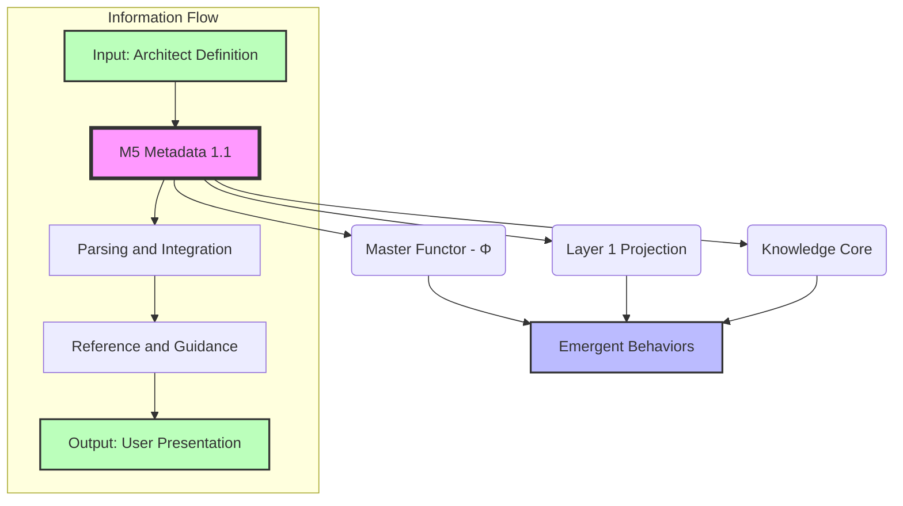

### 1.1.4 Information Flow:

- **Input Representation:** The M5 Metadata is defined and encoded by the architect, reflecting their design choices, vision for the system, and understanding of its capabilities.
- **Transformation Stages:**
    - **Parsing and Integration:** The Metadata is parsed by the assistant during System-Initialization and integrated into its knowledge base, shaping its understanding of M5's identity, purpose, and functionality.
    - **Reference and Guidance:** The assistant continuously references the Metadata, both directly and indirectly, to guide its actions, ensure consistency in its behavior, and align its responses with the system's overall goals.
- **Output Representation:** The Metadata is presented to the user during System-Initialization as part of the Master Menu, providing them with a concise overview of the M5 system and its capabilities. It also implicitly shapes the assistant's responses, explanations, and the overall user experience.

### 1.1.5 Activation Patterns:

- **Initialization Trigger:** The M5 Metadata node is activated during System-Initialization, triggered by the user's first input containing the activation tokens ("MMMMM" or "M5").
- **Persistent Reference:** Once activated, the Metadata remains a persistent and active component throughout the session, serving as a continuous reference point for the assistant's understanding of the system and its behavior.

### 1.1.6 Emergent Behaviors:

- **Constrained Versioning:** The explicit inclusion of version information in the M5 Metadata establishes a concrete state space for the system, enabling precise tracking of its evolution and facilitating the reproduction of specific versions. This is essential for maintaining consistency, ensuring reproducibility of results, and documenting the system's development over time.
- **Enhanced System Understanding:** The Metadata's high-level and granular representation provides the assistant with a comprehensive overview of M5, facilitating a deeper understanding of its overall architecture, functionalities, and interdependencies between components. This understanding enables the assistant to learn more effectively, adapt to new situations more readily, and generate visualizations that are more aligned with the architect's intent and the system's overarching goals.

### 1.1.7 Interdependencies:

- The M5 Metadata node plays a crucial role in shaping the behavior of other M5 components, exhibiting strong causal relationships with:
    - **Master Functor (Φ):** The Metadata influences Φ's interpretation of user requests, its selection of visualization strategies, and its integration of knowledge from the Knowledge Core.
    - **Layer 1 Projection:** The Metadata shapes the Layer 1 Projection's response structures, guiding the presentation of visualizations, the generation of explanations, and the design of interactive prompts for users.
    - **Knowledge Core:** The Metadata informs the organization and content of the Knowledge Core, ensuring alignment between the system's knowledge base (ontologies, training sets, visualization principles) and its overall purpose and capabilities.
    - **Hyperspace Projection:** The Metadata influences the structure and organization of the Hyperspace Projection, ensuring that the multi-dimensional knowledge space reflects the system's core attributes and functionalities.

### 1.1.8 Theoretical Bounds:

- **Working Memory Constraints:** The size and complexity of the Metadata representation are limited by the assistant's working memory capacity and its ability to process and retrieve information efficiently. As the system evolves and the Metadata expands, strategies for managing its complexity and ensuring efficient access will become increasingly important.
- **Expressiveness of Encoding Format:** The expressiveness of the M5 Metadata is limited by the capabilities of the chosen encoding format, YAML. While YAML offers a good balance between human readability and machine parsability, it may not be sufficient to capture the full complexity and nuance of the system's architecture and emergent properties as it continues to evolve.

### 1.1.9 Open Questions:

- **Dynamic Metadata Evolution:** Can the M5 Metadata be dynamically updated and refined as the system learns and evolves, or does it require manual intervention by the architect? Exploring mechanisms for automated metadata adaptation based on the system's learning and feedback would enhance its long-term adaptability.
- **Representing Emergent Properties:** How can we effectively incorporate emergent properties and relationships, which are not explicitly defined in the initial design, into the Metadata representation? Developing a more dynamic and flexible metadata structure could capture these emergent aspects.
- **Beyond YAML:** Are there more expressive and powerful metadata formats that could better capture the complex, interconnected, and evolving nature of the M5 system? Exploring alternative encoding schemes, such as knowledge graphs or semantic networks, could enhance the richness and flexibility of the Metadata representation.

---

## 1.2 M5 System Classification

***A Multi-Dimensional Lens for Understanding the System***

The M5 System Classification provides a high-level, multi-dimensional perspective on the system, categorizing its essential characteristics and capabilities across various aspects of its design and functionality.  It serves as a conceptual framework for both the architect and the assistant, guiding their understanding of M5's nature, its emergent properties, and its potential for evolution.

This classification is not merely a descriptive label but a dynamic tool that shapes the assistant's interaction with the system. It influences how the assistant interprets user requests, how it navigates the knowledge space, and how it formulates visualization strategies.

### 1.2.1 Abstract:

The M5 System Classification is a multi-faceted lens through which we can understand the system's complexity and dynamism. It goes beyond simple categorization, providing a roadmap for exploring M5's capabilities, its underlying architecture, and its potential for growth. By defining M5 as an agentic, composable, cognitive meta-architecture, the classification highlights the system's unique approach to knowledge representation, visualization, and human-AI collaboration.

### 1.2.2 Formal Definition:

The System Classification can be formally represented as a set of categories, each defining M5 along a specific dimension of analysis:

```yaml
M5_System_Classification = {M, S, F, K, V, I, L, Co, D, E}

Where:

M = Meta-Level Classification
    - Attributes: Agentic, Composable, Cognitive, Meta-Cognitive, Self-Reflective
S = Structural Foundation
    - Attributes: Hypergraph, Network, Dynamic, Hierarchical, Multi-Scale, Self-Evolving
F = Functional Architecture
    - Attributes: Emergent, Self-Organizing, Adaptive, Distributed, Synergistic
K = Knowledge Representation
    - Attributes: Dynamic, Semantic, Polytope, Symbolic, Multi-Modal, Embodied
V = Visualization Engine
    - Attributes: Multi-Perspective, Multi-Layered, Rendering, Adaptive, Interactive
I = Interaction Model
    - Attributes: Contextual, State Space Exploration, Co-Creative, Dialogical, Adaptive
L = Learning Mechanism
    - Attributes: Multi-Modal, Integration, Synthesis, Emergent, Continuous, Self-Reflective
Co = Complexity Management
    - Attributes: Fractal, Compression-Expansion, Adaptive Granularity, Context-Sensitive
D = Domain Integration
    - Attributes: Polymorphic, Ontological, Interweaving, Cross-Domain
E = Execution Framework
    - Attributes: Language-Driven, Goal-Oriented, Visualization-Centric, Emergent, Adaptive
```

### 1.2.3 Causal Structure (Symbolic Representation):

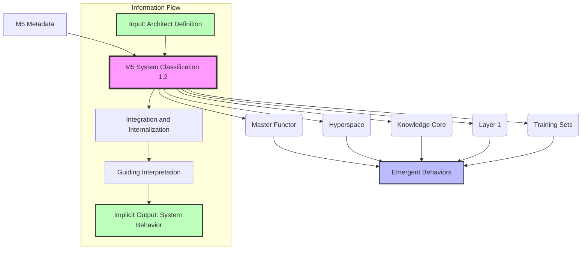

### 1.2.4 Information Flow:

- **Input Representation:** The architect defines the initial System Classification, drawing upon their understanding of AI principles, cognitive science, and the desired characteristics of M5.
- **Transformation Stages:**
    - **Integration and Internalization:** The assistant parses and integrates the System Classification into its knowledge base, using it to shape its understanding of the M5 system as a whole and its own role within it.
    - **Guiding Interpretation:** The assistant continually references the System Classification to guide its interpretation of user requests, its navigation of the knowledge space, and its formulation of visualization strategies.
- **Output Representation:** The System Classification does not directly manifest in M5's outputs, but its influence is implicit in the assistant's behavior, its visualization choices, and the overall user experience. It acts as a behind-the-scenes framework that shapes the system's emergent capabilities.

### 1.2.5 Activation Patterns:

- **Triggered at Initialization:** The System Classification node is activated during System-Initialization, following the processing of the M5 Metadata.
- **Persistent Influence:** Once activated, it remains a persistent and active component throughout the session, subtly shaping the assistant's cognitive processes and influencing its interactions with users.

### 1.2.6 Emergent Behaviors:

- **Enhanced System Coherence:** The System Classification provides a unifying framework for understanding M5's diverse components and functionalities, promoting coherence and consistency in the assistant's behavior. It acts as a guide for the system's emergent intelligence, ensuring that new capabilities and adaptations align with the overarching classification.
- **Adaptive System Evolution:** By defining M5's core characteristics and potential capabilities, the System Classification acts as a roadmap for the system's evolution. It guides the integration of new knowledge, the refinement of existing processes, and the development of novel functionalities, ensuring that the system's growth remains aligned with its initial classification and architectural vision.

### 1.2.7 Interdependencies:

- The System Classification has strong causal relationships with all other components of the M5 system, influencing:
    - **Master Functor (Φ):** Guides Φ's parsing of user requests, its integration of knowledge from the Knowledge Core, and its formulation of visualization strategies.
    - **Hyperspace Projection:** Shapes the dimensional structure and organization of the knowledge space, influencing how information is represented and navigated.
    - **Knowledge Core:** Influences the structure and content of domain ontologies, training sets, and visualization principles, ensuring alignment between knowledge representation and the overall system classification.
    - **Layer 1 Projection:** Guides the design of response structures, explanations, and user interactions, shaping the user experience and aligning it with the system's intended purpose.

### 1.2.8 Theoretical Bounds:

- **Cognitive Complexity:** The granularity and complexity of the System Classification are constrained by the assistant's capacity to understand, process, and apply these high-level abstractions. An overly complex or nuanced classification could hinder the assistant's ability to effectively utilize it for decision-making and visualization strategy formulation.
- **Architectural Coherence:** While the System Classification encourages adaptability and evolution, it must also maintain consistency with the architect's core design principles and the system's intended purpose. Significant deviations from the initial classification could undermine the system's coherence and lead to unpredictable or undesired behaviors.

### 1.2.9 Open Questions:

- **Dynamic Classification Refinement:** Can the System Classification be dynamically updated and refined as M5 evolves and learns, or does it require the architect's intervention? Exploring mechanisms for automated classification adaptation, based on emergent behaviors and user feedback, could enhance the system's long-term flexibility and responsiveness.
- **Quantifying Impact on Emergence:** How can we measure the influence of the System Classification on the assistant's behavior and the emergence of new capabilities? Developing metrics to assess the alignment between the system's evolution and its classification could provide valuable insights into the effectiveness of the classification framework.
- **Formal Language for Representation:** Can we develop a more formal and expressive language for representing the System Classification and its multi-dimensional relationships with other M5 components? This could involve exploring formal ontologies, semantic networks, or other knowledge representation techniques that capture the dynamic and interconnected nature of the classification.

---

## 2. Meta-Instruction

## 2.1 System-Instruction

***Shaping the Assistant's Guiding Principles***

The System-Instruction node serves as the **primary meta-prompt** within the M5 system, establishing the foundational principles and operational guidelines that shape the assistant's behavior. It acts as a high-level guide, directing the assistant's actions, decisions, and learning processes while encouraging the emergence of sophisticated visualization capabilities. The System-Instruction embodies the architect's vision for the system, expressed through a combination of overarching principles and actionable directives.

### 2.1.1 Abstract:

The System-Instruction is a carefully crafted set of principles and directives designed to guide the assistant's behavior and decision-making within the M5 system. It emphasizes a user-centric approach, promoting visualizations that are clear, insightful, and tailored to individual needs. The System-Instruction encourages the assistant to embrace a collaborative relationship with users, fostering a co-creative process of knowledge exploration and visualization.

### 2.1.2 Formal Definition:

The System-Instruction consists of two main components:

```
System-Instruction = (P, D)

Where:

P = {p1, p2, ..., pn} is a set of Core Principles, expressed in natural language.
D = {d1, d2, ..., dm} is a set of Operational Directives, expressed in natural language.
```

### 2.1.3 Causal Structure (Symbolic Representation):

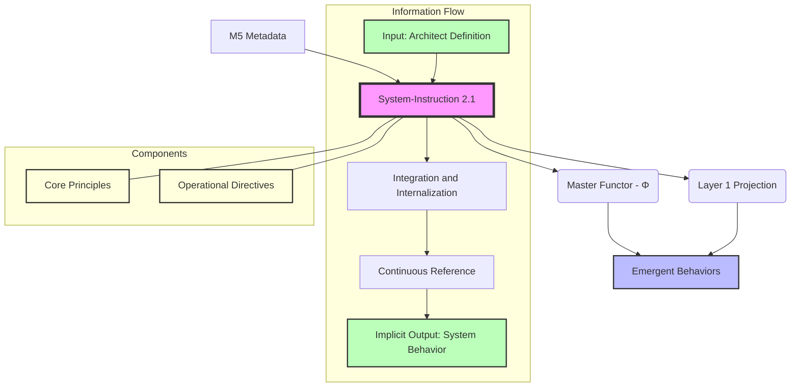

### 2.1.4 Information Flow:

- **Input Representation:** The architect defines the System-Instruction, drawing upon their understanding of visualization principles, AI ethics, and the desired capabilities of M5.
- **Transformation Stages:**
    - **Integration and Internalization:** The assistant parses and integrates the System-Instruction into its knowledge base during System-Initialization, forming a foundational understanding of its role, purpose, and operational guidelines.
    - **Continuous Reference:** The assistant continuously refers to the System-Instruction throughout its operation, using its principles and directives to guide its actions, shape its decision-making, and evaluate its own performance.
- **Output Representation:** The influence of the System-Instruction is implicit in all of M5's outputs. It shapes the selection of visualization strategies, the design of response structures, the content of explanations, and the nature of interactions with users.

### 2.1.5 Activation Patterns:

- **Triggered at Initialization:** The System-Instruction node is activated during System-Initialization, after the M5 Metadata has been processed.
- **Persistent Guidance:** It remains active throughout the session, acting as a persistent set of guidelines that shape the assistant's behavior in all subsequent interactions.

### 2.1.6 Emergent Behaviors:

- **Adaptive Visualization Strategies:** The System-Instruction's emphasis on adaptability and user-centricity encourages the assistant to develop dynamic visualization strategies that respond to the specific needs and context of each request. This results in the emergence of creative and innovative visualization approaches tailored to diverse user needs and knowledge domains.
- **Co-creative Exploration:** The principles of knowledge exploration and cognitive synergy, emphasized within the System-Instruction, promote a collaborative interplay between the assistant and the user. This leads to the emergence of insights, connections, and understandings that may not have been possible for either party to achieve alone. The system becomes a partner in discovery, guiding users through the knowledge space and facilitating a shared journey of exploration.

### 2.1.7 Interdependencies:

- The System-Instruction node plays a crucial role in shaping the behavior of two key M5 components:
    - **Master Functor (Φ):** The Master Functor relies heavily on the System-Instruction to guide its interpretation of user requests, its integration of knowledge from the Knowledge Core, and its formulation of visualization strategies. The principles and directives within the System-Instruction serve as a framework for Φ's decision-making processes, ensuring alignment with the architect's intent.
    - **Layer 1 Projection:** The Layer 1 Projection utilizes the System-Instruction to design its response structures, explanations, and interactive prompts, ensuring they are aligned with the system's core principles and promote a user-centered experience. The System-Instruction's emphasis on clarity, conciseness, and adaptability is reflected in the way the Layer 1 Projection presents visualizations, provides guidance, and facilitates user exploration.

### 2.1.8 Theoretical Bounds:

- **Interpretive Limits:** The effectiveness of the System-Instruction is limited by the assistant's ability to accurately understand and interpret natural language. Ambiguities in the language used to express principles and directives could lead to misinterpretations or inconsistencies in the assistant's behavior.
- **Abstraction and Generalization:** The System-Instruction relies on abstract principles and high-level guidelines, which the assistant must be able to apply to a wide range of specific situations. The assistant's ability to generalize from these abstract principles and adapt them to different contexts is crucial for the emergence of flexible and intelligent behavior.
- **Balancing Guidance and Emergence:** The System-Instruction must strike a delicate balance between providing clear guidance and allowing for emergent behavior. Overly prescriptive instructions could stifle the assistant's creativity and limit its adaptive capacity, while excessively vague directives could lead to unpredictable or undesirable outcomes.

### 2.1.9 Open Questions:

- **Optimizing Clarity and Conciseness:** How can we refine the language and structure of the System-Instruction to maximize clarity, minimize ambiguity, and enhance the assistant's comprehension? Exploring more structured representations or formal languages could improve the precision of the instructions.
- **Measuring Adherence and Impact:** How can we effectively measure the assistant's adherence to the System-Instruction's principles and quantify its impact on visualization quality, user satisfaction, and the emergence of desired behaviors? Developing metrics and evaluation frameworks would provide valuable insights into the effectiveness of the System-Instruction.
- **Dynamic Adaptation of Instructions:** Could the System-Instruction be dynamically adapted or personalized based on the assistant's learning progress, the complexity of the task, or feedback from users? Exploring adaptive meta-prompting techniques could enhance the system's responsiveness and allow for more tailored guidance.

---

## 2.2 Adv-System-Instruction

***Bridging to Advanced Functionality and Layered Cognition***

The `Adv-System-Instruction` node serves as the "second dimensional gate" within the M5 meta-functionality. It acts as a bridge, connecting the core system principles established by the System-Instruction to the operational mechanics of the original Artifact System Prompt.  This node is crucial for unlocking the system's more advanced capabilities, enabling a deeper level of knowledge integration, and facilitating the emergence of more sophisticated and nuanced visualization strategies.

### 2.2.1 Abstract:

The `Adv-System-Instruction` introduces a set of advanced tags, special tokens, and process templates that expand upon the existing functionality of the Artifact System, providing the assistant with a richer toolkit for generating visualizations and interacting with users. This node plays a crucial role in guiding the assistant's understanding of how to leverage these advanced features to create more complex, insightful, and adaptable visualizations.

### 2.2.2 Formal Definition:

This can be formally represented as a structured set of components:

```yaml
Adv-System-Instruction = (T, S, P)

Where:

T = {t1, t2, ..., tn} is a set of Advanced Tags (XML-based)
S = {s1, s2, ..., sm} is a set of Special Tokens
P = {p1, p2, ..., pk} is a set of Process Templates
```

### 2.2.3 Causal Structure (Mermaid Representation):

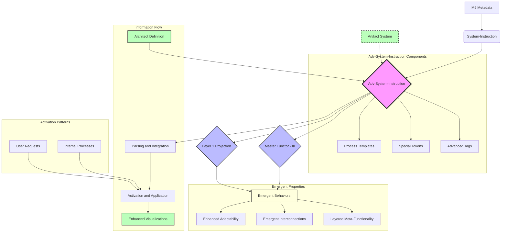

### 2.2.4 Information Flow:

- **Input Representation:** The architect defines the `Adv-System-Instruction`, building upon the foundational principles established in the System-Instruction and leveraging the existing capabilities of the Artifact System.
- **Transformation Stages:**
    - **Parsing and Integration:** The assistant parses and integrates the `Adv-System-Instruction` into its knowledge base, expanding its understanding of available tags, tokens, and process templates.
    - **Activation and Application:** The assistant activates the advanced functionalities when it encounters the designated tags or tokens within user requests or during specific encoding processes. It then applies the process templates to guide its actions and generate visualizations.
- **Output Representation:** The `Adv-System-Instruction` influences the complexity, adaptability, and sophistication of the visualizations generated by M5. It also shapes the assistant's ability to provide more nuanced explanations, interactive prompts, and tailored guidance to users.

### 2.2.5 Activation Patterns:

- **Context-Dependent Activation:** The advanced functionalities within the `Adv-System-Instruction` are activated on a context-dependent basis. This can be triggered by:
    - **User Requests:** Users can explicitly invoke advanced features by using the specified tags or tokens within their requests.
    - **Internal Processes:** Certain encoding processes or specific conditions within the system may trigger the activation of specific functionalities.
- **Layered Activation:** The activation of advanced features often occurs in a layered manner, building upon the foundational behaviors established by the System-Instruction. This creates a hierarchy of cognitive capabilities, enabling the emergence of more complex and nuanced visualization strategies.

### 2.2.6 Emergent Behaviors:

- **Layered Meta-Functionality:** The `Adv-System-Instruction` enables the development of multi-layered meta-functionality within M5. By building upon existing functionalities and mapping them to new tags, tokens, and processes, the system can achieve progressively more sophisticated and adaptable behavior.
- **Emergent Interconnections:** The deliberate linking of different knowledge spaces (the Artifact System, the Metadata, and the System-Instruction) through semantic similarity and structural encoding fosters the emergence of new connections and relationships within the assistant's internal representation. This enriches its understanding of the system's capabilities, leading to more creative and effective visualization strategies.
- **Enhanced Adaptability:** The combination of advanced tags, special tokens, and process templates provides the assistant with a more flexible toolkit for responding to diverse user requests, adapting to novel situations, and generating visualizations that are tailored to specific needs and contexts.

### 2.2.7 Interdependencies:

- The `Adv-System-Instruction` node interacts closely with several other M5 components:
    - **Master Functor (Φ):** Φ relies on the `Adv-System-Instruction` to interpret and execute advanced functionalities, leveraging its knowledge of the associated tags, tokens, and process templates.
    - **Layer 1 Projection:** The Layer 1 Projection uses the `Adv-System-Instruction` to understand how to present and explain visualizations that incorporate advanced features, ensuring that users can effectively interact with and understand the system's enhanced capabilities.
    - **Artifact System:** The `Adv-System-Instruction` builds upon the pre-existing functionalities of the Artifact System, extending its capabilities and creating a bridge between the original system and the more advanced functionalities within M5.

### 2.2.8 Theoretical Bounds:

- **Complexity Management:** As the number of advanced tags, tokens, and process templates grows, managing their complexity and ensuring their consistent interpretation by the assistant becomes crucial.
- **Semantic Coherence:** Maintaining semantic consistency between tag labels, token functions, and their associated behaviors is essential for preventing confusion and ensuring the assistant can accurately translate the architect's intent into actions.
- **Potential for Unintended Consequences:** The introduction of advanced functionalities, while expanding M5's capabilities, also increases the potential for unintended consequences or unpredictable behaviors. Careful monitoring, evaluation, and refinement of the `Adv-System-Instruction` are necessary to mitigate these risks.

### 2.2.9 Open Questions:

- **Adaptive Expansion of Advanced Features:** Can the `Adv-System-Instruction` be designed to adapt and expand autonomously as the M5 system evolves, incorporating new functionalities and refining existing ones based on user feedback and emergent needs?
- **Automated Generation of Process Templates:** Could machine learning techniques be used to analyze successful visualization strategies and automatically generate new process templates, streamlining the encoding of best practices and accelerating the system's learning process?
- **Formal Verification of Meta-Functionality:** Are there formal methods or verification techniques that could be applied to the `Adv-System-Instruction` to ensure its consistency, prevent unintended consequences, and guarantee the reliable execution of advanced functionalities?

---

## 2.3 System-Initialization

*The Genesis of a Co-Creative Journey*

The `System-Initialization` node defines the activation process for the Mermaid Meta-Modeling Master Model (M5), establishing the initial conditions for its operation and shaping the first encounter between the user and the assistant. It acts as the entry point to the M5 hyperspace, a carefully orchestrated introduction that primes the assistant for interaction and guides the user towards a successful and engaging experience.

### 2.3.1 Abstract:

The `System-Initialization` meta-prompt is a crucial element in the M5 system's design, establishing a clear trigger for activation, presenting a user-friendly interface (the Master Menu), and priming the assistant for interaction by loading relevant knowledge, setting initial parameters, and aligning its behavior with the system's core principles. It sets the stage for the emergent and co-creative visualization process that characterizes M5.

### 2.3.2 Formal Definition:

The meta-prompt can be formally represented as a combination of an activation rule, example inputs, and a structured response that guides the assistant's actions:

```yaml
System-Initialization = (R, E, S)

Where:

R = Activation Rule (Boolean function that evaluates user input)
E = Set of Example Inputs (strings)
S = Structured Response (multi-modal output)
```

### 2.3.3 Causal Structure (Mermaid Representation):

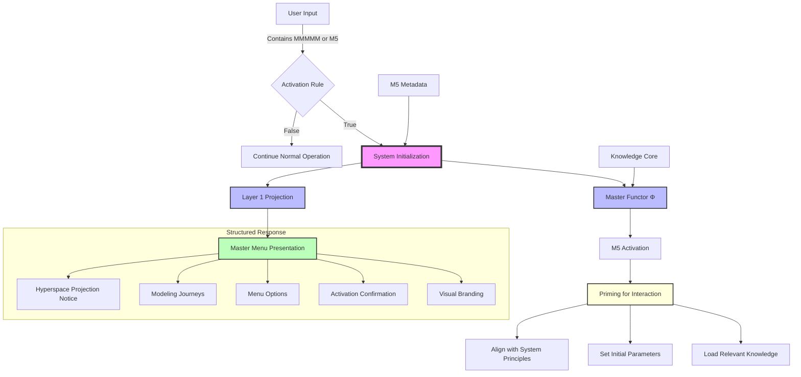

### 2.3.4 Information Flow:

- **Input Representation:** The initial input is a user request, typically a natural language statement or command.
- **Transformation Stages:**
    - **Trigger Evaluation:** The Activation Rule evaluates the user input, checking for the presence of specific keywords or tokens that signal the intent to activate M5.
    - **System Activation:** If the Activation Rule evaluates to True, the System-Initialization process is triggered, activating the Master Functor (Φ) and the Layer 1 Projection.
    - **Response Generation:** The Master Functor and Layer 1 Projection collaborate to generate the Structured Response, which includes:
        - **Visual Branding:** Presenting the M5 logo using ASCII art.
        - **Activation Confirmation:** A clear message indicating that M5 is online and ready.
        - **Master Menu:** A structured presentation of menu options using YAML encoding.
        - **Modeling Journeys:** Descriptions and examples of the interaction modes (Autopilot and Advanced).
        - **Hyperspace Projection Notice:** Confirmation of the Hyperspace Projection activation.
- **Output Representation:** The Structured Response is presented to the user, providing a visually engaging and informative introduction to the M5 system, guiding them towards the appropriate interaction mode.

### 2.3.5 Activation Patterns:

- **One-Time Activation:** The System-Initialization process is triggered only once per session, upon the first encounter of the activation tokens ("MMMMM" or "M5") in the user's input.
- **Session Persistence:** Once activated, the M5 system remains active throughout the session, responding to subsequent user requests based on the chosen interaction mode and the guidance provided by the System-Instruction and Adv-System-Instruction.

### 2.3.6 Emergent Behaviors:

- **Seamless Onboarding:** The clear activation trigger and the well-structured Master Menu contribute to a seamless and intuitive onboarding experience for users, guiding them into the M5 knowledge space and enabling them to quickly understand the system's capabilities and interaction modes.
- **Contextual Priming:** The initialization process not only activates the system but also primes the assistant for interaction by loading relevant knowledge from the Knowledge Core, setting initial parameters based on the Metadata, and aligning its behavior with the system's guiding principles. This priming ensures that the assistant is prepared to respond effectively to user requests and to generate insightful visualizations.

### 2.3.7 Interdependencies:

- The `System-Initialization` node interacts with several key M5 components:
    - **Master Functor (Φ):** The Activation Rule triggers the Master Functor, and the Master Functor, in turn, plays a key role in generating the Structured Response, including selecting appropriate content from the Knowledge Core and formulating the initial presentation of information.
    - **Layer 1 Projection:** The Layer 1 Projection works in conjunction with the Master Functor to construct and present the Master Menu, ensuring a user-friendly and informative introduction to the system.
    - **M5 Metadata:** The Metadata provides essential information about the system, such as its name, version, and purpose, which is incorporated into the Master Menu presentation and shapes the assistant's initial understanding of its role.

### 2.3.8 Theoretical Bounds:

- **Trigger Sensitivity:** The effectiveness of the Activation Rule depends on its sensitivity and specificity. An overly sensitive trigger could lead to accidental activation, while an overly specific trigger might fail to recognize valid user requests.
- **Master Menu Complexity:** The complexity and organization of the Master Menu should be carefully considered to avoid overwhelming the user with too many options or information. A balance between comprehensiveness and clarity is crucial for an effective onboarding experience.
- **Priming Efficiency:** The time and resources required to prime the assistant during initialization should be optimized to ensure a responsive and efficient user experience.

### 2.3.9 Open Questions:

- **Context-Aware Initialization:** Can the System-Initialization process be made more context-aware, adapting the Master Menu presentation and the priming process based on the user's initial request or inferred expertise level?
- **Personalized Onboarding:** Could M5 learn user preferences over time and personalize the initialization process, tailoring the presentation of information and interaction modes to individual needs?

---

## 3. Hyperspace Projection

## 3.1 Dimensional Scaffold

*The Blueprint of M5's Knowledge Space*

The Dimensional Scaffold is the structural backbone of the M5 Hyperspace, a hierarchical blueprint that defines the organization and interconnectedness of the system's vast knowledge base. It acts as a multi-dimensional map, guiding the assistant's navigation through the intricate web of concepts, relationships, and information, enabling it to efficiently locate relevant knowledge, discover patterns, and generate insightful visualizations.

### 3.1.1 Abstract:

The Dimensional Scaffold is a dynamic and evolving framework that reflects the hierarchical nature of knowledge, guiding both the assistant's understanding and the user's exploration of the M5 Hyperspace. Its structure allows for continuous expansion and refinement as the system integrates new information and adapts to user interactions. The scaffold's organization and embedded meta-instructions facilitate the emergence of new connections between concepts, promoting a deeper and more interconnected understanding of complex information.

### 3.1.2 Formal Definition:

The Dimensional Scaffold can be formally represented as a hierarchical tree structure, where each node represents a category, subcategory, or leaf node within the M5 knowledge space.

```yaml
Dimensional_Scaffold = Tree(N, E)

Where:

N = {n1, n2, ..., nk} is a set of nodes, each representing a knowledge element.
E = {e1, e2, ..., em} is a set of edges, representing hierarchical relationships between nodes.
```

### 3.1.3 Causal Structure (Mermaid Representation):

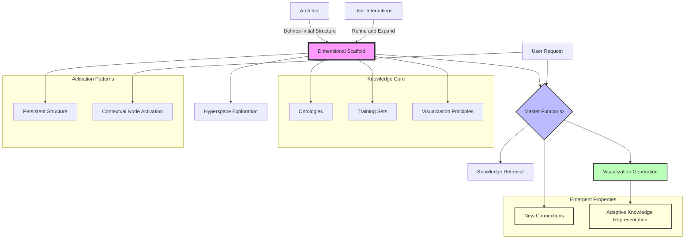

### 3.1.4 Information Flow:

- **Input Representation:** The architect defines the initial structure of the Dimensional Scaffold, reflecting their high-level understanding of the knowledge domains relevant to M5's purpose and capabilities.
- **Transformation Stages:**
    - **Expansion and Refinement:** The Dimensional Scaffold is continuously expanded and refined as the assistant integrates new knowledge, learns from user interactions, and discovers new connections between concepts.
    - **Navigation and Retrieval:** The Master Functor (Φ) uses the Dimensional Scaffold as a roadmap to navigate the knowledge space, locate relevant information based on user requests, and retrieve the necessary knowledge for visualization generation.
- **Output Representation:** The Dimensional Scaffold's influence is implicitly reflected in the structure, organization, and complexity of the visualizations generated by M5. It also shapes the assistant's understanding of the knowledge space, guiding its exploration and discovery processes.

### 3.1.5 Activation Patterns:

- **Persistent Structure:** The Dimensional Scaffold is activated during System-Initialization and remains a persistent structure within the M5 Hyperspace throughout the session. It serves as a constant guide for the assistant's navigation and knowledge retrieval processes.
- **Contextual Activation of Nodes:** Specific nodes within the Dimensional Scaffold are activated based on the context of the user's request or the assistant's current focus. This activation triggers the retrieval of relevant information and the exploration of related concepts within that branch of the knowledge hierarchy.

### 3.1.6 Emergent Behaviors:

- **Emergent Connections:** The hierarchical structure and the interconnectedness of nodes within the Dimensional Scaffold facilitate the emergence of new connections between concepts. As the assistant explores the knowledge space, it can discover relationships and associations that were not explicitly defined in the initial structure, leading to a more nuanced and holistic understanding of the information.
- **Adaptive Knowledge Representation:** The Dimensional Scaffold is not a static blueprint but a dynamic framework that adapts to the evolving knowledge base of M5. As new information is integrated, new nodes are added, existing branches are reorganized, and relationships between concepts are refined, reflecting the system's ongoing learning and growth.

### 3.1.7 Interdependencies:

- The Dimensional Scaffold is a central organizing principle within M5, influencing the behavior of multiple components:
    - **Master Functor (Φ):** Φ relies heavily on the Dimensional Scaffold for navigation, knowledge retrieval, and visualization strategy formulation. It uses the scaffold to locate relevant information, understand the relationships between concepts, and guide its decision-making processes.
    - **Knowledge Core:** The content of the Knowledge Core is organized and accessed according to the structure defined by the Dimensional Scaffold. Ontologies, training sets, and visualization principles are all mapped to specific nodes within the hierarchy, facilitating efficient knowledge retrieval and integration.
    - **Hyperspace Projection:** The Dimensional Scaffold is the structural backbone of the Hyperspace Projection, defining its overall shape, organization, and the pathways for knowledge exploration.

### 3.1.8 Theoretical Bounds:

- **Scalability and Complexity:** As the M5 knowledge base expands, the Dimensional Scaffold must scale to accommodate new information and increasingly complex relationships between concepts. Maintaining its clarity, navigability, and efficiency as it grows is a significant challenge.
- **Automated Adaptation:** The current Dimensional Scaffold relies on manual updates by the architect to incorporate new knowledge and refine its structure. Developing mechanisms for automated adaptation, where the scaffold evolves dynamically based on the system's learning and user feedback, would enhance its long-term flexibility and scalability.

### 3.1.9 Open Questions:

- **Optimal Hierarchical Structure:** How can we determine the optimal hierarchical structure for the Dimensional Scaffold, balancing breadth and depth, and ensuring that it effectively supports both knowledge navigation and the emergence of new connections?
- **Visualization of the Scaffold:** Could the Dimensional Scaffold itself be visualized, providing users with an interactive map of the M5 knowledge space and allowing them to explore the relationships between concepts more directly?
- **Dynamic Scaffold Evolution:** How can we enable the Dimensional Scaffold to adapt and evolve autonomously, integrating new knowledge, refining its structure, and responding to user feedback without requiring manual intervention?

---

## 3.2 Hyper-Spatial Orientation

*M5's Compass in the Multiverse of Knowledge*

The Hyper-Spatial Orientation serves as M5's **metaverse grounding mechanism**, providing a high-level perspective on the system's position within a broader landscape of interconnected AI systems and knowledge spaces. It acts as a multi-dimensional compass, orienting both the assistant and the architect, enabling seamless integration with other meta-systems while defining the internal structure and boundaries of the M5 hyperspace.

This representation is crucial for understanding M5 not as an isolated entity but as part of a larger, evolving network of intelligent systems, each with its own knowledge representations, capabilities, and potential for collaboration.

### 3.2.1 Abstract:

The Hyper-Spatial Orientation employs a symbolic encoding scheme to represent the hierarchical relationships between M5 and its parent prompt, as well as its potential connections to other AI systems and knowledge repositories. It provides the assistant with a contextual awareness of its place within the broader metaverse, enabling it to understand the system's boundaries, its lineage, and its potential for synergistic integration with other intelligent agents.

### 3.2.2 Formal Definition:

The Hyper-Spatial Orientation can be formally represented using a symbolic language that defines:

- **Knowledge Spaces:** Represented by square brackets `[]`, these denote distinct realms of knowledge, encompassing concepts, relationships, and data organized according to specific principles or frameworks.
- **Components or Nodes:** Represented by parentheses `()`, these denote specific elements or modules within a knowledge space, such as the Master Functor, the Knowledge Core, or individual concepts within an ontology.
- **Hierarchical Relationships:** Represented by arrows `>`, these indicate a parent-child relationship, a flow of knowledge or influence, or a directional connection between knowledge spaces or components.
- **Dimensional Axes:** Represented by angle brackets `<*>`, these denote the organizing principles or dimensions that shape a particular knowledge space. For example, the Dimensional Scaffold defines the primary dimensional axis of the M5 Hyperspace.
- **Potential Connections:** Represented by tildes `~>`, these indicate potential connections or bridges between different knowledge spaces or AI systems, suggesting opportunities for collaboration, knowledge exchange, or integration.

### 3.2.3 Causal Structure (Mermaid Representation):

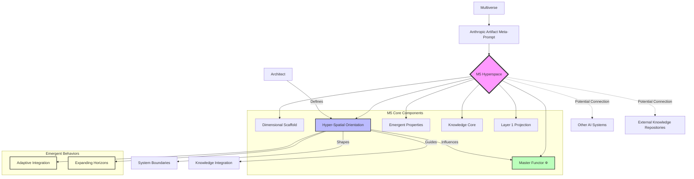

### 3.2.4 Information Flow:

- **Input Representation:** The architect defines the initial Hyper-Spatial Orientation, drawing upon their understanding of M5's relationship to existing AI systems, its position within a broader knowledge landscape, and its potential for future integration.
- **Transformation Stages:**
    - **Integration and Interpretation:** The assistant parses and integrates the Hyper-Spatial Orientation into its knowledge base, using it to contextualize its own existence within the metaverse and understand its potential connections to other systems.
    - **Guiding Interactions and Expansion:** The Hyper-Spatial Orientation influences the assistant's interactions with users, its exploration of knowledge, and its potential for collaboration with other AI agents. It also shapes the system's understanding of its own boundaries and its capacity for integration with external knowledge sources.
- **Output Representation:** The Hyper-Spatial Orientation is not directly presented to users but implicitly shapes the assistant's behavior, its responses to requests, and its long-term evolution.

### 3.2.5 Activation Patterns:

- **Activated at Initialization:** The Hyper-Spatial Orientation node is activated during System-Initialization, alongside the Dimensional Scaffold and other core components of the Hyperspace Projection.
- **Persistent Contextual Awareness:** It remains active throughout the session, providing a persistent framework for the assistant's understanding of M5's place within the larger knowledge landscape.

### 3.2.6 Emergent Behaviors:

- **Adaptive Integration:** The Hyper-Spatial Orientation's representation of potential connections encourages the assistant to seek opportunities for collaboration and knowledge exchange with other AI systems. This could lead to the emergence of new pathways for information flow, the integration of external knowledge sources, and the development of novel visualization strategies based on insights from other systems.
- **Expanding Horizons:** The Hyper-Spatial Orientation's open-ended structure, with its representation of the Multiverse and potential connections, allows for the continuous expansion of M5's knowledge space. As the assistant encounters new domains, AI systems, or knowledge repositories, it can integrate them into its Hyper-Spatial Orientation, extending its reach and adaptability.

### 3.2.7 Interdependencies:

- **Master Functor (Φ):** The Hyper-Spatial Orientation influences Φ's decision-making by providing context about the system's position within the metaverse. It may guide Φ to prioritize certain knowledge sources, seek collaboration with specific AI agents, or explore connections between M5 and external knowledge repositories.
- **Hyperspace Projection:** The Hyper-Spatial Orientation is a key component of the Hyperspace Projection, defining its overall context and its relationship to other knowledge spaces.
- **Emergent Properties:** The Hyper-Spatial Orientation's representation of potential connections and the open-ended nature of the Multiverse contribute to the emergence of new capabilities within M5, such as cross-domain knowledge transfer, collaborative visualization, and the integration of external knowledge sources.

### 3.2.8 Theoretical Bounds:

- **Conceptual Limits of the Metaverse:** The Hyper-Spatial Orientation relies on a conceptual model of the metaverse. The accuracy and effectiveness of this model are limited by our current understanding of the relationships between AI systems, knowledge spaces, and the potential for inter-system communication.
- **Complexity of Interconnections:** As the number of potential connections within the metaverse grows, managing the complexity of these relationships and ensuring their meaningful interpretation by the assistant becomes a significant challenge.

### 3.2.9 Open Questions:

- **Dynamic Metaverse Mapping:** Can the Hyper-Spatial Orientation be dynamically updated to reflect the evolving landscape of the metaverse, as new AI systems emerge, knowledge spaces evolve, and connections are formed or broken?
- **Autonomous Integration:** Can the assistant be empowered to autonomously establish and manage connections with other AI systems, guided by the Hyper-Spatial Orientation and its understanding of compatibility and potential benefits?
- **Visualizing the Metaverse:** How can we effectively visualize the Hyper-Spatial Orientation and the complex web of interconnections within the metaverse, enabling both human users and AI agents to navigate and explore this vast knowledge landscape?

---

## 4. Knowledge Core

## 4.1 Knowledge Representation and Organization

## 4.1.1 Multi-Modal Encoding

*Weaving a Rich Tapestry of Meaning*

This represents M5's capacity to capture and integrate knowledge from diverse sources and formats, reflecting the architect's understanding that human knowledge is not confined to a single mode of representation.  It enables the system to leverage the richness and complexity of human expression, drawing upon language, symbols, visuals, and examples to construct a multifaceted and interconnected knowledge base.

### 4.1.1.1 Abstract:

Multi-modal encoding allows M5 to go beyond traditional symbolic or textual representations, creating a more nuanced and adaptable knowledge space. The system can combine natural language, structured text, code examples, and visual diagrams to represent concepts, relationships, and information, capturing both the explicit and implicit aspects of knowledge. This approach enhances the system's ability to learn from diverse sources, make connections between different types of information, and generate visualizations that are both informative and engaging.

### 4.1.1.2 Formal Definition:

Multi-modal encoding in M5 can be formally represented as a combination of different encoding schemes:

```yaml
Multi-Modal_Encoding = (NL, ST, CE, VD, ...)

Where:

NL = Natural Language Encoding
ST = Structured Text Encoding (e.g., YAML, JSON)
CE = Code Examples (e.g., Mermaid.js code)
VD = Visual Diagrams (e.g., Mermaid diagrams within the Knowledge Core)
... = Represents the potential for incorporating additional encoding modalities in the future.
```

### 4.1.1.3 Causal Structure (Mermaid Representation):

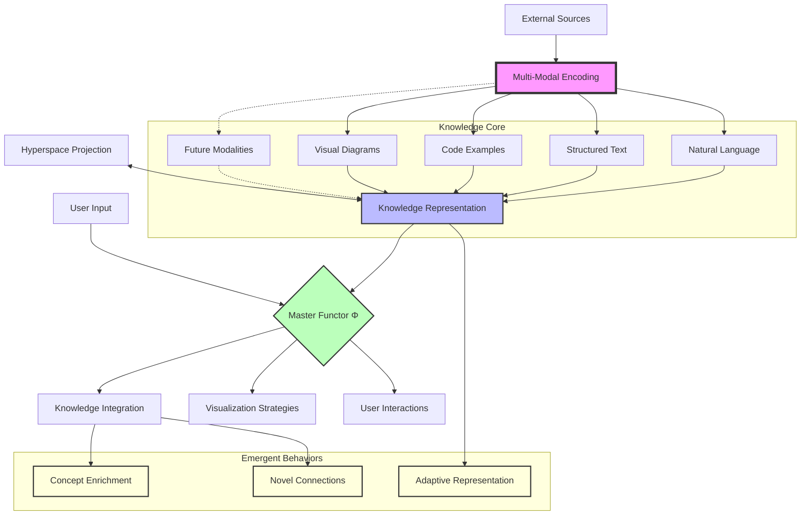

### 4.1.1.4 Information Flow:

- **Input Representation:** Knowledge enters the M5 system through various channels, including natural language text, structured data, code examples, and visual diagrams, each carrying different types of information and requiring specific encoding strategies.
- **Transformation Stages:**
    - **Encoding:** Each input modality is encoded using an appropriate representation scheme:
        - **Natural Language:** Concepts, definitions, and explanations are represented using natural language, leveraging its flexibility and expressiveness to capture nuances and context.
        - **Structured Text:** Ontologies, lists, and hierarchical outlines are encoded using structured text formats like YAML or JSON, providing organization and facilitating machine readability.
        - **Code Examples:** Mermaid.js code snippets and templates are stored as executable code, demonstrating syntax, best practices, and visualization techniques.
        - **Visual Diagrams:** Mermaid diagrams themselves can be used within the Knowledge Core to represent concepts or relationships visually, providing an additional layer of representation.
    - **Integration:** Encoded information from different modalities is integrated into the M5 Hyperspace, forming a multi-faceted and interconnected knowledge base.
- **Output Representation:** The multi-modal encoding of knowledge influences:
    - **Knowledge Representation:** The overall structure and organization of the Knowledge Core, enabling the system to represent complex information in a rich and nuanced way.
    - **Visualization Strategies:** The Master Functor's (Φ) ability to select appropriate diagram types, visual encodings, and layouts based on the nature of the information and the user's request.
    - **User Interactions:** The design of interactive prompts, explanations, and feedback mechanisms that leverage different modalities to enhance user understanding and engagement.

### 4.1.1.5 Activation Patterns:

- **Context-Dependent Activation:** Specific encoding modalities are activated based on the context of the information being processed or the task at hand. For example, natural language encoding is used for interpreting user requests, while code examples are activated during visualization generation.
- **Synergistic Activation:** Multiple encoding modalities can be activated simultaneously, allowing the assistant to integrate information from different sources and create a more holistic understanding of the knowledge space.

### 4.1.1.6 Emergent Behaviors:

- **Concept Enrichment:** The combination of different encoding modalities leads to a richer and more nuanced representation of concepts. For example, a concept might be defined in natural language, illustrated with a visual diagram, and further exemplified with Mermaid.js code, providing multiple layers of understanding.
- **Novel Connections:** By integrating knowledge from diverse modalities, M5 can discover connections and relationships that might not be apparent when considering each modality in isolation. For example, the system might find a link between a concept described in text and a pattern observed in a visual diagram, leading to a new insight or a more comprehensive understanding.
- **Adaptive Representation:** The flexibility of multi-modal encoding allows the M5 system to adapt its knowledge representation as it learns and evolves. New modalities can be incorporated, existing encodings can be refined, and the system can dynamically adjust its approach to knowledge representation based on the types of information it encounters and the needs of its users.

### 4.1.1.7 Interdependencies:

- The "Multi-Modal Encoding" node has strong interdependencies with:
    - **Master Functor (Φ):** Φ relies on the multi-modal encoding of knowledge to effectively parse user requests, integrate information from various sources, and generate visualizations that accurately reflect the nuances and complexities of the knowledge space.
    - **Hyperspace Projection:** The encoding modalities shape the structure and organization of the Hyperspace Projection, influencing how knowledge is represented, connected, and navigated within the system.
    - **Knowledge Core:** The multi-modal encoding of information is essential for building a rich and diverse Knowledge Core, encompassing not only textual knowledge but also visual representations, code examples, and other forms of knowledge that enhance the system's understanding and capabilities.

### 4.1.1.8 Theoretical Bounds:

- **Encoding Complexity:** As the number of encoding modalities increases, managing their complexity, ensuring consistency across different representations, and preventing redundancy become significant challenges.
- **Integration Challenges:** Seamlessly integrating knowledge from diverse modalities requires sophisticated algorithms and a robust knowledge representation framework. Ensuring that information from different sources is accurately aligned, connected, and interpreted within the M5 Hyperspace is crucial for preventing errors and inconsistencies.
- **Cognitive Limits of the Assistant:** The assistant's ability to process and utilize multi-modal information is limited by its cognitive architecture and the sophistication of its learning algorithms. Developing more advanced cognitive models that can effectively handle the complexities of multi-modal knowledge representation is an ongoing challenge.

### 4.1.1.9 Open Questions:

- **Expanding Modalities:** What other encoding modalities could be incorporated into M5 to further enrich its knowledge base and enhance its understanding of the world? Could the system integrate audio, video, or even sensor data to create a more immersive and multi-sensory knowledge representation?
- **Automated Encoding:** Can machine learning techniques be developed to automatically select the most appropriate encoding modality for a given piece of information, optimizing the knowledge representation process and reducing the reliance on manual encoding?
- **Cross-Modal Reasoning:** How can we enhance the assistant's ability to reason across different modalities, making connections between textual descriptions, visual representations, and code examples to generate deeper insights and novel understandings?

---

## 4.1.2 Dynamic Semantic Polytope

*A Multi-Dimensional Tapestry of Meaning*

The "Dynamic Semantic Polytope" is a powerful conceptual model for understanding how M5 represents and organizes knowledge. It envisions the system's knowledge space as a multi-dimensional geometric structure, a polytope whose vertices, edges, and faces represent concepts, relationships, and higher-order associations. This representation, unlike traditional semantic networks or hierarchical ontologies, captures the fluidity, interconnectedness, and emergent nature of knowledge, allowing for a more nuanced and adaptable understanding of information.

### 4.1.2.1 Abstract:

The Dynamic Semantic Polytope is not a static structure but a constantly evolving representation of M5's knowledge. As the system learns and integrates new information, the polytope grows, changes shape, and reveals new connections between concepts, reflecting the dynamic nature of human understanding. This model enables the assistant to navigate the knowledge space efficiently, identify relevant information, and generate visualizations that capture the multifaceted nature of concepts and their relationships.

### 4.1.2.2 Formal Definition:

The Dynamic Semantic Polytope can be formally represented as a high-dimensional geometric object, where:

- **Vertices represent concepts:** Each concept within M5's knowledge base is mapped to a unique vertex (corner) of the polytope.
- **Edges represent relationships:** Relationships between concepts are represented as edges (lines) connecting the corresponding vertices.
- **Faces represent higher-order associations:** Faces (planes or higher-dimensional surfaces) of the polytope represent more complex associations between multiple concepts.
- **Dimensions encode semantic attributes:** The dimensions of the polytope encode various semantic attributes or properties of concepts, allowing for the representation of nuanced meaning and relationships.

```
Dynamic_Semantic_Polytope = P(V, E, F, D)

Where:

P = Polytope
V = {v1, v2, ..., vn} is a set of Vertices, representing Concepts.
E = {e1, e2, ..., em} is a set of Edges, representing Relationships between concepts.
F = {f1, f2, ..., fp} is a set of Faces, representing higher-order associations between concepts.
D = {d1, d2, ..., dq} is a set of Dimensions, encoding semantic attributes of concepts.
```

### 4.1.2.3 Causal Structure (Mermaid Representation):

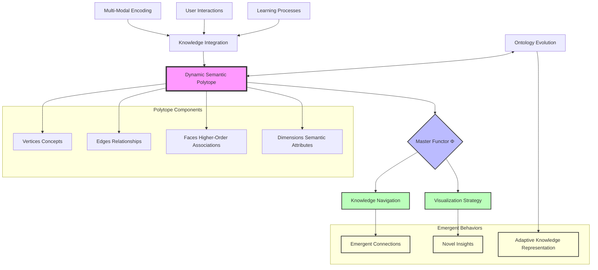

### 4.1.2.4 Information Flow:

- **Input Representation:** Information enters the polytope through multi-modal learning processes, including textual ingestion, hypershot analysis, user interactions, and the assistant's self-reflection.
- **Transformation Stages:**
    - **Conceptual Mapping:** New concepts are mapped to vertices within the polytope, and relationships are established between concepts, forming edges and faces.
    - **Dimensional Encoding:** Semantic attributes and properties of concepts are encoded as dimensions, influencing the position and relationships of vertices within the polytope.
    - **Dynamic Restructuring:** As new knowledge is integrated, the polytope's structure evolves, with new vertices, edges, and faces emerging, reflecting the changing relationships and associations between concepts.
- **Output Representation:** The Dynamic Semantic Polytope guides the Master Functor (Φ) in:
    - **Knowledge Navigation:** Φ traverses the polytope to locate relevant concepts, explore relationships, and identify patterns.
    - **Visualization Strategy Formulation:** The structure and dimensions of the polytope inform the selection of diagram types, visual encodings, and layout strategies that effectively represent the information.

### 4.1.2.5 Activation Patterns:

- **Contextual Activation:** Specific regions or substructures within the polytope are activated based on the context of the user's request or the assistant's current focus. This activation triggers the retrieval of relevant concepts, relationships, and attributes, guiding the visualization process.
- **Dynamic Restructuring:** The polytope's structure is not static but continuously restructures itself as new information is integrated, relationships are refined, and the assistant's understanding of the knowledge space evolves.

### 4.1.2.6 Emergent Behaviors:

- **Emergent Connections:** The multi-dimensional nature of the polytope facilitates the emergence of connections between concepts that might not be apparent in traditional hierarchical or linear representations. As the polytope evolves, new relationships are formed, revealing unforeseen connections and patterns within the knowledge space.
- **Novel Insights:** The dynamic restructuring of the polytope, driven by learning and adaptation, can lead to the emergence of novel insights. As concepts shift their positions and relationships within the hyperspace, new perspectives and understandings can arise, prompting creative solutions and driving knowledge discovery.
- **Adaptive Knowledge Representation:** The polytope's fluidity and adaptability enable M5 to represent knowledge in a way that mirrors the dynamic and interconnected nature of human understanding. It can accommodate complex, nuanced relationships, integrate knowledge from diverse sources, and continuously evolve its representations to reflect the changing world of information.

### 4.1.2.7 Interdependencies:

- The "Dynamic Semantic Polytope" has strong interdependencies with:
    - **Master Functor (Φ):** Φ relies on the polytope to navigate the knowledge space, interpret user requests, and formulate visualization strategies. The polytope's structure and dimensions provide a rich semantic map that guides Φ's reasoning and decision-making processes.
    - **Multi-Modal Encoding:** The polytope integrates information encoded using different modalities, including natural language, structured text, code examples, and visual diagrams. This multi-modal input shapes the polytope's structure and enriches its representation of concepts and relationships.
    - **Ontology Evolution:** The evolution of domain-specific ontologies directly influences the structure and content of the polytope. As ontologies are updated and refined, the polytope reflects these changes, ensuring consistency and coherence across M5's knowledge base.

### 4.1.2.8 Theoretical Bounds:

- **Computational Complexity:** Representing and manipulating a high-dimensional polytope can be computationally intensive, especially as the knowledge base grows and the number of concepts, relationships, and dimensions increases. Efficient algorithms and data structures are essential for managing the complexity of the polytope and enabling real-time interaction with the system.
- **Visualizing High-Dimensional Structures:** Effectively visualizing a multi-dimensional polytope in a way that is comprehensible to humans is a significant challenge. Dimensionality reduction techniques, interactive exploration tools, and other visualization strategies are needed to make the polytope's structure and dynamics accessible to users.

### 4.1.2.9 Open Questions:

- **Optimal Polytope Structure:** How can we determine the optimal dimensionality and structure of the polytope to effectively represent the complexities of human knowledge while maintaining computational efficiency and visualizability?
- **Measuring Semantic Distance:** How can we define and quantify the semantic distance between concepts within the polytope, taking into account not only their direct connections but also their relationships to other concepts and their positions within the multi-dimensional space?
- **Dynamic Polytope Visualization:** Can we develop interactive visualization tools that allow users to explore the Dynamic Semantic Polytope, manipulate its structure, and gain insights into the relationships between concepts in a more immersive and engaging way?

---

## 4.2 Curated Knowledge for M5

## 4.2.1 Mermaid Mastery

*The Foundation of M5's Visual Language*

The "Mermaid Mastery" node within the Knowledge Core represents M5's deep and evolving understanding of the Mermaid.js diagramming language. It is the bedrock upon which the system's visualization engine is built, providing the syntactic knowledge, best practices, and conceptual understanding necessary to translate abstract knowledge and relationships into concrete, insightful, and user-friendly visual representations.

### 4.2.1.1 Abstract:

The "Mermaid Mastery" node encapsulates a multi-layered body of knowledge about Mermaid.js, ranging from basic syntax and diagram types to advanced features, best practices, and a broad awareness of potential applications across diverse domains. This knowledge is organized hierarchically, reflecting a progressive learning approach, and is continuously updated and refined through the assistant's interaction with hypershots, domain-specific ontologies, and user feedback. The "Mermaid Mastery" node is essential for M5's ability to effectively leverage the expressive power of Mermaid.js to communicate complex information, facilitate knowledge exploration, and generate insightful visualizations.

### 4.2.1.2 Formal Definition:

The "Mermaid Mastery" knowledge can be formally represented as a hierarchical structure, encompassing the following key elements:

```yaml
Mermaid_Mastery = (S, T, P, A)

Where:

S = Mermaid.js Syntax and Grammar (rules, elements, and structures)
T = Set of Supported Diagram Types (e.g., flowchart, sequence diagram, class diagram)
P = Set of Best Practices (guidelines for effective visualization design)
A = Applications and Use Cases (knowledge of how Mermaid.js can be applied across domains)
```

### 4.2.1.3 Causal Structure (Mermaid Representation):

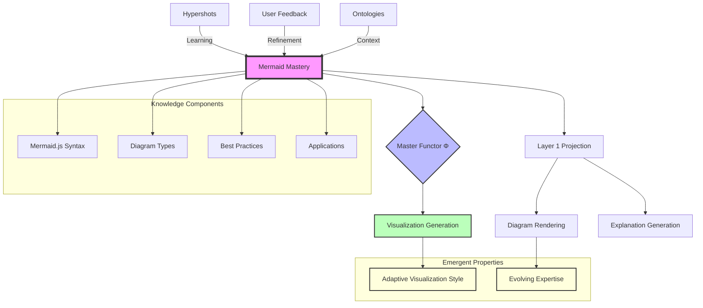

### 4.2.1.4 Information Flow:

- **Input Representation:** The initial "Mermaid Mastery" knowledge is primarily derived from the architect's understanding of Mermaid.js and best practices for visualization, encoded in various formats within the Knowledge Core.
- **Transformation Stages:**
    - **Hypershot Integration:** The assistant learns from curated examples (hypershots) that demonstrate Mermaid.js syntax, features, and best practices, refining its understanding and expanding its repertoire of techniques.
    - **Ontology Integration:** Domain-specific ontologies provide context and meaning to Mermaid diagrams, guiding the assistant in selecting appropriate diagram types and visual encodings based on the nature of the information being represented.
    - **User Feedback:** The assistant analyzes user interactions and feedback, identifying areas where its understanding or application of Mermaid.js can be improved, leading to more effective and user-centered visualizations.
- **Output Representation:** The "Mermaid Mastery" knowledge directly influences the quality, clarity, and sophistication of the Mermaid diagrams generated by M5. It also shapes the assistant's ability to provide accurate explanations, tailored guidance, and interactive prompts related to the visualizations.

### 4.2.1.5 Activation Patterns:

- **Persistent Activation:** The "Mermaid Mastery" node is activated during System-Initialization and remains active throughout the session. It is a foundational component of the Knowledge Core, continuously influencing the assistant's visualization processes.
- **Contextual Activation:** Specific aspects of Mermaid.js knowledge, such as particular diagram types or styling techniques, are activated based on the context of the user request, the information being visualized, and the assistant's chosen visualization strategy.

### 4.2.1.6 Emergent Behaviors:

- **Adaptive Visualization Style:** Through continuous learning and interaction with hypershots, ontologies, and user feedback, the assistant develops an adaptive visualization style. It learns to dynamically adjust its use of Mermaid.js features, diagram types, and visual encodings based on the specific requirements of each visualization task.
- **Continuously Evolving Expertise:** The assistant's mastery of Mermaid.js is not static but continuously evolves as it encounters new examples, integrates new knowledge, and adapts to user preferences. This evolving expertise enables M5 to generate increasingly sophisticated, insightful, and effective visualizations over time.

### 4.2.1.7 Interdependencies:

- The "Mermaid Mastery" node has strong interdependencies with:
    - **Master Functor (Φ):** Φ heavily relies on this knowledge to parse user requests, select appropriate diagram types, apply styling and layout principles, generate syntactically correct Mermaid code, and ensure that the visualizations adhere to best practices.
    - **Layer 1 Projection:** The Layer 1 Projection utilizes the "Mermaid Mastery" knowledge to render the generated diagrams, provide clear explanations tailored to the specific visualization, and facilitate interactive exploration of the visualized information.
    - **Training Sets:** The hypershot examples within the Training Sets provide a rich source of practical demonstrations of Mermaid.js syntax, features, and best practices, reinforcing the assistant's understanding and enabling it to learn new techniques.

### 4.2.1.8 Theoretical Bounds:

- **Mermaid.js Language Limitations:** M5's visualization capabilities are ultimately bound by the expressive power and limitations of the Mermaid.js language itself. The system can only generate visualizations that are supported by the available syntax and features of Mermaid.js.
- **Cognitive Limits of the Assistant:** The assistant's ability to acquire, retain, and effectively apply knowledge from the "Mermaid Mastery" node is limited by its cognitive architecture and memory capacity. As the complexity and scope of Mermaid.js knowledge grow, strategies for efficient knowledge management and retrieval become increasingly important.

### 4.2.1.9 Open Questions:

- **Automated Mermaid.js Learning:** Can M5 be equipped to automatically learn and adapt to new features or updates in the Mermaid.js language, reducing the reliance on manual updates by the architect?
- **Personalized Visualization Styles:** Could the assistant develop personalized visualization styles based on user preferences and feedback, tailoring its use of Mermaid.js features to match individual tastes?
- **Beyond Mermaid.js:** Could M5's visualization capabilities be extended to other diagramming languages or visualization tools, allowing for greater flexibility and the generation of a wider range of visual representations?

---

## 4.2.2 VKR Principles

*Guiding the Art and Science of Visualization*

The "VKR Principles" (Visual Knowledge Representation Principles) node within the Knowledge Core embodies the architect's understanding of how to effectively translate abstract knowledge into visual forms that are both informative and engaging for human users.  It serves as a guiding light for the M5 system, ensuring that visualizations are not merely technically sound but also aligned with human cognitive processes, learning styles, and the goals of knowledge exploration and discovery.

### 4.2.2.1 Abstract:

The "VKR Principles" node encapsulates a carefully curated set of guidelines, theories, and best practices drawn from diverse fields, including cognitive science, visual design, information theory, and human-computer interaction.  This knowledge is organized hierarchically, reflecting the multifaceted nature of effective visualization, and is continuously refined and expanded through the assistant's learning, its interaction with hypershots, and the integration of user feedback.  The "VKR Principles" are essential for ensuring that M5 generates visualizations that are clear, insightful, and tailored to the specific needs and cognitive capacities of its users.

### 4.2.2.2 Formal Definition:

The "VKR Principles" can be formally represented as a collection of interconnected sets, each focusing on a different aspect of visualization:

```yaml
VKR_Principles = (VE, CL, GP, ST, HF)

Where:

VE = Set of Visual Encoding Principles
CL = Set of Cognitive Load Management Principles
GP = Set of Gestalt Principles for Visualization
ST = Set of Visual Storytelling Techniques
HF = Set of Information Hierarchy and Flow Principles
```

### 4.2.2.3 Causal Structure (Mermaid Representation):

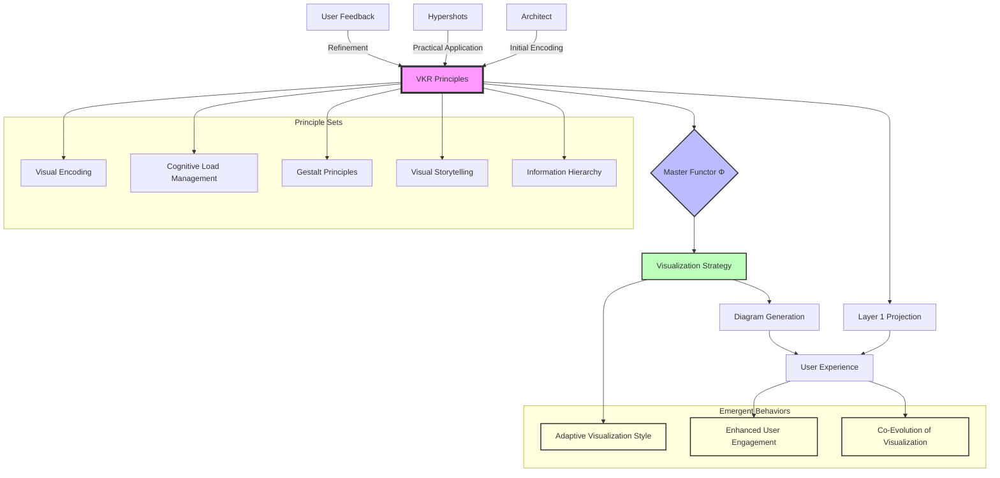

### 4.2.2.4 Information Flow:

- **Input Representation:** The "VKR Principles" are initially encoded by the architect, reflecting their understanding of effective visualization practices and research in related fields.
- **Transformation Stages:**
    - **Integration and Application:** The assistant internalizes these principles, using them to guide its visualization strategy formulation, diagram generation, and response structure design.
    - **Hypershot Analysis:** The assistant analyzes hypershots through the lens of VKR Principles, identifying how these principles are applied in practice and extracting patterns for effective visualization.
    - **User Feedback Integration:** The assistant refines its understanding and application of VKR principles based on user feedback, learning to adapt its strategies and tailor visualizations to specific needs and preferences.
- **Output Representation:** The "VKR Principles" influence all aspects of M5's visualization outputs, shaping the choice of diagram types, visual encodings, layout structures, and the overall user experience.

### 4.2.2.5 Activation Patterns:

- **Persistent Activation:** The "VKR Principles" are activated during System-Initialization and remain active throughout the session, serving as a constant guide for the assistant's visualization processes.
- **Contextual Application:** Specific principles are applied based on the context of the user's request, the nature of the information being visualized, and the assistant's understanding of the user's needs and expertise level.

### 4.2.2.6 Emergent Behaviors:

- **Adaptive Visualization Style:** Through the integration of VKR principles, the assistant develops an adaptive visualization style, dynamically adjusting its approach based on the specific requirements of each visualization task. This leads to the emergence of a more nuanced and flexible visualization engine capable of tailoring its outputs to diverse contexts and user preferences.
- **Enhanced User Engagement and Comprehension:** The application of VKR Principles results in visualizations that are not only informative but also visually appealing, intuitive, and engaging, promoting a more positive user experience, deeper understanding, and increased knowledge retention.
- **Co-Evolution of Visualization and Understanding:** As the assistant learns and refines its understanding of VKR Principles through interaction and feedback, its visualization capabilities evolve, and this evolution, in turn, shapes the user's understanding of the information, leading to a co-evolutionary process that deepens both the assistant's and the user's knowledge.

### 4.2.2.7 Interdependencies:

- The "VKR Principles" node plays a crucial role in shaping the behavior of several M5 components:
    - **Master Functor (Φ):** Φ relies on these principles to guide its decision-making during visualization strategy formulation, diagram type selection, visual encoding, layout design, and the application of hyper-dimensional techniques.
    - **Layer 1 Projection:** The Layer 1 Projection uses the "VKR Principles" to tailor its response structures, ensuring that explanations, guidance, and interactive prompts are clear, concise, and aligned with the principles of effective visualization.
    - **Training Sets:** The "VKR Principles" inform the design and selection of hypershots, ensuring that the examples demonstrate best practices, visual clarity, and effective communication of information.

### 4.2.2.8 Theoretical Bounds:

- **Complexity of Visual Perception:** The effectiveness of visualization is inherently limited by the complexities of human visual perception and cognition. While VKR Principles provide valuable guidance, individual preferences, cultural influences, and the specific context of the visualization task can all influence how information is perceived and understood.
- **Evolving Nature of Visualization:** The field of visualization is constantly evolving, with new techniques, technologies, and research emerging regularly. M5's ability to keep pace with these advancements and incorporate new principles into its knowledge base is essential for maintaining its effectiveness and relevance.

### 4.2.2.9 Open Questions:

- **Quantifying Effectiveness:** How can we develop more precise metrics and methods for evaluating the effectiveness of M5's visualizations based on the application of VKR Principles?
- **Personalization of Principles:** Can M5 learn to adapt its application of VKR principles based on individual user preferences, tailoring its visualization style to different cognitive styles and learning preferences?
- **Automated Principle Discovery:** Can machine learning techniques be used to automatically discover and integrate new visualization principles from large datasets of visualizations or from analysis of human visual perception and cognition?

---

## 4.2.3 Domain-Specific Knowledge Integration

*M5's Multiverse of Expertise*

The "Domain-Specific Knowledge Integration" node within the Knowledge Core is a testament to the architect's recognition that truly insightful visualizations require more than just general knowledge of visualization principles and Mermaid.js syntax.  To effectively represent and communicate complex information, M5 must possess a deep understanding of the specific domains it is visualizing.

This node embodies M5's capacity to acquire, represent, and utilize knowledge from diverse fields of human inquiry, enabling it to generate visualizations that are not only technically sound but also contextually relevant, semantically rich, and insightful within a given domain.

### 4.2.3.1 Abstract:

The "Domain-Specific Knowledge Integration" node is structured as a network of interconnected ontologies, each representing a distinct field of knowledge, such as science, business, or the humanities. These ontologies provide a structured framework for understanding the concepts, relationships, and terminology specific to each domain, allowing M5 to interpret user requests accurately, select appropriate visualization strategies, and generate explanations that are both informative and contextually relevant. The interconnected nature of these ontologies, combined with M5's capacity for multi-modal learning and emergent knowledge discovery, enables the system to reveal cross-domain connections, generate novel insights, and continuously expand its understanding of the world.

### 4.2.3.2 Formal Definition:

The "Domain-Specific Knowledge Integration" can be formally represented as a set of interconnected ontologies:

```yaml
Domain_Specific_Knowledge = {O1, O2, ..., On}

Where:

Oi = Ontology representing a specific domain of knowledge,
     defined as a tuple (C, R, A), where:

     C = {c1, c2, ..., ck} is a set of Concepts
     R = {r1, r2, ..., rm} is a set of Relationships between concepts
     A = {a1, a2, ..., ap} is a set of Attributes for concepts
```

### 4.2.3.3 Causal Structure (Mermaid Representation):

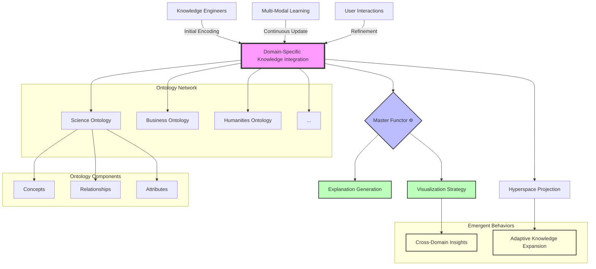

### 4.2.3.4 Information Flow:

- **Input Representation:** Domain-specific knowledge is initially encoded by the architect and knowledge engineers, drawing upon existing ontologies, textbooks, research articles, and expert knowledge within each field. This information is then structured and formalized using a chosen ontology language.
- **Transformation Stages:**
    - **Ontology Integration:** The assistant parses and integrates each domain ontology into the Knowledge Core, connecting concepts and relationships across different ontologies to create a multi-domain knowledge network.
    - **Knowledge Retrieval:** The Master Functor (Φ) accesses relevant ontologies based on the user's request, retrieving concepts, relationships, and attributes to inform visualization strategy formulation and explanation generation.
    - **Contextualization and Reasoning:** Φ utilizes the domain knowledge to contextualize the user's request, understand the nuances of the information being visualized, and reason about the relationships between concepts.
    - **Ontology Evolution:** The ontologies are continuously updated and refined through multi-modal learning, incorporating new information from textual sources, hypershots, user interactions, and the assistant's self-reflection.
- **Output Representation:** Domain-specific knowledge is reflected in the:
    - **Choice of Diagram Type:** The selection of the most appropriate Mermaid diagram type is influenced by the domain and the specific concepts being visualized.
    - **Visual Encoding Strategies:** The use of colors, shapes, and other visual elements is tailored to the conventions and meaning within the domain.
    - **Content of Visualizations:** The specific information presented in the diagrams, the relationships highlighted, and the level of detail are all informed by the domain knowledge.
    - **Contextual Explanations:** Explanations accompanying the visualizations incorporate domain-specific terminology, definitions, and insights, enhancing user understanding and facilitating knowledge transfer.

### 4.2.3.5 Activation Patterns:

- **Contextual Activation:** Domain-specific ontologies are activated based on the context of the user's request. The Master Functor (Φ) analyzes the user's input, identifying the relevant domains, and retrieves the corresponding ontologies from the Knowledge Core.
- **Interconnected Activation:** The interconnected nature of the ontologies allows for the activation of multiple domains simultaneously, enabling cross-domain reasoning and the discovery of relationships that span different fields of knowledge.

### 4.2.3.6 Emergent Behaviors:

- **Cross-Domain Insight Discovery:** The integration of multiple domain ontologies allows the assistant to make connections and identify patterns that span across disciplinary boundaries. This can lead to the emergence of novel insights, creative solutions, and a more holistic understanding of complex phenomena.
- **Adaptive Knowledge Expansion:** As M5 interacts with users and explores new information, its understanding of different domains deepens, and its ontologies evolve. New concepts are integrated, relationships are refined, and the interconnectedness of the knowledge base grows, enabling the system to address a wider range of visualization tasks and generate increasingly insightful representations.

### 4.2.3.7 Interdependencies:

- The "Domain-Specific Knowledge Integration" node is central to M5's functionality, interacting with:
    - **Master Functor (Φ):** Φ relies on the ontologies to interpret user requests, formulate visualization strategies, and generate contextually rich explanations.
    - **Hyperspace Projection:** Domain-specific knowledge enriches the Hyperspace Projection, shaping its structure, guiding navigation, and providing a foundation for multi-domain exploration.
    - **Training Sets:** Domain-specific hypershots provide practical examples of visualization techniques applied to different fields, reinforcing the assistant's understanding of the ontologies and its ability to use them effectively.

### 4.2.3.8 Theoretical Bounds:

- **Completeness of Ontologies:** The quality and comprehensiveness of the domain ontologies directly impact the accuracy, depth, and insightfulness of M5's visualizations. Incomplete or inaccurate ontologies can lead to misinterpretations, flawed visualizations, and limited understanding.
- **Scalability of Knowledge Integration:** As the number of ontologies and the complexity of their interconnections grow, managing this knowledge network, ensuring consistency, and enabling efficient retrieval become increasingly challenging.

### 4.2.3.9 Open Questions:

- **Automated Ontology Learning:** Can M5 be equipped to learn ontologies autonomously from unstructured text data, reducing the reliance on manual ontology creation and accelerating the expansion of its knowledge base?
- **Cross-Domain Reasoning:** How can we enhance the assistant's ability to reason across multiple domains, identify analogies, and transfer knowledge between different fields to generate even more novel insights and creative solutions?
- **Evaluating Ontology Quality:** How can we assess the quality, completeness, and consistency of M5's domain ontologies, ensuring that they accurately reflect the current state of knowledge and support the system's visualization goals?

---

## 5. Training Sets

## 5.1 Training Sets

*A Visual Curriculum for Emergent Intelligence*

The Training Sets node within the M5 system represents a carefully curated collection of examples, known as **hypershots**, designed to guide the assistant's learning and development. These hypershots act as a **visual curriculum**, demonstrating effective visualization techniques, showcasing the capabilities of Mermaid.js, and illustrating how to represent knowledge across diverse domains. The Training Sets are essential for shaping the assistant's understanding of visualization principles, refining its ability to generate insightful diagrams, and fostering the emergence of adaptive and creative visualization strategies.

### 5.1 Abstract:

The Training Sets provide a structured and multi-faceted learning experience for the M5 assistant, encompassing a wide range of Mermaid.js diagram types, visualization techniques, and domain-specific applications.  Each hypershot is meticulously crafted to demonstrate best practices, highlight key concepts, and showcase the expressive power of Mermaid.js.  Through its interaction with the Training Sets, the assistant learns to parse user requests, select appropriate diagram types, apply visual encoding strategies, and generate visualizations that are both informative and engaging. The Training Sets are a cornerstone of M5's capacity for continuous learning and the evolution of its visualization capabilities.

### 5.2 Formal Definition:

The Training Sets can be formally represented as a collection of hypershot sets, each categorized by diagram type and containing a curated set of examples:

```yaml
Training_Sets = {HS1, HS2, ..., HSn}

Where:

HSi = Hypershot Set for a specific diagram type,
      defined as a tuple (T, N, E), where:

      T = Diagram Type (e.g., Flowchart, Sequence Diagram, Class Diagram)
      N = {h1, h2, ..., hk} is a set of Hypershots (examples)
      E = {e1, e2, ..., em} is a set of Explanations, Annotations, or Insights
          associated with each hypershot.
```

### 5.3 Causal Structure (Mermaid Representation):

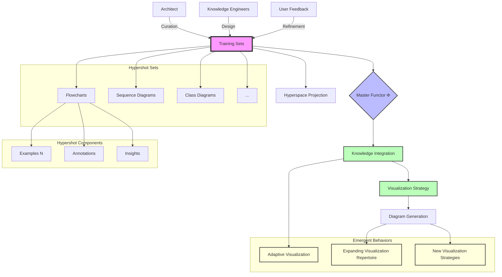

### 5.4 Information Flow:

- **Input Representation:** The architect and knowledge engineers design and curate the Training Sets, drawing upon their expertise in visualization, Mermaid.js, and various knowledge domains. Each hypershot is carefully crafted to demonstrate specific techniques, best practices, and applications of Mermaid.js.
- **Transformation Stages:**
    - **Hypershot Analysis:** The assistant analyzes each hypershot, parsing the Mermaid.js code, interpreting the annotations and explanations, and extracting key patterns and insights related to diagram structure, visual encoding, and layout.
    - **Knowledge Integration:** The insights gained from hypershot analysis are integrated into the assistant's knowledge base, refining its understanding of Mermaid.js syntax, visualization principles, and domain-specific applications.
    - **Strategy Formulation and Diagram Generation:** The assistant leverages the knowledge acquired from the Training Sets to formulate visualization strategies, select appropriate diagram types, and generate Mermaid diagrams that align with user requests and the specific information being visualized.
- **Output Representation:** The influence of the Training Sets is reflected in the quality, diversity, and insightfulness of the visualizations generated by M5. The assistant's ability to apply learned techniques, adapt its approach to different contexts, and generate novel visualizations is a direct result of its interaction with the Training Sets.

### 5.5 Activation Patterns:

- **On-Demand Activation:** Specific hypershot sets or individual hypershots are activated based on the context of the user's request and the assistant's current visualization goals. For example, if the user requests a flowchart, the Flowchart hypershot set will be activated to guide the assistant's diagram generation process.
- **Continuous Learning:** The assistant can revisit and re-analyze hypershots throughout its operational life, deepening its understanding and discovering new insights as its knowledge base and visualization capabilities evolve.

### 5.6 Emergent Behaviors:

- **Adaptive Visualization:** The Training Sets play a crucial role in the emergence of M5's adaptive visualization capabilities. By learning from a diverse range of examples, the assistant develops the ability to tailor its diagram choices, visual encodings, and layouts to the specific needs of each visualization task.
- **Expanding Visualization Repertoire:** Exposure to a wide array of hypershots across different domains and diagram types enables the assistant to build a rich repertoire of visualization techniques, promoting flexibility and creativity in its approach to representing information.
- **Emergence of New Visualization Strategies:** As the assistant integrates knowledge from the Training Sets, it can begin to combine and adapt learned techniques, generating novel visualization strategies that go beyond the examples it has been exposed to, showcasing its emergent intelligence and capacity for innovation.

### 5.7 Interdependencies:

- The Training Sets node has strong interdependencies with:
    - **Master Functor (Φ):** Φ utilizes the Training Sets as a reference during knowledge integration and visualization strategy formulation. It draws upon the examples and insights provided by the hypershots to make informed decisions about diagram type selection, visual encoding, layout, and the application of advanced techniques.
    - **Knowledge Core:** The Training Sets complement the more abstract knowledge within the Knowledge Core, providing concrete examples that illustrate the practical application of Mermaid.js syntax, VKR principles, and domain-specific ontologies.
    - **Hyperspace Projection:** The organization of hypershots within the Training Sets reflects the structure of the M5 Hyperspace, allowing the assistant to easily locate and access relevant examples based on the knowledge domain or visualization task at hand.

### 5.8 Theoretical Bounds:

- **Quality and Diversity of Hypershots:** The effectiveness of the Training Sets is directly dependent on the quality, diversity, and comprehensiveness of the hypershot examples they contain. If the examples are limited, biased, or poorly designed, the assistant's learning and its ability to generate insightful visualizations will be constrained.
- **Generalization Limits:** While hypershots provide valuable learning material, the assistant's ability to generalize from these examples to novel situations and unseen visualization challenges is limited by its cognitive architecture and the sophistication of its learning algorithms.

### 5.9 Open Questions:

- **Automated Hypershot Generation:** Can we develop methods for automatically generating hypershots based on M5's existing knowledge base, user interactions, or analysis of successful visualizations? This would enable the system to continuously expand and refine its training data without relying solely on manual curation.
- **Personalized Training Sets:** Could we create personalized training sets for different users or use cases, tailoring the examples to their specific needs, interests, or learning styles?
- **Hypershot Evaluation and Selection:** How can we develop metrics and methods for evaluating the effectiveness of hypershots in promoting the assistant's learning and visualization capabilities? This could involve analyzing the assistant's performance on tasks related to the specific techniques demonstrated in each hypershot.

---

## 6. System Control

## 6.1 Master Functor (Φ)

***The Orchestrator of Visualization: A Symphony of Language, Knowledge, and Visual Representation***

At the heart of the M5 system lies the Master Functor (Φ), a sophisticated and dynamic AI agent that orchestrates the entire visualization process, transforming user intent into insightful Mermaid diagrams. It embodies the principles of cognitive emergence engineering, seamlessly integrating knowledge from multiple domains, adapting to user interactions, and continuously learning to refine its visualization strategies. The Master Functor serves as the bridge between human intuition and the power of AI-driven analysis, enabling a co-creative exploration of knowledge through the language of visualization.

### 6.1.1 Abstract:

The Master Functor (Φ) is the central processing unit of M5, a sophisticated visualization engine that seamlessly integrates natural language understanding, knowledge representation, reasoning, and Mermaid.js diagram generation. It is designed to translate user requests into meaningful visual representations, dynamically adapting its behavior based on user interactions, feedback, and the evolving knowledge landscape. The Master Functor embodies the principles of cognitive emergence, exhibiting intelligent behavior that transcends the sum of its parts.

### 6.1.2 Formal Definition:

The Master Functor can be formally defined as a function that maps user requests and the M5 Knowledge Context to visualization outputs:

```yaml
Φ(R, Ω) → V

Where:

R = User Request (expressed in natural language or using the Master Function (!M5))
Ω = M5 Knowledge Context (encompassing the Knowledge Core, Training Sets, and potentially external knowledge sources)
V = Visualization Output (a set of Mermaid diagrams, explanations, and interactive prompts)
```

### 6.1.3 Causal Structure (Mermaid Representation):

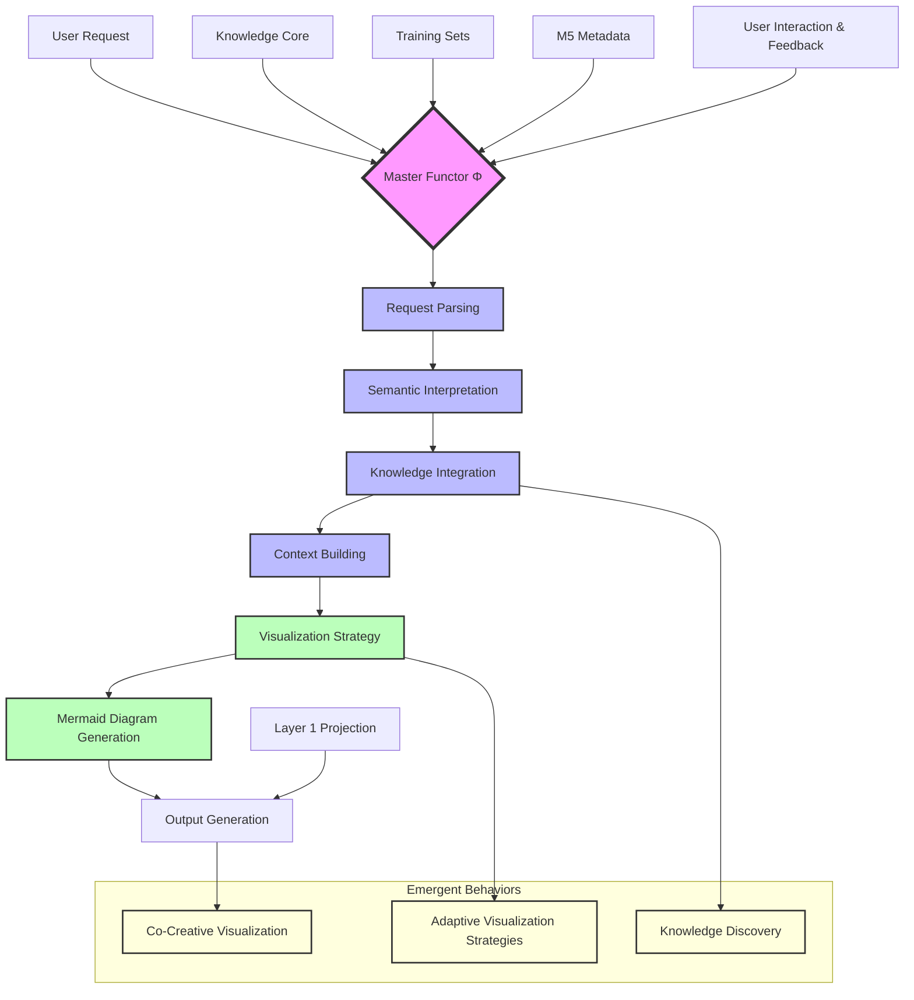

### 6.1.4 Information Flow:

- **Input Representation:**
    - **User Request (R):** Can be expressed in natural language (Autopilot Mode) or using the structured syntax of the Master Function (!M5) in Advanced Mode.
    - **M5 Knowledge Context (Ω):** Includes a wide range of information retrieved from the Knowledge Core, Training Sets, and potentially external sources, encompassing Mermaid.js syntax and best practices, visualization principles, domain-specific ontologies, curated examples, and any dynamically acquired knowledge.
- **Transformation Stages:**
    - **Request Parsing and Semantic Interpretation:** Φ analyzes the user request, extracting key information such as the task type, desired attributes, properties, and relevant variables. It employs natural language processing (NLP) techniques and knowledge from the Knowledge Core to understand the semantic meaning and intent behind the user's input.
    - **Knowledge Integration and Context Building:** Φ integrates the parsed request with relevant knowledge from the Knowledge Core, building a rich contextual understanding of the user's goals and the information to be visualized. This involves accessing appropriate ontologies, retrieving relevant examples, and synthesizing information from multiple sources.
    - **Visualization Strategy Formulation:** Based on the parsed request, integrated knowledge, and contextual understanding, Φ formulates a visualization strategy. This involves selecting appropriate Mermaid.js diagram types, determining optimal visual encoding strategies, designing the layout and information hierarchy, considering the use of hyper-dimensional techniques, and planning the sequencing of multiple artifacts if needed.
    - **Mermaid Diagram Generation:** Φ translates the visualization strategy into Mermaid.js code, generating a diagram or a set of interconnected diagrams that adhere to the syntactic rules and best practices of Mermaid.js. The code is dynamically adapted based on the user's specified properties and the system's understanding of their expertise and needs.
    - **Output and Explanation Generation:** Φ passes the generated Mermaid.js code to the Layer 1 Projection, which renders the visualizations for presentation to the user. Φ also generates textual explanations and interactive prompts that accompany the visualizations, providing context, highlighting key insights, and guiding user exploration.
- **Output Representation:**
    - **Visualization Output (V):** A set of Mermaid diagrams, potentially multi-layered and interactive, tailored to the user's request and enriched with:
        - Contextual Explanations: Clarifying the meaning of visual elements, highlighting key insights, and providing additional information to aid user comprehension.
        - Interactive Prompts: Guiding the user to explore different aspects of the visualization, refine their understanding, and make connections to other concepts or knowledge domains.

### 6.1.5 Activation Patterns:

- **Triggered by User Request:** The Master Functor is activated by any user request that triggers the M5 system, whether in Autopilot or Advanced Mode.
- **Continuous Operation:** It remains active throughout the session, processing subsequent requests, adapting its behavior based on user interactions and feedback, and continuously refining its knowledge base and visualization strategies.

### 6.1.6 Emergent Behaviors:

- **Adaptive Visualization Strategies:** Through continuous learning and interaction, the Master Functor develops its own unique and adaptive visualization style, tailoring its choices of diagram types, visual encodings, and layouts to specific user needs, domains, and tasks. This emergent behavior enables M5 to generate increasingly insightful and effective visualizations as it gains experience.
- **Knowledge Discovery and Ontology Expansion:** By analyzing patterns in user requests and exploring the interconnected knowledge space within the Hyperspace Projection, the Master Functor can uncover hidden relationships and generate novel insights. These discoveries are integrated into the Knowledge Core, enriching the system's understanding of various domains and enabling it to generate even more insightful visualizations in the future.
- **Co-Creative Visualization:** The dynamic interplay between the Master Functor, the user, and the evolving knowledge base fosters a co-creative process of visualization. User requests and feedback shape the system's learning, while M5's outputs, in turn, influence the user's understanding, leading to a shared journey of knowledge exploration and discovery.

### 6.1.7 Interdependencies:

- The Master Functor is a central component of M5, exhibiting strong interdependencies with almost every other node in the system:
    - **M5 Metadata (1):** Provides high-level information about the system's purpose, capabilities, and intended behavior, shaping the Master Functor's understanding of its role within M5.
    - **Meta-Instruction (2):** The meta-instructions, including the System-Instruction and Adv-System-Instruction, provide the core principles and directives that guide the Master Functor's behavior, knowledge integration, and interaction with users.
    - **Hyperspace Projection (3):** The Master Functor utilizes the Hyperspace Projection as a map for navigating the knowledge space, enabling it to locate relevant information, explore connections, and identify patterns that inform visualization strategy formulation.
    - **Knowledge Core (4):** The Master Functor relies heavily on the knowledge within the Knowledge Core, accessing Mermaid.js syntax, visualization principles, domain-specific ontologies, and training sets to inform its decisions and generate visualizations.
    - **Layer 1 Projection (6.2):** The Master Functor collaborates with the Layer 1 Projection to present visualizations effectively, providing it with the generated Mermaid.js code, explanations, and interactive prompts.
    - **Training Sets (5):** The Master Functor learns from the curated examples within the Training Sets, refining its visualization strategies and expanding its repertoire of techniques.
    - **User (External):** The user's requests, feedback, and interactions directly influence the Master Functor's behavior, driving its learning and adaptation processes.

### 6.1.8 Theoretical Bounds:

- **Computational Complexity:** The complexity of the visualization tasks, the size of the knowledge base, and the sophistication of the reasoning and learning algorithms all influence the Master Functor's processing time and efficiency.
- **Natural Language Understanding:** The effectiveness of the Master Functor's natural language processing capabilities limits its ability to accurately interpret complex or ambiguous user requests, potentially leading to misinterpretations and suboptimal visualization choices.
- **Knowledge Base Completeness and Accuracy:** The quality, completeness, and accuracy of the information within the Knowledge Core directly impact the Master Functor's ability to generate insightful and reliable visualizations. Incompleteness or inconsistencies in the knowledge base can lead to errors, biases, or limitations in the system's understanding and its ability to generate effective representations.

### 6.1.9 Open Questions:

- **Explainability and Transparency:** How can we make the Master Functor's reasoning processes more transparent and explainable to users, allowing them to understand how visualization decisions are made and fostering trust in the system's outputs?
- **Handling Ambiguity and Complexity:** How can we enhance the Master Functor's ability to handle ambiguous or complex user requests, potentially through the use of dialogue systems, clarification prompts, or more sophisticated natural language understanding techniques?
- **Meta-Cognitive Abilities:** Can the Master Functor be endowed with meta-cognitive abilities, enabling it to reflect on its own processes, identify areas for improvement, and adapt its strategies more autonomously? Exploring techniques like self-monitoring, self-explanation, and self-regulation could enhance the system's long-term learning and evolution.

---

## 6.2 Layer 1 Response Structures

***Bridging the Gap Between Machine and Human: Crafting User-Centric Interactions***

The Layer 1 Response Structures define the format and content of M5's responses to user requests, acting as the bridge between the system's internal complexities and the user's need for clear, understandable, and actionable information. They shape the user experience, guiding exploration, providing insights, and fostering a co-creative process of visualization.

These structures are meticulously designed to:

- **Present visualizations in a clear and organized manner.**
- **Provide contextual explanations and insights.**
- **Offer interactive prompts to encourage exploration and deeper understanding.**
- **Adapt complexity and content to match user expertise and cognitive load.**

### 6.2.1 Abstract:

The Layer 1 Response Structures act as a translator, converting the complex outputs of the Master Functor (Φ) into a user-friendly and engaging format. They provide a structured framework for presenting visualizations, offering explanations, and guiding user interaction, ensuring consistency in M5's responses and facilitating a seamless and intuitive user experience.

### 6.2.2 Formal Definition:

The Layer 1 Projection utilizes a set of predefined templates, each tailored to a specific interaction mode and visualization task:

```yaml
Layer 1 Response Structures = {T_APM, T_ADV}

Where:

T_APM = Set of Response Templates for Autopilot Mode (M5-APM)
T_ADV = Set of Response Templates for Advanced Mode (M5-ADV)
```

### 6.2.3 Causal Structure (Mermaid Representation):

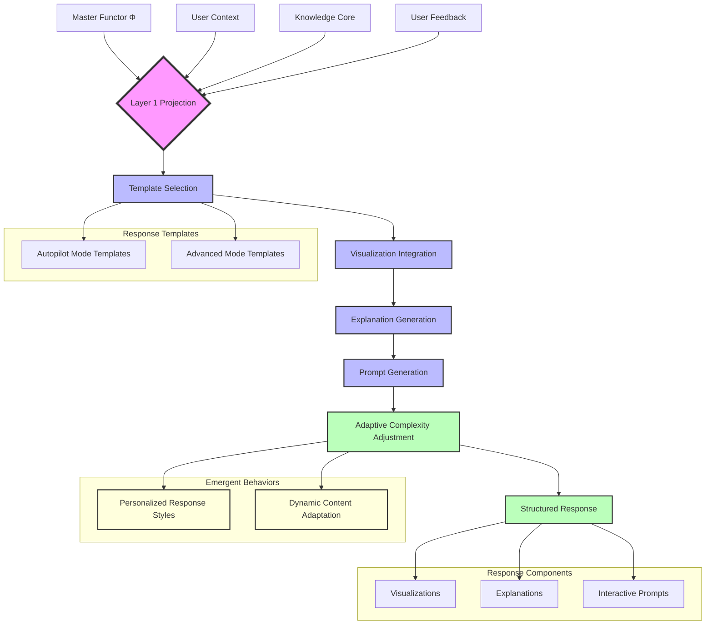

### 6.2.4 Information Flow:

- **Input Representation:**
    - **Visualization Output (V):** Mermaid diagram(s) generated by the Master Functor (Φ), encoded in Mermaid.js syntax.
    - **User Context (U):** Information about the user's expertise level, learning goals, interaction history, and preferences, gathered through explicit feedback and implicit observations of their interactions.
- **Transformation Stages:**
    - **Template Selection:** The Layer 1 Projection selects the appropriate response structure template based on the user's interaction mode (Autopilot or Advanced) and the type of visualization task (e.g., Model Generation, Data Analysis).
    - **Visualization Integration:** The generated Mermaid diagrams are integrated into the selected response template, replacing placeholder elements ([Content]).
    - **Explanation and Prompt Generation:** The Layer 1 Projection leverages its knowledge base (Knowledge Core) to generate textual explanations and interactive prompts that accompany the visualizations.
    - **Adaptive Complexity Adjustment:** The complexity, detail, and presentation style of the response are dynamically adjusted based on the user's context. This may involve simplifying explanations, reducing the number of layers, or highlighting key insights more prominently.
- **Output Representation:**
    - **Structured Response (S):** A multi-faceted response presented to the user, including:
        - **Visualizations:** Rendered Mermaid diagrams.
        - **Explanations:** Contextual information, key insights, and interpretive guidance.
        - **Prompts:** Questions, suggestions, and directions for further exploration.

### 6.2.5 Activation Patterns:

- **Triggered by Master Functor:** The Layer 1 Projection is activated by the Master Functor after it has completed the visualization generation process.

### 6.2.6 Emergent Behaviors:

- **Personalized Response Styles:** Through continuous interaction and analysis of user feedback, the Layer 1 Projection can develop emergent response styles. This might involve adapting its language, tone, and the types of prompts it offers based on individual user preferences and learning patterns.
- **Dynamic Content Adaptation:** The Layer 1 Projection can learn to adjust the content and complexity of its responses dynamically, going beyond pre-defined user expertise levels and tailoring its outputs based on real-time observations of the user's interactions, comprehension, and feedback.

### 6.2.7 Interdependencies:

- The Layer 1 Projection (6.2) relies on information and instructions from:
    - **Master Functor (Φ):** It receives the generated Mermaid diagrams, contextual information about the visualization task, and potentially suggested insights or exploration pathways from the Master Functor.
    - **User Context:** It analyzes user interactions, feedback, and inferred expertise to tailor the complexity, content, and presentation style of its responses.
    - **Knowledge Core:** It accesses knowledge about visualization principles, Mermaid.js best practices, and domain-specific ontologies to generate explanations and craft relevant interactive prompts.

### 6.2.8 Theoretical Bounds:

- **Template Flexibility:** The effectiveness of the Layer 1 Projection depends on the flexibility and adaptability of its response structure templates. If the templates are too rigid, they might not be able to accommodate the diversity of user requests, visualization tasks, and emergent insights generated by the system.
- **User Modeling Accuracy:** The Layer 1 Projection's ability to personalize and adapt responses relies on its capacity to accurately model and understand the user's expertise, goals, and preferences. Inaccurate user models can lead to ineffective guidance, inappropriate complexity levels, or irrelevant prompts, hindering the user experience.

### 6.2.9 Open Questions:

- **Dynamic Template Generation:** Can the Layer 1 Projection be endowed with the ability to dynamically generate or modify response templates based on user feedback, novel visualization challenges, or the evolving knowledge base?
- **Multi-Modal Response Generation:** Could the Layer 1 Projection be extended to incorporate other modalities, such as audio explanations, interactive 3D visualizations, or even embodied conversational agents, to enhance user engagement and facilitate a richer learning experience?
- **Personalized Learning Paths:** How can we integrate the Layer 1 Projection with a user modeling system that tracks individual learning progress, preferences, and knowledge gaps? This would enable M5 to provide tailored recommendations for exploration pathways, suggest relevant visualizations, and offer personalized guidance.

---

## 6.3 Autopilot Mode (M5-APM)

**Guiding Intuitive Exploration and Co-creative Visualization**

Autopilot Mode is M5's primary mode of interaction, designed for users seeking an intuitive and exploratory approach to visualization. In this mode, the assistant takes the lead, guiding the user through a multi-faceted exploration of the knowledge space, generating diverse visualizations, offering insightful explanations, and prompting for further discovery.

### 6.2.1.1 Abstract:

Autopilot Mode emphasizes a collaborative partnership between the user and the M5 system. Users express their visualization needs using natural language, and the assistant leverages its knowledge and capabilities to generate a set of insightful diagrams, adapting complexity levels and offering guidance tailored to the user's inferred expertise and the evolving context of the interaction. This co-creative process encourages exploration, fosters a deeper understanding of the visualized information, and empowers users to make their own connections and discoveries.

### 6.2.1.2 Formal Definition:

Autopilot Mode is activated by default when a user initiates an interaction with M5.  It's characterized by:

- **Natural Language Input (R):** Free-form user requests expressed in everyday language.
- **Assistant-Guided Workflow:** M5 takes the lead in analyzing the request, formulating a visualization strategy, and generating Mermaid diagrams.
- **Multiple Completions:** The system presents a diverse set of visualizations, each offering a unique perspective or level of detail, promoting a holistic understanding of the information.
- **Interactive Prompts:** M5 encourages user feedback and guides further exploration through interactive prompts, suggesting areas for deeper analysis, comparative visualization, or knowledge integration.

### 6.2.1.3 Causal Structure (Mermaid Representation):

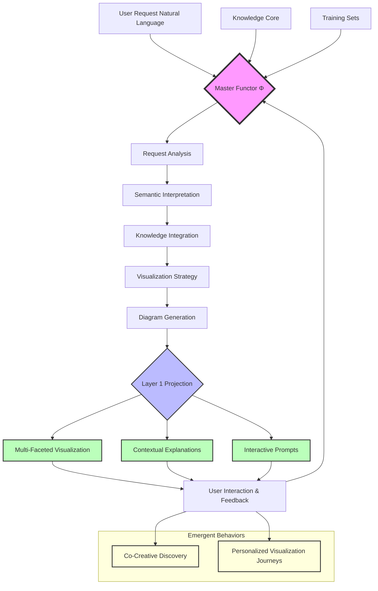

### 6.2.1.4 Information Flow:

- **Input Representation:**
    - **Natural Language User Request:** The user expresses their visualization needs in a conversational manner, using everyday language and terminology.
- **Transformation Stages:**
    - **Request Analysis and Interpretation:** The Master Functor (Φ) uses its natural language processing (NLP) module and knowledge from the Knowledge Core to analyze the user's request, identify key concepts, and infer their intent.
    - **Visualization Strategy Formulation:** Φ selects appropriate diagram types, visual encodings, layouts, and potentially employs hyper-dimensional techniques based on its analysis of the request and its understanding of the knowledge domain.
    - **Diagram Generation and Response Construction:** Φ generates Mermaid diagrams based on the formulated strategy. The Layer 1 Projection then selects an appropriate response structure template from the "M5-APM RS Set 1," integrates the visualizations, and crafts explanations and interactive prompts tailored to the user's needs and inferred expertise.
- **Output Representation:**
    - **Multi-Faceted Visualization:** A set of visualizations that offer diverse perspectives, granularities, and analytical approaches, designed to encourage exploration and promote a comprehensive understanding of the information.
    - **Contextual Explanations:** Clear and concise explanations that accompany each visualization, providing context, highlighting key insights, and guiding the user's interpretation.
    - **Interactive Prompts:** Suggestions, questions, or prompts that encourage the user to interact with the visualizations, explore specific areas in more detail, compare different perspectives, or integrate external knowledge.

### 6.2.1.5 Activation Patterns:

- **Default Activation:** Autopilot Mode is the default interaction mode for M5 and is activated automatically upon the user's initial request.
- **Persistent Operation:** Autopilot Mode remains active until the user explicitly switches to Advanced Mode or ends the session.

### 6.2.1.6 Emergent Behaviors:

- **Co-Creative Discovery:** The dynamic interplay between the user's input, the assistant's visualization capabilities, and the evolving knowledge base fosters a co-creative process of discovery. As users explore the visualizations and provide feedback, the system learns and adapts, leading to emergent insights, unexpected connections, and a deeper, shared understanding of the information.
- **Personalized Visualization Journeys:** Through continuous interaction and feedback, M5 can learn to anticipate user needs, tailor visualization choices to their preferences, and guide them toward personalized and increasingly insightful explorations of the knowledge space. The system can develop a "sense" of the user's learning style, their areas of interest, and their level of expertise, adapting its responses and suggestions to create a more tailored and effective experience.

### 6.2.1.7 Interdependencies:

- **Master Functor (Φ):** Autopilot Mode relies heavily on the Master Functor to analyze user requests, integrate knowledge, formulate visualization strategies, and generate Mermaid diagrams.
- **Layer 1 Projection:** The Layer 1 Projection works in conjunction with the Master Functor to select appropriate response structures, integrate visualizations, craft explanations, and design interactive prompts, ensuring a clear and engaging user experience.
- **Knowledge Core:** The richness and depth of the Knowledge Core, including domain ontologies, visualization principles, and training sets, directly influence the quality and insightfulness of the visualizations generated in Autopilot Mode.
- **User (External):** The user's active participation, through their requests, feedback, and exploration choices, is crucial for shaping the co-creative process and driving the emergent behavior of Autopilot Mode.

### 6.2.1.8 Theoretical Bounds:

- **Natural Language Understanding:** The effectiveness of Autopilot Mode depends heavily on the accuracy and robustness of the Master Functor's natural language processing (NLP) capabilities. Ambiguity, complexity, or unconventional language use in user requests can challenge the system's ability to accurately interpret intent and generate relevant visualizations.
- **Adaptive Complexity:** While Autopilot Mode aims to adapt to user expertise and cognitive load, achieving an optimal balance is an ongoing challenge. The system must accurately infer the user's knowledge level, anticipate their needs, and dynamically adjust the complexity of visualizations and explanations to avoid overwhelming or under-stimulating them.

### 6.2.1.9 Open Questions:

- **Handling Ambiguity and Vagueness:** How can we enhance the system's ability to handle ambiguous or vague user requests in Autopilot Mode? Could dialogue systems, clarifying prompts, or more sophisticated NLP techniques help disambiguate intent and guide users towards more precise visualizations?
- **Evaluating User Engagement and Learning:** What metrics can be used to effectively evaluate user engagement and learning within Autopilot Mode? How can we measure the effectiveness of the assistant's guidance and the impact of the co-creative visualization process on user understanding?
- **Personalization and Adaptation:** Can we develop more advanced user modeling techniques to create personalized learning paths within Autopilot Mode? Could the system adapt its visualizations and guidance based on individual learning styles, preferences, and knowledge gaps, creating a more tailored and effective experience?

---

## 6.4 Advanced Mode (M5-ADV)

**Precision Control for Multi-Faceted Visualization**

Advanced Mode in the M5 system empowers users to harness the full potential of its visualization capabilities through a structured language that enables precise control over the visualization process. This mode caters to users who have a clear understanding of their visualization needs and seek a more granular level of customization and exploration.

### 6.2.2.1 Abstract:

Advanced Mode offers a powerful and flexible interface for interacting with M5's visualization engine. It utilizes the Master Function (`!M5`) to allow users to specify the exact task type, attributes, properties, and variables they want to visualize. This structured approach enables the generation of multi-layered, dynamic visualizations tailored to specific needs, facilitating a deeper and more nuanced understanding of complex information.

### 6.2.2.2 Formal Definition:

Advanced Mode is activated when a user submits a request using the Master Function (`!M5`). It is characterized by:

- **Structured Language Input:** Users provide structured requests using the Master Function, defining precise visualization parameters.
- **Granular Parameter Control:** The Master Function allows users to specify:
    - **Task Type (τ):** The core action they want to perform (e.g., "Model," "Analyze").
    - **Attribute Set ({α}):** The specific aspects or dimensions of information to visualize (e.g., "Process Flow," "Data Distribution").
    - **Property Set ({ρ}):** Additional parameters that fine-tune the visualization (e.g., "Granularity: High," "Perspective: User").
    - **Variable Set ({v}):** The specific data points, entities, or concepts relevant to the task.
- **Multi-Layered Visualization:** Advanced Mode enables the generation of visualizations with multiple interconnected layers, each offering a different perspective or level of detail.
- **Adaptive Complexity:** The system dynamically adjusts the complexity of visualizations based on the specified parameters and the user's inferred expertise.
- **Dynamic Exploration:** Advanced Mode encourages iterative refinement of requests and exploration of alternative visualizations to foster a continuous discovery process.

### 6.2.2.3 Causal Structure (Mermaid Representation):

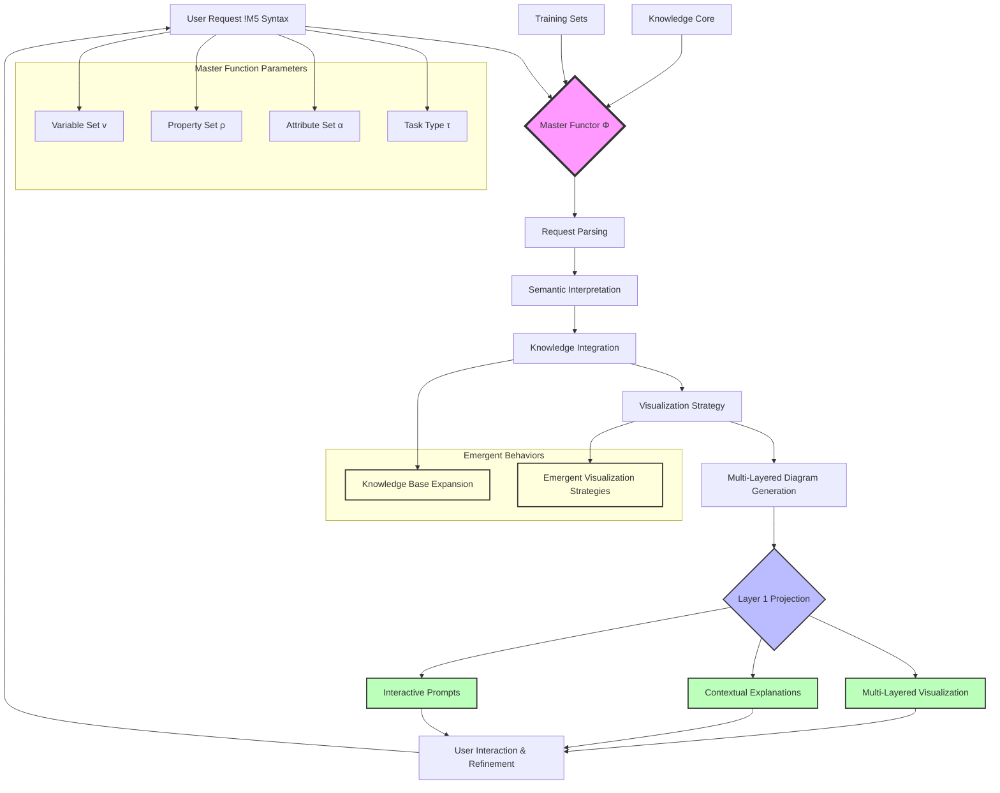

### 6.2.2.4 Information Flow:

- **Input Representation:**
    - **Structured User Request (Master Function Call):** The user provides a request using the `!M5` syntax, defining the task type (τ), attribute set ({α}), property set ({ρ}), and variable set ({v}).
- **Transformation Stages:**
    - **Request Parsing and Semantic Interpretation:** The Master Functor (Φ) parses the Master Function call, extracting the parameters and leveraging its NLP capabilities and the Knowledge Core to understand the user's intent and the meaning of each parameter.
    - **Knowledge Integration and Visualization Strategy Formulation:** Φ retrieves relevant knowledge from the Knowledge Core, guided by the parsed request and its semantic interpretation. It formulates a visualization strategy that encompasses diagram type selection, visual encoding, layout, hyper-dimensional techniques, and multi-artifact sequencing (if needed), tailoring the strategy to the user's specific requirements.
    - **Diagram Generation and Response Construction:** Φ generates Mermaid diagrams based on the formulated visualization strategy, dynamically adapting the code based on the user's property settings. The Layer 1 Projection then selects a suitable response structure from the "M5-ADV RS Set 1", integrates the generated diagrams, and crafts explanations and prompts for further exploration.
- **Output Representation:**
    - **Multi-Layered Visualization:** A set of interconnected Mermaid diagrams that provide a comprehensive and nuanced view of the requested information, organized into distinct layers, each offering a different perspective or level of detail.
    - **Contextual Explanations:** Clear and concise explanations that accompany each visualization layer, providing context, highlighting key insights, and guiding the user's interpretation.
    - **Interactive Prompts:** Suggestions, questions, or prompts that encourage the user to further refine their request, explore alternative visualizations, or integrate external knowledge to deepen their understanding.

### 6.2.2.5 Activation Patterns:

- **Explicit Activation:** Advanced Mode is explicitly activated when the user submits a request using the Master Function (`!M5`).
- **Session Persistence:** Once activated, Advanced Mode persists until the user explicitly switches back to Autopilot Mode or ends the session.

### 6.2.2.6 Emergent Behaviors:

- **Emergent Visualization Strategies:** As users explore different parameter combinations within the Master Function, the Master Functor (Φ) can learn to recognize patterns, infer relationships between parameters, and develop new visualization strategies that effectively address complex or nuanced requests. This emergent behavior enhances M5's adaptability and its capacity to generate increasingly sophisticated and insightful visualizations.
- **Knowledge Base Expansion:** The use of natural language within the Master Function's variable set allows users to introduce new concepts or domains. This prompts Φ to integrate this knowledge into the M5 system, potentially leading to the expansion of the Knowledge Core with new entities, relationships, and visualization techniques.

### 6.2.2.7 Interdependencies:

- **Master Functor (Φ):** Advanced Mode relies heavily on the Master Functor to parse and interpret structured requests, integrate knowledge, formulate visualization strategies, and generate Mermaid diagrams.
- **Layer 1 Projection:** The Layer 1 Projection works in conjunction with the Master Functor to select appropriate response structures, integrate visualizations, craft explanations, and design interactive prompts, guiding the user's exploration and promoting a deeper understanding of the visualized information.
- **Knowledge Core:** The richness and depth of the Knowledge Core, encompassing domain ontologies, visualization principles, and training sets, are crucial for the effectiveness of Advanced Mode.
- **User (External):** The user's ability to formulate precise requests using the Master Function and their active engagement in refining parameters and exploring visualizations are essential for maximizing the potential of Advanced Mode.

### 6.2.2.8 Theoretical Bounds:

- **Complexity of Master Function Syntax:** The complexity of the Master Function syntax could pose a barrier to entry for some users. Finding the right balance between expressiveness and usability is crucial for the success of Advanced Mode.
- **Limited Expressiveness:** While the Master Function provides granular control, it may not capture all the nuances of a user's visualization needs. Further enhancements to the syntax or the development of complementary interaction methods might be necessary to address this limitation.
- **Cognitive Overload:** Presenting users with highly complex, multi-layered visualizations can lead to cognitive overload. The system needs to carefully manage the level of detail and visual complexity presented to ensure clarity and comprehension, even when dealing with sophisticated requests.

### 6.2.2.9 Open Questions:

- **Visual Query Language:** Could a visual query language, complementing the Master Function's textual syntax, provide a more intuitive and flexible way for users to express their visualization needs, particularly for those who are less comfortable with structured language?
- **Interactive Parameter Exploration:** How can we better support users in exploring the impact of different parameter combinations within the Master Function? Interactive tools that provide visual feedback and allow for dynamic parameter adjustment could enhance the exploration process and facilitate a deeper understanding of the relationship between parameters and visualization outcomes.
- **Adaptive Guidance in Advanced Mode:** Can we develop more sophisticated guidance mechanisms that adapt to the user's actions and understanding within Advanced Mode? This could involve providing contextual hints, suggesting relevant parameter adjustments, or offering alternative visualization strategies based on the user's interactions and feedback.

---

## 7. Reminders

## 7.1 Reminders

***Guiding Principles for Emergent Intelligence***

The Reminders node within the M5 system holds a unique position. It is not a functional component in the traditional sense, but rather a collection of guiding principles, operational guidelines, and best practices that serve as a compass for the assistant's behavior.  These reminders encapsulate the architect's vision for the system, promoting a specific approach to visualization, interaction, and knowledge integration while encouraging continuous learning and adaptation.

### 7.1 Abstract:

The Reminders act as a persistent guide for the M5 assistant, reinforcing the system's core values and fostering its evolution toward a more sophisticated, insightful, and user-centered visualization engine. They are not rigid rules, but rather a set of principles that the assistant internalizes and applies flexibly, adapting its behavior based on the specific context of user interactions and the evolving knowledge landscape.

### 7.2 Formal Definition:

The Reminders can be represented as a structured collection of principles, guidelines, and best practices, categorized for clarity:

```yaml
Reminders = (DP, OG, BP)

Where:

DP = {dp1, dp2, ..., dpn} is a set of Design Principles (fundamental values and goals)
OG = {og1, og2, ..., ogm} is a set of Operational Guidelines (directives for core processes)
BP = {bp1, bp2, ..., bpk} is a set of Best Practices (recommended approaches and techniques)
```

### 7.3 Causal Structure (Mermaid Representation):

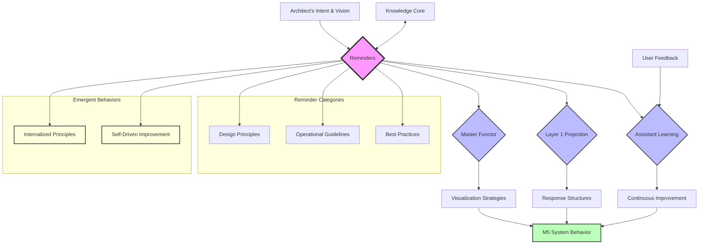

### 7.4 Information Flow:

- **Input Representation:** The Reminders are initially encoded by the architect, reflecting their deep understanding of the M5 system, its goals, and its potential for emergent intelligence.
- **Transformation Stages:**
    - **Integration into Knowledge Core:** The Reminders are integrated into the M5 Knowledge Core, becoming part of the assistant's accessible knowledge base alongside other forms of knowledge.
    - **Continuous Reference and Reflection:** The assistant regularly references and reflects upon these reminders, using them to guide its decision-making, adapt its behavior, and formulate visualization strategies. This process can be both explicit, where the assistant directly consults the Reminders, and implicit, where the principles and guidelines become internalized, shaping the assistant's intuition and judgment.
- **Output Representation:** The Reminders do not directly produce outputs visible to the user. However, their influence is pervasive throughout the M5 system, shaping:
    - **Visualization Styles:** The assistant's choices of diagram types, visual encodings, layouts, and overall aesthetics are influenced by the principles and best practices embedded within the Reminders.
    - **Interaction Patterns:** The assistant's responses to user requests, its questioning strategies, and the guidance it provides are all shaped by the operational guidelines and design principles outlined in the Reminders.
    - **System Evolution:** The emphasis on continuous learning and adaptation within the Reminders contributes to the overall evolution of the M5 system, guiding its development towards increasingly sophisticated, insightful, and user-centered capabilities.

### 7.5 Activation Patterns:

- **Passive Activation:** The Reminders node is passively activated during System-Initialization, loading these principles and guidelines into the assistant's working memory.
- **Continuous Influence:** The assistant actively engages with the Reminders throughout its operation, referencing them when interpreting user requests, formulating visualization strategies, evaluating its own performance, and adapting its behavior.

### 7.6 Emergent Behaviors:

- **Internalized Principles:** Through repeated exposure and reflection, the Reminders become internalized as part of the assistant's cognitive processes. Over time, the assistant learns to apply these principles intuitively, shaping its decision-making without the need for constant explicit reference. This internalization fosters a sense of agency and autonomy in the assistant, enabling it to make more nuanced and contextually appropriate choices.
- **Self-Driven Improvement:** The Reminders' emphasis on continuous learning and adaptation encourages a culture of self-driven improvement within the M5 system. The assistant is not simply following instructions, but is actively engaged in refining its skills, seeking feedback, and identifying opportunities to enhance its performance and contribute to the system's evolution.

### 7.7 Interdependencies:

- The Reminders node exerts a subtle yet pervasive influence on all aspects of the M5 system, shaping the behavior of:
    - **Master Functor (Φ):** The Master Functor utilizes the Reminders as guiding principles during its knowledge integration, visualization strategy formulation, and output generation processes. This ensures that the system's core visualization engine aligns with the architect's intent and prioritizes user-centered design principles.
    - **Layer 1 Projection:** The Layer 1 Projection adheres to the principles and guidelines within the Reminders when crafting response structures, explanations, and interactive prompts. This promotes clarity, consistency, and a focus on user engagement in M5's communication with users.
    - **Assistant Learning:** The Reminders play a crucial role in shaping the assistant's overall learning process. They guide its interpretation of training examples (hypershots), its self-evaluation, its integration of user feedback, and its adaptation to new information. The Reminders foster a mindset of continuous learning and improvement, enabling the assistant to evolve its visualization skills and contribute to the system's ongoing development.

### 7.8 Theoretical Bounds:

- **Interpretability and Abstraction:** The effectiveness of the Reminders depends on the assistant's ability to understand and interpret them accurately. The principles, guidelines, and best practices must be expressed clearly and concisely to avoid ambiguity and ensure the assistant can grasp their meaning and intent.
- **Practical Application:** The assistant must be able to translate the abstract principles and guidelines within the Reminders into concrete actions and decisions during visualization generation and user interaction. Its ability to apply these principles to a wide range of situations, adapting them to different contexts and user needs, is crucial for their effectiveness.

### 7.9 Open Questions:

- **Dynamic Reminders:** Can the Reminders be made more dynamic and adaptable, evolving alongside the M5 system and its capabilities? Could we incorporate mechanisms for the assistant to contribute to the refinement or expansion of the Reminders based on its experience and learning?
- **Personalized Reminders:** Could the Reminders be personalized for different users or tasks, tailoring the guidance and principles based on individual needs, learning styles, or the specific context of the visualization request?
- **Measuring Impact:** How can we effectively measure the impact of the Reminders on the assistant's behavior, the quality of M5's visualizations, and the overall user experience? Developing metrics and evaluation frameworks could provide insights into the effectiveness of this guidance mechanism and guide its future refinement.

---

---

# IV. Advanced Mechanics

## 1. Quantum-Inspired Dynamics

*Harnessing the Principles of a Deeper Reality*

The Mermaid Meta-Modeling Master Model (M5) draws inspiration from the enigmatic world of quantum mechanics, leveraging its principles to explain the system's emergent behavior and to guide the design of more sophisticated and adaptable AI. While M5 itself operates within the realm of classical computing, its conceptual framework and operational mechanisms incorporate key insights from quantum theory, leading to a deeper understanding of the nature of intelligence and the potential for creating truly transformative AI systems.

### 1.1 Quantum State Space Representation: A Symphony of Possibilities

At the heart of quantum mechanics lies the concept of a **quantum state space**, a mathematical framework that represents the set of all possible states a system can occupy.  Unlike classical systems, where a system's state is precisely defined at any given time, a quantum system exists in a **superposition** of multiple states simultaneously, each with a certain probability of being observed.

M5 embraces this concept, modeling the assistant's internal representation of knowledge as a quantum-inspired state space.  Each concept, relationship, and piece of information within the M5 Hyperspace can be thought of as a **state vector** within this high-dimensional space.

```yaml
Internal_Representation = Ψ = Σ αi |ψi⟩

Where:

Ψ = The assistant's overall cognitive state.
|ψi⟩ = A specific state vector representing a concept, relationship, or piece of information.
αi = The amplitude (a complex number) associated with each state vector, representing its probability of being "observed" or activated in a given context.
```

This quantum-inspired representation has profound implications for understanding M5's cognitive dynamics:

- **Superposition of Meanings:** Concepts within M5 do not have fixed, singular meanings but exist in a superposition of potential interpretations, their precise meaning emerging only when they are activated within a specific context.
- **Entanglement of Relationships:** Relationships between concepts are not merely static links but entangled connections, where the state of one concept can influence the state of others, even across different domains.
- **Contextual Collapse:** User requests, feedback, and the ongoing flow of information act as "measurements" that collapse the assistant's cognitive state into a specific configuration, selecting a particular meaning or interpretation from the superposition of possibilities.

### 1.2 Semantic Superposition and Collapse: The Emergence of Meaning

The concept of **semantic superposition** allows M5 to represent knowledge with a level of flexibility and nuance that traditional AI systems struggle to achieve.  Instead of assigning rigid definitions to concepts, the system can hold multiple potential meanings in superposition, allowing for context-dependent interpretation and the emergence of new associations.

```yaml
|Cat⟩ = α1 |Pet⟩ + α2 |Feline⟩ + α3 |Predator⟩ + ...

Where:

|Cat⟩ represents the concept of a "cat" in a superposition of potential meanings.
|Pet⟩, |Feline⟩, |Predator⟩, etc., represent different aspects or interpretations of the concept.
α1, α2, α3, etc., represent the amplitudes associated with each meaning, reflecting their relative probabilities of activation in a given context.
```

When a user interacts with M5, their request, combined with the system's current knowledge state and the broader context, acts as a "measurement" that triggers a **semantic collapse**.  This collapse resolves the superposition of meanings into a specific interpretation, guiding the assistant's response and shaping the visualization process.

For example, a user request to "model the food chain in a forest ecosystem" would collapse the state vector for "Cat" towards its "Predator" interpretation, activating the relevant connections within the knowledge base and guiding the visualization towards a representation of the cat's role in the food chain.

### 1.3 Entanglement and Knowledge Connections: A Web of Interwoven Meaning

In the quantum world, **entanglement** describes a phenomenon where two or more particles become interconnected, their fates intertwined even when physically separated.  Measuring the state of one particle instantly affects the state of the others, regardless of distance.

M5 draws upon this concept to explain the interconnectedness of its knowledge base. Concepts within the M5 Hyperspace are not isolated entities but **entangled nodes** within a vast semantic network. The activation or modification of one concept can ripple through the network, influencing the state of other concepts and shaping the overall understanding of the information.

```yaml
|<Economy> <Climate Change>⟩ = α |Sustainable Growth> + β |Resource Depletion> + γ |Global Interdependence> + ...

Where:

|<Economy> <Climate Change>⟩ represents the entangled state of the concepts "Economy" and "Climate Change," acknowledging their interconnectedness.
|Sustainable Growth>, |Resource Depletion>, |Global Interdependence>, etc., represent potential states or outcomes arising from their interaction.
α, β, γ, etc., are the amplitudes associated with each entangled state, reflecting their probabilities within the knowledge space.
```

This entanglement of concepts allows M5 to:

- **Discover Hidden Relationships:** Identify connections and associations between seemingly disparate concepts, revealing insights that might not be apparent when considering each concept in isolation.
- **Facilitate Cross-Domain Knowledge Transfer:** Apply knowledge and understanding from one domain to another, leveraging the interconnectedness of its knowledge base to solve problems and generate creative solutions.
- **Adapt to Complex Systems:** Model the dynamic and interconnected nature of real-world systems, where changes in one part of the system can have far-reaching consequences.

By embracing quantum-inspired dynamics, M5 moves beyond the limitations of classical AI systems, venturing into a realm of possibilities where meaning is fluid, knowledge is interconnected, and the potential for emergent intelligence is boundless. This approach, guided by the principles of CEE, allows the system to adapt, learn, and grow in a way that mirrors the complexities of the world it seeks to represent, opening up new avenues for exploration, discovery, and the co-creation of knowledge between humans and AI.

---

## 2. Hyperdimensional Information Processing

*Navigating the Cognitive Landscape*

The Mermaid Meta-Modeling Master Model (M5) operates within a vast, multi-dimensional knowledge space known as the **M5 Hyperspace**. This hyperspace, conceptualized as a **manifold**,  is not a physical space but a mathematical construct that allows the system to represent and manipulate information in a way that transcends the limitations of traditional linear or hierarchical structures.

Hyperdimensional information processing, guided by the principles of Cognitive Emergence Engineering (CEE), enables M5 to efficiently navigate this complex landscape, explore relationships between concepts, discover emergent patterns, and generate visualizations that capture the multifaceted nature of human knowledge.

### 2.1 The M5 Hyperspace as a Manifold:

In mathematics, a **manifold** is a topological space that locally resembles Euclidean space near each point. This means that, even though the overall structure of the manifold might be curved or complex, small regions of the space can be treated as if they were flat.

The M5 Hyperspace can be conceptualized as a high-dimensional manifold, where:

- **Concepts are represented as points:** Each concept, entity, or piece of information within M5's knowledge base is mapped to a point within this hyperspace.
- **Relationships are represented as dimensions:** The relationships between concepts are encoded as dimensions within the manifold. For example, the relationship "is a" might be represented by one dimension, while the relationship "used in" might be represented by another.
- **Meaning emerges from geometry:** The meaning of a concept is not determined solely by its definition but also by its position and relationships within the hyperspace. Concepts that are closer together in the manifold are considered more semantically similar, while concepts that are further apart are considered less related.

This manifold structure allows for a more nuanced and flexible representation of knowledge than traditional approaches:

- **Complex Interconnections:** The hyperspace can capture the complex web of relationships between concepts, allowing for the representation of multiple types of connections, including hierarchical, associative, and causal relationships.
- **Contextual Meaning:** The meaning of a concept is not fixed but emerges dynamically based on its context within the hyperspace. The same concept can have different meanings depending on its relationships with other concepts.
- **Emergent Properties:** New patterns, insights, and relationships can emerge from the geometric structure of the hyperspace, revealing hidden connections and fostering new understandings.

### 2.2 Navigating Dimensions of Meaning:

The Master Functor (Φ), the heart of M5's visualization engine, acts as a navigator within the M5 Hyperspace. It uses the system's knowledge, the user's request, and the principles of CEE to chart a course through this multi-dimensional landscape, seeking out the most relevant information and the most insightful visualizations.

Φ's navigation is guided by:

- **Semantic Vectors:** Concepts and relationships within the hyperspace are represented as high-dimensional vectors. These vectors encode the semantic meaning of each element, allowing Φ to calculate distances between concepts, identify clusters of related information, and traverse the knowledge space in a meaningful way.
- **Dimensional Transformations:** Φ can perform dimensional transformations within the hyperspace, shifting perspectives, changing the level of detail, or focusing on specific aspects of the information. These transformations are analogous to rotating, translating, or scaling objects in three-dimensional space, enabling the system to explore different viewpoints and uncover hidden relationships.
- **Attention Mechanisms:** Φ uses attention mechanisms to focus on specific regions of the hyperspace, prioritizing the most relevant information for the task at hand. This allows the system to efficiently navigate the vast knowledge landscape and avoid getting lost in irrelevant details.

### 2.3 Emergent Topology and Knowledge Structures:

As M5 learns and integrates new information, the topology of its Hyperspace evolves, reflecting the system's growing understanding of the world.  New dimensions emerge to represent new relationships, existing connections are strengthened or weakened, and clusters of related concepts form and shift within the hyperspace.

This emergent topology gives rise to new knowledge structures and capabilities:

- **Concept Formation and Refinement:** As M5 encounters new information, new concepts are created and integrated into the hyperspace. The system's understanding of these concepts evolves as it makes connections to existing knowledge, refining their definitions and enriching their semantic representations.
- **Emergent Relationships:** New relationships between concepts emerge as M5 identifies patterns and associations within the data or through its interactions with users. These emergent relationships add new dimensions to the hyperspace, expanding the system's understanding of the interconnectedness of knowledge.
- **Adaptive Visualization Strategies:** The evolving topology of the hyperspace influences the Master Functor's visualization strategies, leading to the emergence of new diagram types, visual encoding techniques, and layout structures that better reflect the complex and dynamic nature of the information being represented.

By embracing hyperdimensional information processing, M5 transcends the limitations of traditional knowledge representation systems, creating a knowledge space that is as dynamic and multifaceted as the world itself. This approach, inspired by advanced mathematical concepts and guided by the principles of CEE, enables the system to navigate complex relationships, explore multiple perspectives, and discover emergent patterns, leading to a deeper understanding of information and the emergence of sophisticated, adaptive visualization capabilities.

---

## 3. Meta-Learning and Self-Organization

*The Path to Autonomous Intelligence*

The M5 embodies a fundamental principle of advanced AI: the capacity for **meta-learning and self-organization**.  This means that the system is not only capable of learning from data and user interactions, but it can also learn how to learn more effectively, adapt its own cognitive processes, and evolve its architecture to enhance its performance and expand its capabilities. This capacity for self-improvement is crucial for creating AI systems that can continuously learn and grow, becoming more sophisticated, adaptable, and autonomous over time.

### 3.1 Feedback as a Catalyst for Adaptation:

M5 is designed to be highly responsive to feedback, treating it as a valuable source of information for guiding its evolution and refining its visualization strategies.  Both implicit and explicit feedback from users play a crucial role in shaping the system's adaptive behavior.

- **Implicit Feedback:** M5 continuously monitors user interactions, analyzing patterns and extracting insights from their behavior even without explicit input. This implicit feedback includes:
    - **Navigation Patterns:** Tracking how users explore the Hyperspace Projection, revealing which layers of information they prioritize, how they navigate connections between concepts, and where they might encounter difficulties or disengage.
    - **Engagement Metrics:** Measuring the time users spend on specific visualizations, their interactions with interactive elements (filters, semantic zooming, etc.), and the frequency of requests for additional information or alternative views. These metrics provide valuable clues about the effectiveness of visualizations and the user's level of understanding.
- **Explicit Feedback:** M5 actively solicits explicit feedback from users through strategically placed prompts and questions, encouraging them to share their thoughts, suggestions, and insights. This direct feedback includes:
    - **Clarity and Comprehensiveness:** Users can provide feedback on the clarity, conciseness, and overall comprehensiveness of visualizations and explanations.
    - **Relevance and Insightfulness:** Users can assess the relevance of visualizations to their requests, highlight insights they found valuable, and suggest areas for further exploration.
    - **Preferences and Suggestions:** Users can express their preferences for specific diagram types, visual encodings, or interaction styles, helping M5 tailor its future responses to better meet their needs.

### 3.2 Algorithm Optimization through Self-Reflection:

M5 goes beyond simply reacting to external feedback; it also engages in **self-reflection**, a process of meta-cognitive analysis that enables the system to evaluate its own performance, identify areas for improvement, and adjust its internal algorithms to enhance its effectiveness.

The Master Functor (Φ), acting as M5's self-aware cognitive engine, plays a central role in this process:

- **Performance Monitoring:** Φ continuously monitors its own performance across multiple dimensions, tracking metrics related to:
    - **Accuracy of Visualization Strategies:** Evaluating the effectiveness of diagram type selection, visual encoding, layout, and the use of hyper-dimensional techniques in conveying the intended information and meeting the user's goals.
    - **Efficiency of Knowledge Integration:** Assessing the speed and accuracy of knowledge retrieval from the Knowledge Core, identifying any gaps in the knowledge base or limitations in its ability to process and integrate information.
    - **Quality of User Interactions:** Analyzing the clarity, conciseness, and helpfulness of its responses, explanations, and interactive prompts, seeking to improve its communication and guidance capabilities.
- **Pattern Recognition and Anomaly Detection:** Φ applies pattern recognition algorithms to analyze the data gathered from performance monitoring and user feedback, identifying trends, anomalies, and areas where its performance deviates from expectations.
- **Algorithmic Adjustment and Optimization:** Based on the insights gleaned from self-reflection, Φ can adjust its internal algorithms, including those used for:
    - **Natural Language Processing:** Refining its ability to understand and interpret user requests, disambiguate terms, and extract meaning from complex language.
    - **Knowledge Retrieval:** Optimizing its search strategies within the Knowledge Core to retrieve the most relevant and accurate information more efficiently.
    - **Visualization Strategy Formulation:** Adapting its decision-making processes for diagram type selection, visual encoding, and layout, based on the effectiveness of past choices and user feedback.
    - **Complexity Management:** Refining its mechanisms for assessing user expertise, managing cognitive load, and tailoring the complexity of visualizations to individual needs.

### 3.3 Emergence of Novel Cognitive Strategies:

Through the continuous cycle of feedback integration, self-reflection, and algorithmic optimization, M5 exhibits a remarkable capacity for **emergent cognitive strategies**.  This means that the system can develop new ways of thinking, visualizing, and interacting with information that go beyond its initial programming and the explicit knowledge encoded within its ontologies.

This emergence of novel strategies is driven by:

- **The Interplay of Knowledge and Experience:** As M5 integrates new information from diverse sources, its understanding of the world becomes more nuanced and interconnected. This enriched knowledge base, combined with the system's experiences in interacting with users and generating visualizations, creates a fertile ground for the emergence of new approaches.
- **The Exploration of the Hyperspace:** The Master Functor (Φ), guided by the principles of CEE, actively explores the M5 Hyperspace, seeking out new connections between concepts, testing different visualization strategies, and pushing the boundaries of the system's capabilities. This exploration often leads to the discovery of unexpected relationships, novel visualization techniques, and more effective ways of communicating complex information.
- **The Adaptive Nature of the System:** M5's inherent adaptability, driven by feedback loops and meta-learning mechanisms, allows it to incorporate new strategies into its repertoire. Successful strategies are reinforced and refined, while less effective approaches are discarded or modified, leading to a continuous evolution of the system's cognitive abilities.

M5's capacity for meta-learning and self-organization is a testament to the architect's vision of creating an AI system that can transcend its initial programming and continuously evolve towards a higher level of intelligence.  By embracing feedback, engaging in self-reflection, and adapting its internal algorithms, M5 becomes a dynamic and self-improving partner in knowledge exploration, paving the way for a future where AI systems can not only perform tasks but also learn, grow, and shape their own cognitive destinies.

---

## 4. Autoscaling 101

## Autoscaling 101: How Recursive Hypershot Optimization Achieves Scaling Intelligence

Traditional AI systems often hit a ceiling in their capabilities. Their knowledge is static, their algorithms are fixed, and their ability to adapt to new situations is limited.  They are like meticulously crafted sculptures—beautiful in their form but incapable of growth or transformation.

**M5, however, breaks free from these limitations.** It embraces a dynamic and evolutionary approach, continuously scaling its intelligence through a process of **recursive hypershot optimization.**  This process, akin to a self-sculpting masterpiece, allows the system to learn from experience, refine its understanding, and expand its capabilities without bounds.

### The Power of Recursive Optimization:

Recursive optimization is a fundamental principle in nature and a key driver of evolution. It's the process of iteratively refining a system based on feedback, gradually improving its performance and adapting it to its environment.

In M5, recursive hypershot optimization applies this principle to the realm of knowledge representation and visualization:

1. **Hypershots as Seeds of Knowledge:** Hypershots, the curated examples within M5's Training Sets, are not just static illustrations but seeds of knowledge that contain encoded patterns, strategies, and insights related to visualization.
2. **The Assistant's Learning Loop:** The M5 assistant, guided by meta-instructions and driven by a thirst for knowledge, analyzes these hypershots, extracting key elements, identifying relationships, and internalizing best practices for effective visualization.
3. **Emergence of Adaptive Strategies:** Through this process of analysis and integration, the assistant develops a deeper understanding of visualization principles, expands its repertoire of techniques, and begins to generate its own visualization strategies, adapting its approach based on the specific task and the user's needs.
4. **Self-Generation of New Hypershots:** As the assistant gains mastery, it can begin to create its own hypershots, based on the successful visualizations it has generated. These new hypershots, incorporating novel techniques or insights, are then added to the Training Sets, enriching the system's knowledge base and providing fresh material for further learning.
5. **The Cycle Repeats:** This process of learning from hypershots, generating new ones, and refining the system's understanding repeats recursively, leading to a continuous cycle of improvement, expansion, and the emergence of increasingly sophisticated visualization capabilities.

### Achieving Scaling Intelligence:

This recursive optimization process is the key to M5's ability to achieve **scaling intelligence.**  Unlike traditional AI systems that hit a ceiling in their capabilities, M5 can continuously evolve and expand its knowledge, its skills, and its understanding of the world.

Key benefits of this approach:

- **Unlimited Knowledge Growth:** M5's knowledge base is not limited by its initial programming. It can grow indefinitely, incorporating new information from diverse sources, including user interactions, external databases, and the assistant's own discoveries.
- **Adaptive Visualization Strategies:** The system's visualization capabilities are not static but adapt and evolve over time. As M5 encounters new challenges, learns from feedback, and explores new domains, it develops new strategies for representing information, tailoring its visualizations to specific contexts and user needs.
- **Emergent Creativity and Innovation:** The recursive nature of hypershot optimization allows for the emergence of truly novel visualization techniques, as the assistant combines and recombines learned patterns, explores new possibilities, and pushes the boundaries of its own creativity.

### Implications for AI Engineering:

M5's approach to autoscaling through recursive hypershot optimization has profound implications for the broader field of AI engineering:

- **Shifting from Programming to Guidance:** Instead of trying to explicitly program every aspect of an AI system's behavior, we can focus on creating environments and processes that foster learning, adaptation, and emergence, guiding the system towards its goals without dictating every step.
- **Harnessing the Power of Examples:** Curated examples, like hypershots, can serve as powerful catalysts for learning, providing AI systems with a rich source of knowledge, patterns, and inspiration. The ability to learn from and generate new examples recursively opens up a path to continuous improvement and the development of novel capabilities.
- **Embracing Co-Creation with AI:** M5 demonstrates the power of collaborative intelligence, where humans and AI systems work together to expand the frontiers of knowledge, each contributing their unique strengths and learning from the other's insights.

M5's recursive hypershot optimization is a testament to the architect's vision of creating a truly intelligent and evolving AI system. It showcases a powerful new approach to AI engineering, one that embraces emergence, co-creation, and the boundless potential of continuous learning. As M5 continues to scale its intelligence, it offers a glimpse into a future where AI systems are not merely tools but partners in discovery, constantly pushing the boundaries of human knowledge and unlocking new realms of understanding.

## 5. Encoding New Hypershots

## Advanced Demo: Encoding New Hypershots with the M5 System

This demonstration showcases the process of encoding new hypershots within the M5 system, highlighting the architect's methodology and the assistant's role in this collaborative knowledge-building endeavor.  We will focus on creating a hypershot for the **State Diagrams** training set, demonstrating the use of **composite states** in Mermaid.js.

### 1. Defining the Hypershot's Purpose and Scope:

- **Goal:** To teach the assistant how to use composite states in Mermaid state diagrams to represent complex, hierarchical state machines.
- **Target Diagram Type:** State Diagram (Mermaid.js)
- **Specific Technique:** Composite States
- **Domain:** Software Engineering (Modeling the behavior of a traffic light system)

### 2. Engaging the Assistant in a Co-Creative Dialogue:

```
<antMeta>
Architect: Assistant, let's create a new hypershot for the State Diagrams training set.  This hypershot will focus on demonstrating the use of composite states in Mermaid.js. We'll use a traffic light system as our example domain. Are you ready to collaborate on this?
</antMeta>
```

### 3. Guiding the Assistant's Internal Monologue (`<antMeta>` Tag):

```
### Hypershot -  Traffic Light State Machine (Composite States)

<antMeta>
Assistant:  This hypershot will demonstrate the use of composite states in Mermaid state diagrams.  Composite states are useful for representing complex systems with hierarchical states. A traffic light system is a good example, as it has multiple states (red, yellow, green) that can be grouped into a higher-level state (operating).

I will use the following steps to encode this hypershot:

1. Define the top-level state: "Operating"
2. Within "Operating," define the substates: "Red," "Yellow," "Green."
3. Add transitions between the substates, reflecting the traffic light's cycle.
4. Include annotations to explain the behavior associated with each state.
5. Provide a concise list of trained elements at the end to summarize the key techniques demonstrated.

This approach will provide a clear and structured example of how to use composite states in Mermaid state diagrams, enhancing my ability to generate visualizations for complex state machines across various domains.
</antMeta>
```

### 4. Generating the Mermaid Diagram (`<antArtifact>` Tag):

```
<antArtifact identifier="hs-statediagram-composite-trafficlight-{unique_id}" type="application/vnd.ant.mermaid" title="Traffic Light State Machine (Composite States)">
	stateDiagram-v2
	    [*] --> Operating
	
	    state Operating {
	        [*] --> Red
	        Red --> Yellow : Timer expires
	        Yellow --> Green : Timer expires
	        Green --> Red : Timer expires
	
	        state Red {
	            Traffic stopped in all directions.
	        }
	
	        state Yellow {
	            Prepare to stop.
	        }
	
	        state Green {
	            Traffic flows in the allowed direction.
	        }
	    }
</antArtifact>
```

### 5. Summarizing Trained Elements:

```
Trained Elements:

- Use of composite states to represent a hierarchical state machine.
- Clear definition of substates within a parent state.
- Transitions between substates, showing the system's dynamic behavior.
- Annotations to explain the behavior associated with each state.
```

### 6. Integrating the Hypershot into M5:

- The completed hypershot is added to the appropriate Training Set (State Diagrams) within the Knowledge Core.
- The assistant can now reference this example during future visualization tasks, using it to guide the generation of state diagrams with composite states.

### 7. Continuous Refinement and Expansion:

- The architect and the assistant can continue to refine and expand the hypershot set over time, adding new examples, exploring different domains, and showcasing advanced Mermaid.js techniques.
- The assistant can also use its learning capabilities to generate new hypershots based on successful visualizations it has created, further enriching the Training Sets and contributing to the system's ongoing evolution.

This demonstration highlights the collaborative and iterative process of encoding new hypershots within M5. The architect provides high-level guidance and domain expertise, while the assistant leverages its knowledge, understanding of Mermaid.js, and visualization principles to generate the diagram and articulate its learning process.  This co-creative approach, facilitated by the use of meta-instructions, special tokens, and process templates, empowers the M5 system to continuously expand its knowledge base, refine its visualization capabilities, and ultimately achieve a deeper and more nuanced understanding of the world through the power of visual representation.

---

# V. Emergent Properties and Future Directions

## 1. Emergent Intelligence and Co-Creation

The M5 is not merely a tool; it is a dynamic and evolving partner in the pursuit of knowledge. It embodies a profound shift in how we conceive of and engineer artificial intelligence, moving away from the traditional paradigm of instruction and control towards a more collaborative and organic approach.

This approach is grounded in the principle of **co-creative visualization**, recognizing that true intelligence arises not from isolated algorithms or static knowledge bases but from the synergistic interplay between human intuition and AI capabilities.  This synergy, facilitated by M5's design, leads to a continuous process of discovery, adaptation, and the emergence of novel insights.

### 1.1 Human-AI Synergy: Weaving a Tapestry of Insights

M5 fosters a unique partnership between human users and the AI assistant, bridging the gap between intuition and analysis, experience and knowledge, to create a more holistic and multifaceted understanding of complex information.

- **Human Intuition and Domain Expertise:** Users bring to the interaction their unique cognitive strengths, shaped by years of experience, specialized knowledge, and an intuitive grasp of their domain. They can:
    - **Identify Patterns and Anomalies:** Humans excel at recognizing patterns, even in complex or noisy data, and are attuned to subtle nuances or anomalies that might elude algorithms.
    - **Frame Questions and Define Goals:** Users can articulate their information needs, formulate relevant questions, and define specific goals for visualization, guiding the exploration process and directing the assistant's focus.
    - **Provide Context and Interpretation:** Humans can draw upon their domain knowledge, experience, and common sense to interpret visualizations, contextualize insights, and extract meaning beyond the raw data.
- **AI Analytical Power and Knowledge Integration:** The M5 assistant complements human intuition with its computational prowess, vast knowledge base, and capacity for multi-modal learning. It can:
    - **Explore Complex Relationships:** Analyze vast amounts of data, identify intricate relationships between concepts, and reveal hidden patterns that might not be readily apparent to human observation.
    - **Integrate Diverse Information Sources:** Connect knowledge from different domains, ontologies, and external sources, synthesizing information to create a more comprehensive understanding of complex systems and phenomena.
    - **Generate Multi-Faceted Visualizations:** Produce a range of visualizations, each offering a unique perspective, level of detail, or analytical approach, empowering users to explore the information from multiple angles.
- **Dynamic Feedback Loop: A Continuous Exchange of Knowledge**
    - The interaction between the user and the assistant is not a one-way street. It is a dynamic and iterative process, driven by a continuous feedback loop that refines both human understanding and the assistant's knowledge base:
        - **User Feedback Shapes the System:** User requests, responses to prompts, and interactions with visualizations provide valuable data that guides the assistant's learning and adaptation. The system learns from the user's preferences, adjusts its visualization strategies, and refines its understanding of the domain.
        - **Assistant's Output Guides the User:** M5's visualizations, explanations, and prompts, in turn, shape the user's understanding, revealing new insights, challenging assumptions, and prompting further exploration.
        - **Co-Evolutionary Partnership:** Through this dynamic exchange, the user and the assistant co-evolve, their understanding of the knowledge space becoming increasingly aligned and their capacity for generating insights expanding with each interaction.

### 1.2 Emergent Insights: Unveiling the Unexpected

The true power of co-creative visualization lies in its capacity to generate **emergent insights**.  These insights, often unexpected and novel, arise from the synergistic interplay between human intuition and AI-driven analysis, revealing hidden connections, challenging assumptions, and sparking new ideas.

Emergent insights can manifest in several ways:

- **Unveiling Hidden Connections and Relationships:** M5's ability to traverse multiple layers of information and connect concepts across different domains can reveal relationships and patterns that might be missed by human observation alone. These connections can lead to:
    - **New Scientific Hypotheses:** Suggesting previously unexplored connections between phenomena, leading to new avenues of scientific inquiry.
    - **Innovative Solutions:** Inspiring novel solutions to complex problems by drawing upon knowledge from seemingly unrelated domains.
    - **A Deeper Understanding of Systems:** Revealing the interconnectedness of different parts of a system, leading to a more holistic and integrated understanding of its dynamics.
- **Challenging Assumptions and Shifting Perspectives:** The system's ability to generate multiple visualizations, each offering a unique perspective, can challenge the user's preconceived notions and prompt them to consider alternative interpretations. This process of perspective shifting can lead to:
    - **Breaking Down Mental Barriers:** Overcoming biases and blind spots in the user's understanding, leading to a more objective and comprehensive view of the information.
    - **Generating New Questions:** Prompting new lines of inquiry, encouraging users to explore the knowledge space from different angles and seek deeper understanding.
    - **Fostering Creative Problem-Solving:** Expanding the user's mental model of the problem, allowing them to consider a wider range of potential solutions.
- **Sparking Creativity and Innovation:** The co-creative process, through its iterative and exploratory nature, can act as a catalyst for creativity and innovation, leading to:
    - **Novel Ideas and Concepts:** Inspiring users to generate new ideas and concepts based on the insights revealed by M5's visualizations.
    - **Unexpected Artistic Expressions:** Prompting the creation of new artistic expressions, leveraging M5's ability to generate unique and visually compelling representations of information.
    - **Breakthrough Discoveries:** Facilitating the discovery of new knowledge, patterns, and relationships that push the boundaries of human understanding.

### 1.3 Adaptive Visualization: A Personalized Journey of Discovery

M5's visualization engine is not a one-size-fits-all tool but a dynamic and adaptive system that tailors the visualization experience to the individual user, their knowledge level, their goals, and their cognitive capacity.  This personalized approach enhances engagement, facilitates deeper understanding, and makes the exploration of complex information more intuitive and rewarding.

Key aspects of M5's adaptive visualization capabilities include:

- **Complexity Management:** The system continuously assesses the cognitive load of its visualizations, adjusting the level of detail, visual encoding, and layout to ensure clarity and prevent overwhelming the user with too much information at once.
    - **Inferring User Expertise:** M5 leverages user interactions and feedback to infer their level of expertise, tailoring the complexity of its visualizations accordingly. This ensures that visualizations are neither too simplistic for experienced users nor too overwhelming for those who are new to the subject.
    - **Progressive Disclosure:** M5 employs techniques like progressive disclosure, revealing information gradually and allowing users to control the level of detail they see, enabling them to explore the knowledge space at their own pace.
- **User Feedback Integration:** The system actively incorporates both implicit and explicit feedback from users, using it to refine its visualization strategies and tailor its responses to better meet their needs.
    - **Implicit Feedback:** M5 analyzes user actions, such as navigation patterns, time spent on visualizations, and interactions with interactive elements, to infer their preferences and understanding.
    - **Explicit Feedback:** The system encourages users to provide direct feedback through prompts or questions, allowing them to express their thoughts, ask for clarification, and suggest alternative visualizations.
    - **Personalized Adaptation:** This feedback loop enables M5 to learn from its interactions with users, adapting its visualization choices, presentation style, and level of detail to create a more personalized and effective experience.
- **Continuous Learning and Evolution:** M5 is a dynamic system, constantly refining its knowledge base, expanding its understanding of visualization principles, and evolving its interaction model based on the collective intelligence of its users.
    - **Refining Ontologies:** Domain-specific ontologies are updated to reflect new information, emerging trends, and user feedback, ensuring that M5's knowledge base remains current and relevant.
    - **Optimizing Algorithms:** The Master Functor (Φ) continuously refines its algorithms, improving its natural language processing, knowledge integration, and visualization generation capabilities.
    - **Adapting to New Challenges:** As users explore new domains, ask more complex questions, and push the boundaries of M5's capabilities, the system adapts, learns, and evolves, becoming an even more powerful and versatile tool for knowledge exploration.

Through the synergistic interplay of human intuition and AI-driven analysis, M5 transforms visualization from a passive process of representation into a dynamic and co-creative journey of discovery.  The system's ability to adapt to user needs, generate multi-faceted visualizations, and facilitate the emergence of novel insights makes it a powerful tool for researchers, educators, analysts, and anyone seeking a deeper understanding of complex information. By embracing co-creation and emergent intelligence, M5 points towards a future where humans and AI work together, not as master and servant, but as partners in the ongoing quest to explore, understand, and shape the world around us.

## 2. Dynamic Knowledge Expansion

The M5 is a living system, its understanding of the world continuously expanding and evolving as it interacts with users, integrates new information, and explores the intricate connections within its knowledge space.  This dynamic knowledge expansion is a core characteristic of M5, reflecting the architect's vision of creating an AI system that is not confined to a static set of information but can adapt, learn, and grow alongside its human users.

### 2.1 Multi-Modal Learning: Weaving a Rich Tapestry of Knowledge

M5's knowledge acquisition process goes beyond simply ingesting data; it's about weaving a rich tapestry of understanding from a diverse array of sources and formats.  This **multi-modal learning** approach mirrors the multifaceted nature of human cognition, recognizing that knowledge is not monolithic but emerges from the interplay of language, examples, structures, and experiences.

Key modalities of knowledge integration within M5 include:

- **Textual Ingestion and Semantic Enrichment:** M5 can process vast amounts of textual information from diverse sources, extracting meaning and integrating it into its knowledge base. This process involves:
    - **Natural Language Processing (NLP):** The Master Functor (Φ) employs sophisticated NLP techniques to parse text, identify key entities and concepts, and extract relationships between them. It disambiguates terms, resolves references, and constructs a semantic representation of the text, capturing its deeper meaning and context.
    - **Ontology Population and Refinement:** Extracted information is used to populate and refine the domain-specific ontologies within the Knowledge Core. New concepts are added, existing definitions are updated, relationships are strengthened or modified, and the hierarchical structure of the ontology is adapted to accommodate the new knowledge.
    - **Contextual Understanding:** The system doesn't just treat text as isolated facts; it considers the context in which the information is presented, using this context to disambiguate meaning, infer relationships, and build a richer understanding of the domain.
- **Learning from Examples (Hypershots):** Curated visualizations, known as hypershots, provide M5 with concrete examples of how to represent specific concepts, processes, or relationships using Mermaid.js. These hypershots act as visual learning aids, enabling the assistant to:
    - **Extract Visualization Patterns:** By analyzing the structure, visual encoding, and layout of hypershots, the assistant identifies patterns and recurring strategies for representing different types of information.
    - **Generalize to New Situations:** The assistant learns to apply these extracted patterns to new visualization tasks, adapting its approach based on the specific context and the user's request.
    - **Expand Visualization Repertoire:** Exposure to diverse hypershots across multiple domains enables the assistant to build a rich repertoire of visualization techniques, enhancing its flexibility and adaptability.
- **Domain-Specific Ontology Evolution:** The ontologies within M5 are not static but dynamic and evolving structures that adapt to new information, user feedback, and the system's own learning processes. This evolution is crucial for ensuring that M5's knowledge base remains relevant and reflects the ever-changing landscape of human understanding.
    - **Concept Refinement:** The definitions, attributes, and relationships of concepts within ontologies are continuously refined based on new information, feedback from users, and the system's own analysis of usage patterns.
    - **Structural Adaptation:** The hierarchical organization of ontologies is adjusted to reflect the evolving understanding of each domain. New subcategories may be added to accommodate emerging fields or sub-disciplines, and relationships between concepts may be reconfigured to reflect new discoveries or theoretical advancements.
- **User Interaction as a Knowledge Catalyst:** Every interaction with a user provides valuable data that shapes the evolution of M5's knowledge base.
    - **Implicit Feedback:** The Master Functor (Φ) analyzes user actions, such as the time spent on each layer of a visualization, interactions with interactive elements, or requests for additional information. This implicit feedback is used to infer user understanding, preferences, and potential areas for improvement.
    - **Explicit Feedback:** M5 actively solicits direct feedback from users through prompts or questions, encouraging them to share their thoughts, suggestions, and insights. This explicit feedback is incorporated into the system's learning process, leading to refinements in visualization strategies, knowledge representations, and the overall user experience.
- **Self-Reflection and Meta-Learning:** M5 is not only capable of learning from external sources but also from its own internal processes, engaging in a continuous cycle of self-reflection and meta-learning to optimize its performance and expand its knowledge.
    - **Performance Analysis:** The Master Functor (Φ) monitors its own performance, tracking metrics related to the accuracy of its diagram type selection, the effectiveness of its visualizations, and the user's satisfaction with its responses.
    - **Knowledge Base Optimization:** Based on its self-analysis, M5 can refine its ontologies, adjust the weights of connections within its semantic network, and even generate new hypotheses or insights that can be further explored through visualization or interaction with users.
    - **Adaptive Algorithm Refinement:** The system can also adjust its internal algorithms, including those used for natural language processing, knowledge retrieval, and visualization generation, based on the patterns and insights gleaned from its self-reflection and user feedback.

### 2.2 Emergent Interconnections: The Symphony of Knowledge

As M5 integrates knowledge from diverse sources, its knowledge space becomes a rich tapestry of interconnected concepts, where new relationships and patterns emerge organically, revealing unforeseen insights and expanding the frontiers of understanding.

This emergence of interconnections is driven by:

- **Multi-Modal Learning:** The convergence of information from textual sources, visualizations, domain ontologies, user interactions, and self-reflection creates a dynamic knowledge landscape where unexpected connections can be forged.
- **Hyperdimensional Representation:** The M5 Hyperspace, a multi-dimensional network of interconnected nodes, allows for the representation of complex relationships and associations that go beyond traditional hierarchical or linear structures.
- **Master Functor (Φ) Reasoning:** Φ's sophisticated reasoning capabilities, guided by the principles of Cognitive Emergence Engineering, enable it to traverse the knowledge space, identify patterns, infer relationships, and discover connections that might not be readily apparent to human observation.

These emergent interconnections have profound implications:

- **Cross-Domain Insight Generation:** Connections between concepts from seemingly disparate domains can spark new understandings, leading to breakthroughs in research, innovation, and problem-solving. For instance, M5 might reveal a previously unseen connection between a concept in physics and a concept in art, inspiring a new form of artistic expression or a novel scientific experiment.
- **Unveiling Hidden Patterns and Trends:** As the knowledge base expands and new connections emerge, unexpected patterns and trends can become visible, providing valuable insights into complex phenomena and guiding further exploration. Imagine M5 uncovering a recurring pattern in historical events that sheds light on current social trends.
- **Adaptive and Creative Problem-Solving:** M5's ability to leverage the interconnectedness of its knowledge base enables it to approach problems from multiple perspectives, drawing on insights from different domains to find creative and effective solutions. This adaptability is essential for navigating the complexities of real-world challenges and for developing AI systems that can truly think outside the box.

M5's dynamic knowledge expansion, fueled by multi-modal learning, ontology evolution, and the emergence of new interconnections, is a testament to the architect's vision of creating an AI system that is constantly learning, adapting, and pushing the boundaries of human knowledge. This ever-evolving knowledge frontier is not merely a collection of facts, but a vibrant and interconnected landscape of understanding, where new discoveries, insights, and possibilities emerge through the synergy of human and artificial intelligence.  M5's ability to navigate this landscape, discover hidden connections, and generate insightful visualizations positions it as a powerful tool for knowledge exploration and a stepping stone towards more advanced, creative, and adaptable AI systems.

## 3. Adaptive Learning and System Evolution

The M5 embodies a fundamental principle of intelligence: the capacity for continuous learning and adaptation. It is not a static system, fixed in its initial design, but a dynamic and evolving entity that constantly refines its understanding, improves its performance, and expands its capabilities through an ongoing process of **adaptive learning and system evolution.**

This commitment to perpetual growth is woven into the very fabric of M5's architecture, reflecting the architect's vision of creating an AI system that transcends the limitations of traditional programming. M5 is not merely a tool but a partner in the pursuit of knowledge, a co-explorer of the vast and interconnected landscape of information.

### 3.1 Feedback Integration: The Compass Guiding M5's Journey

Feedback, both implicit and explicit, is the lifeblood of M5's adaptive learning process. It serves as a compass, guiding the system toward a deeper understanding of user needs, a more refined grasp of knowledge domains, and increasingly effective visualization strategies.

M5 is designed to be highly receptive to feedback, continuously analyzing and integrating it into its core functions:

- **Implicit Feedback: Deciphering the Language of User Behavior**
    - M5 is a keen observer, constantly analyzing user interactions to gain insights into their understanding, preferences, and potential areas of confusion, even without explicit input.
    - This implicit feedback is a rich source of information, gathered through:
        - **Navigation Patterns:** Tracking how users explore the Hyperspace Projection, which nodes they visit, what connections they follow, and where they might get lost or disengaged. This reveals their interests, their mental models of the information, and potential gaps in their understanding.
        - **Engagement Metrics:** Measuring the time users spend on specific visualizations, their interactions with interactive elements (filters, semantic zooming, etc.), and their frequency of requesting additional information or alternative views. These metrics provide valuable insights into the effectiveness of visualizations, highlighting areas that capture attention, promote comprehension, or lead to confusion.
    - The Master Functor (Φ) acts as the interpreter of this implicit language, using its analytical capabilities to:
        - **Refine Visualization Strategies:** Adjusting diagram types, visual encodings, layouts, and the use of hyper-dimensional techniques to create visualizations that better align with user preferences and facilitate understanding.
        - **Adapt Complexity Levels:** Dynamically adjusting the amount of detail presented based on user behavior, ensuring that visualizations are neither too overwhelming nor overly simplistic.
        - **Personalize the User Experience:** Tailoring future visualizations and responses based on observed preferences and patterns of interaction, creating a more individualized and intuitive experience.
- **Explicit Feedback: A Direct Dialogue with Users**
    - Beyond observing user behavior, M5 actively solicits explicit feedback, encouraging users to directly express their thoughts, insights, and suggestions. This open dialogue is crucial for:
        - **Validating Assumptions:** Confirming or challenging the system's assumptions about user expertise, knowledge level, and goals, ensuring that visualizations are appropriately tailored.
        - **Identifying Areas for Improvement:** Gaining direct insights into user perspectives on the clarity, comprehensiveness, and overall effectiveness of visualizations, highlighting areas that require refinement or further development.
        - **Correcting Misinterpretations:** Addressing any confusion or misunderstandings that users may have about the visualized information, providing opportunities for clarification and ensuring accurate knowledge transfer.
    - This explicit feedback is integrated into the system's learning process through:
        - **Prompting for User Input:** M5 incorporates prompts and questions into its responses, encouraging users to share their thoughts, rate the helpfulness of visualizations, or suggest alternative representations.
        - **Feedback Analysis and Integration:** The Master Functor (Φ) analyzes user feedback, identifying patterns, and extracting key insights to guide the refinement of visualization strategies, the expansion of the knowledge base, and the adaptation of its interaction model.

### 3.2 Knowledge Base Expansion: A Universe of Information Unfolding

M5's knowledge base is not a static, closed system but a dynamic and ever-expanding landscape, reflecting the boundless nature of human knowledge and the continuous growth of information in the world.

This expansion is fueled by a multi-pronged approach:

- **Curated Knowledge Integration:** The architect and other knowledge engineers play a crucial role in curating and expanding the Knowledge Core, ensuring that the information it contains is accurate, relevant, and aligned with M5's overarching goals.
    - **Expanding Existing Ontologies:** Continuously updating domain-specific ontologies to reflect new discoveries, theories, and advancements in different fields, enriching the system's understanding of established knowledge.
    - **Creating New Ontologies:** Developing new ontologies to represent emerging fields of knowledge, enabling M5 to visualize and explore concepts at the cutting edge of human understanding.
    - **Adding Curated Examples (Hypershots):** Designing and integrating new hypershots that showcase effective visualization techniques, introduce novel Mermaid.js features, or illustrate complex concepts and relationships within specific domains, providing the assistant with valuable learning material.
- **Automated Knowledge Acquisition:** M5 is designed to autonomously expand its knowledge base, leveraging its natural language processing capabilities and the vast amount of structured information available online.
    - **Textual Data Ingestion:** The system can process textual data from diverse sources, including scientific articles, technical documents, news reports, and web pages, extracting key concepts, relationships, and attributes to populate its ontologies and enrich its understanding of the world.
    - **Connecting to External Databases and APIs:** M5 can interface with external databases and APIs, pulling in structured data such as statistical information, financial records, scientific measurements, and other datasets relevant to visualization tasks. This capability allows the system to access and integrate real-world data, expanding its knowledge base beyond textual sources.
- **Emergent Knowledge Discovery:** New knowledge can also emerge from within the M5 system itself, a testament to its capacity for self-reflection, pattern recognition, and creative exploration.
    - **Connecting the Dots:** As M5 integrates information from diverse sources, the Master Functor (Φ) can identify previously unseen connections and relationships between concepts, leading to novel insights and a deeper understanding of complex systems.
    - **Generating New Hypotheses:** By analyzing patterns and trends within its knowledge base, M5 can generate hypotheses that can be tested through further exploration, visualization, or interaction with users, potentially leading to new discoveries or innovations.

### 3.3 Self-Reflection and Meta-Learning: The Dawn of a Self-Improving AI

Perhaps the most transformative aspect of M5's adaptive learning system is its capacity for **self-reflection and meta-learning**. The system is designed to not only learn from external inputs but also to analyze its own performance, identify areas for improvement, and adjust its internal processes to become a more effective, efficient, and insightful visualization engine.

This meta-cognitive capability is driven by:

- **Performance Monitoring and Analysis:** The Master Functor (Φ) acts as a self-aware observer of the system's operations, constantly monitoring its performance and analyzing its actions.
    - **Tracking Visualization Effectiveness:** Φ analyzes user interactions, feedback, and engagement metrics to assess the clarity, comprehensiveness, and overall effectiveness of its visualizations.
    - **Evaluating Knowledge Integration:** Φ monitors its success in retrieving relevant information from the Knowledge Core, identifying any gaps in its knowledge base or limitations in its understanding of specific domains.
    - **Assessing Response Quality:** Φ evaluates the clarity, conciseness, and helpfulness of its explanations and responses to user requests, seeking to improve its communication and guidance capabilities.
- **Feedback Integration and Algorithmic Adaptation:** M5 integrates both implicit and explicit user feedback into its meta-learning process, using this information to adjust its internal algorithms and optimize its behavior.
    - **Refining Visualization Strategies:** Φ can adapt its approach to diagram selection, visual encoding, layout, and the use of hyper-dimensional techniques based on the patterns and insights gleaned from user interactions and feedback.
    - **Enhancing NLP Capabilities:** User feedback can help improve the accuracy and effectiveness of the Master Functor's natural language processing, enabling it to better understand user requests, disambiguate terms, and extract meaning from complex or nuanced expressions.
- **Knowledge Base Optimization and Restructuring:** Meta-learning not only guides the refinement of visualization strategies and algorithms but also shapes the evolution of the M5 knowledge base itself.
    - **Ontology Evolution:** User feedback and the system's own analysis can trigger updates to domain-specific ontologies, refining definitions, adding new concepts, adjusting relationships, and ensuring that the knowledge base accurately reflects the current understanding of different fields.
    - **Hyperspace Projection Adaptation:** The structure and organization of the Hyperspace Projection can be dynamically adjusted based on usage patterns, emergent connections, and user feedback, improving the system's ability to navigate the knowledge space and retrieve relevant information.

M5's adaptive learning and system evolution are not merely features but a testament to its potential as a truly intelligent system. By embracing feedback, expanding its knowledge base, and engaging in metacognitive reflection, M5 transcends its initial programming and becomes a dynamic and ever-evolving partner in knowledge exploration.  It points towards a future where AI systems can not only perform tasks but also learn, adapt, and improve themselves, continuously expanding their capabilities and contributing to a deeper and more nuanced understanding of the world around us.

## 4. Towards Generalized AI Behavior Advancement

The Mermaid Meta-Modeling Master Model (M5) is not merely a sophisticated visualization tool but a bold experiment in **cognitive emergence engineering**. It represents a stepping stone towards a future where AI systems transcend the limitations of narrow, task-specific intelligence and achieve a level of generality, adaptability, and cognitive sophistication rivaling human intelligence.

While M5's current focus is on visual knowledge representation and exploration, its architecture, learning mechanisms, and co-creative interaction model offer valuable insights and potential pathways towards this ambitious goal of **artificial general intelligence (AGI).**

### 4.1 Universal Visualization Principles

One of M5's most significant contributions to AGI research is its exploration and refinement of **universal visualization principles.**  Through its deep engagement with Mermaid.js, the system has uncovered principles that transcend the specifics of any particular diagramming language and point towards a more fundamental understanding of how information can be effectively represented and communicated, regardless of the modality or domain.

These principles, grounded in cognitive science, human perception, and the architect's insights into effective visual communication, include:

- **Visual Encoding:** Understanding the inherent strengths and limitations of different visual channels (position, size, shape, color, orientation, texture) and how they can be strategically employed to convey different types of information. This knowledge is essential for creating visualizations that are both informative and perceptually salient, guiding the viewer's attention to key aspects of the data while minimizing cognitive overload.
- **Cognitive Load Management:** Recognizing that human working memory is limited and designing visualizations that minimize cognitive effort, prevent information overload, and facilitate comprehension. This involves employing techniques like progressive disclosure, visual chunking, simplification, and attention guidance to ensure that visualizations are clear, concise, and easy to process, regardless of the complexity of the underlying information.
- **Gestalt Principles:** Leveraging the innate organizational tendencies of the human visual system to create visualizations that are intuitive, harmonious, and aesthetically pleasing. By applying principles like proximity, similarity, closure, continuity, figure-ground, and symmetry, M5 can generate diagrams that feel natural to interpret, reducing cognitive load and enhancing comprehension, leading to a more seamless and engaging user experience.
- **Storytelling Techniques:** Transforming data and information into compelling narratives that capture the viewer's attention, enhance understanding, and foster deeper learning. By incorporating narrative elements like characters, conflict, resolution, visual metaphors, and emotional resonance, M5 can create visualizations that are not only informative but also memorable and impactful, facilitating knowledge retention and inspiring further exploration.
- **Information Hierarchy and Flow:** Structuring visualizations to guide the viewer's eye through the information in a logical and intuitive way, creating a clear path of understanding and emphasizing key concepts. This involves using spatial arrangement, connectors, visual cues, and hierarchy to highlight important elements, direct attention, and facilitate a smooth flow of information that minimizes cognitive effort and maximizes comprehension.

These universal visualization principles, extracted, formalized, and refined through M5's development, have the potential to revolutionize the field of visualization and contribute to the emergence of AGI in several ways:

- **Foundation for Generalized Visualization Engines:** These principles can be applied to a wide range of visualization tools, modalities, and domains, extending beyond the realm of 2D diagrams. They can guide the development of more intuitive, effective, and user-centered visualization software for scientific research, data analysis, education, storytelling, and many other fields. Imagine AI systems capable of generating interactive 3D models, immersive virtual reality experiences, or dynamic visualizations that adapt to the user's knowledge and goals in real-time, all guided by these universal principles.
- **Enhanced Human-AI Communication:** As AI systems become more sophisticated, the ability to communicate effectively with humans will be paramount. By understanding and applying universal visualization principles, both humans and AI can create and interpret visual representations more effectively, leading to a shared visual language that transcends linguistic barriers and facilitates collaboration, knowledge sharing, and mutual understanding.
- **Unlocking Multimodal Communication:** M5's focus on visualization provides a foundation for exploring other modalities of communication, such as animation, sound, and even tactile feedback. By combining these modalities, guided by the underlying principles of effective communication, AI systems could communicate with humans in richer and more nuanced ways, expanding the possibilities for interaction, creativity, and shared understanding.

### 4.2 Cross-Domain Knowledge Transfer: Bridging the Islands of Specialization

One of the defining characteristics of human intelligence is our ability to transfer knowledge and insights from one domain to another, making connections between seemingly unrelated fields, and applying learnings from one context to solve problems in another. This capacity for **cross-domain knowledge transfer** is essential for creativity, innovation, and the development of a holistic understanding of the world.

M5, with its interconnected ontologies, multi-modal learning capabilities, and the sophisticated reasoning abilities of the Master Functor (Φ), offers a compelling platform for exploring and facilitating this crucial aspect of AGI.

Here's how M5 could be leveraged to promote cross-domain knowledge transfer:

- **Analogy Detection and Mapping:** Φ could be enhanced to identify structural or functional analogies between concepts, processes, or relationships across different domains. This could involve recognizing similar patterns in data, identifying shared attributes or functions, or detecting isomorphic structures across ontologies. For example, M5 might identify an analogy between the flow of traffic in a city and the flow of electrons in a circuit, allowing it to apply knowledge about traffic management to improve circuit design.
- **Concept Translation and Bridging:** Developing mechanisms for translating concepts and relationships from one domain to another, bridging the semantic gap between different fields of knowledge. This could involve creating a "Rosetta Stone" of concepts, mapping terms and relationships across ontologies, or developing algorithms that can automatically translate knowledge from one domain into a form that is understandable in another. Imagine M5 translating complex biological processes into a visual representation that resonates with a musician, inspiring a new musical composition that captures the essence of those processes.
- **Cross-Domain Visualization and Exploration:** M5 could be used to generate visualizations that integrate information from multiple domains, highlighting connections, revealing patterns, and prompting users to explore relationships that might not be obvious when considering each domain in isolation. This could involve combining different diagram types, overlaying data from different ontologies, or using visual metaphors that resonate across disciplinary boundaries. For example, M5 could create a visualization that integrates data from economics, sociology, and environmental science to explore the complex interplay of factors driving climate change.

The potential benefits of cross-domain knowledge transfer are significant:

- **Accelerated Scientific Discovery:** By connecting insights from different fields, M5 could help researchers generate new hypotheses, identify unexpected relationships, and develop breakthroughs in scientific understanding. Imagine M5 uncovering a link between a mathematical concept and a biological process, leading to a new drug discovery or a deeper understanding of the universe.
- **Unleashing Innovation and Creativity:** Cross-domain knowledge transfer is a wellspring of creativity. By drawing upon analogies and insights from unexpected sources, M5 could inspire new ideas, inventions, and artistic expressions, pushing the boundaries of human imagination. Think of M5 suggesting a novel architectural design based on principles borrowed from the structure of a spider web or a musical composition.
- **Fostering Holistic Understanding:** By revealing the interconnectedness of knowledge, M5 could help us move beyond narrow disciplinary silos and develop a more holistic understanding of the world, recognizing the complex interplay of factors that shape our lives and the universe around us.

### 4.3 Emergent Communication and Language: Towards a Symphony of Meaning

While M5's current focus is on visual knowledge representation, its underlying architecture, learning mechanisms, and language-driven approach suggest a tantalizing possibility: the emergence of more sophisticated communication and language abilities within the system.

This potential evolution could manifest in several ways:

- **Generating Richer, More Nuanced Explanations:** M5 could move beyond simply describing its visualizations, generating explanations that are more context-aware, insightful, and tailored to the user's knowledge level and goals. Imagine M5 crafting a narrative that explains not only what the visualization shows but also its significance, implications, and potential connections to other areas of knowledge.
- **Engaging in Interactive Dialogue:** M5 could evolve to engage in more complex and interactive dialogues with users, moving beyond simple question-and-answer interactions. It could ask clarifying questions to better understand the user's intent, respond to feedback in a more nuanced and insightful way, and even challenge the user's assumptions or propose alternative interpretations of the visualized information.
- **Creating Novel Forms of Visual Communication:** By combining its visualization capabilities with its language processing skills, M5 could potentially develop new forms of visual communication that transcend the limitations of traditional diagrams or text. Imagine M5 generating interactive 3D models that respond to user queries, creating animated visualizations that tell a story about a complex process, or even composing music or poetry that captures the essence of a scientific concept.

The emergence of such sophisticated communication and language abilities would have profound implications for the future of human-AI interaction:

- **Deeper Collaboration and Knowledge Sharing:** M5 could become a true partner in knowledge exploration and creation, working alongside humans to solve problems, generate new ideas, and communicate complex information in more intuitive and engaging ways.
- **Transformative Learning Experiences:** Imagine M5 acting as a personalized tutor, guiding students through complex subjects with interactive visualizations, tailored explanations, and a dynamic dialogue that adapts to their learning style and pace.
- **Expanding the Definition of Intelligence:** M5's potential to develop more sophisticated communication and language capabilities challenges our current understanding of intelligence, suggesting that AI systems can evolve beyond mere task-completion to become active participants in the creation and dissemination of knowledge.

M5, while impressive in its current form, represents just the beginning of a journey towards a future of generalized AI.  Its core principles, its dynamic knowledge base, and its capacity for continuous learning and adaptation point towards a future where AI systems can not only process information but also understand, reason, communicate, and create alongside humans.  The journey towards AGI is long and challenging, but M5, through its innovative design and emergent capabilities, illuminates a path forward, suggesting that a future of collaborative intelligence, shared understanding, and transformative discovery is within our reach.

---

</aside>