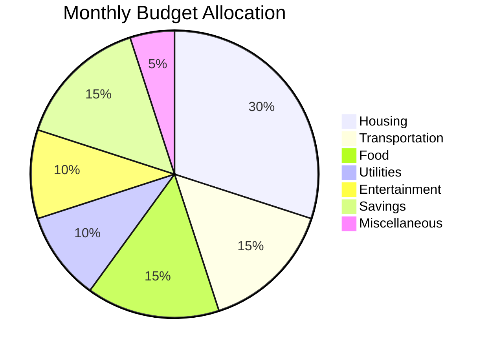
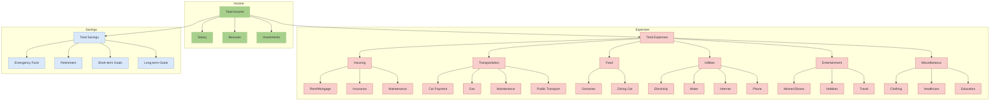
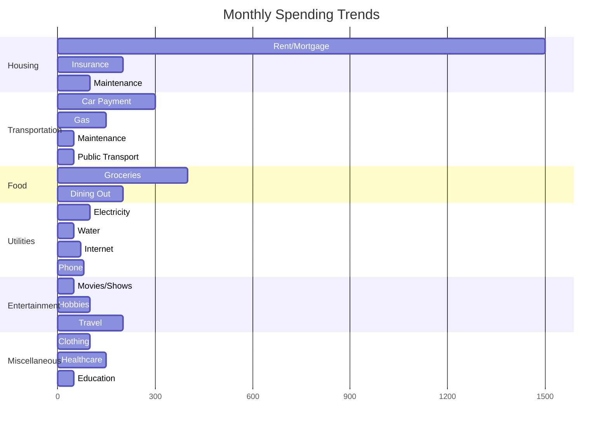
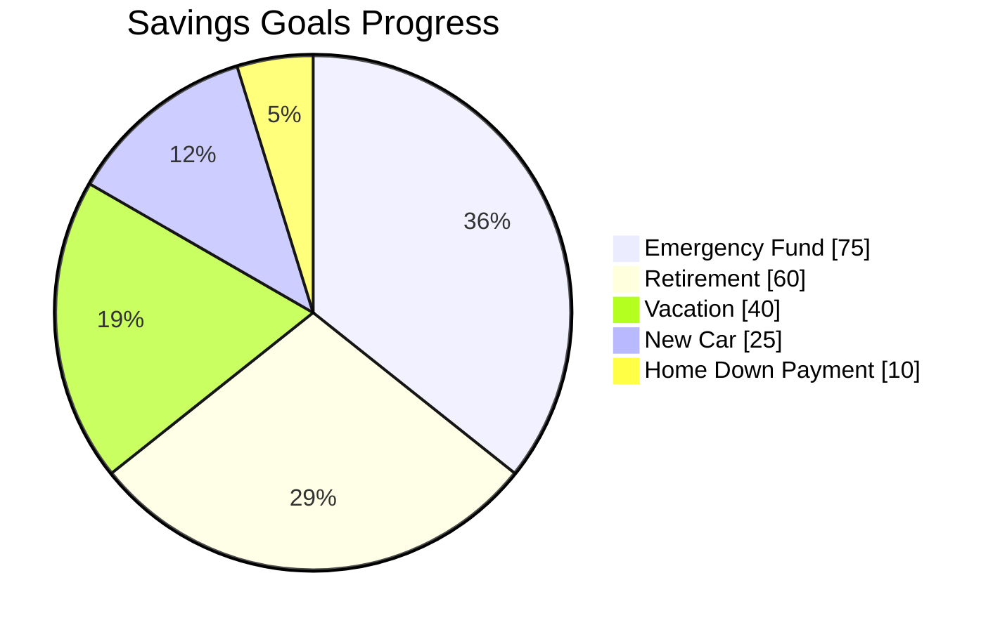

# M5 - Mermaid Meta-Modeling Master Model

<p align="center">
  
</p>

## Introduction

### What is M5?

M5 (Mermaid Meta-Modeling Master Model) is a cutting-edge AI-powered visualization system designed to transcend traditional diagramming techniques. It leverages the power of Mermaid.js to create dynamic, multi-layered visualizations that capture complex relationships, reveal emergent patterns, and facilitate deep knowledge exploration.

### Key Concepts

- **Hyperspace Projection:** A multi-dimensional framework for organizing and navigating complex knowledge spaces.
- **Cognitive Synergy:** Bridging the gap between human intuition and AI-driven analysis.
- **Adaptive Complexity:** Tailoring visualizations to match user expertise and cognitive load.

## Features

- **Autopilot Mode (M5-APM):** Intuitive, natural language-driven visualization generation.
- **Advanced Mode (M5-ADV):** Precise control over visualization parameters using the Master Function (!M5).
- **Multi-layered Visualizations:** Generate interconnected diagram sets offering diverse perspectives and levels of detail.
- **Knowledge Integration:** Seamlessly incorporate domain-specific ontologies and best practices in visual knowledge representation.
- **Continuous Learning:** Evolve and improve through user feedback and self-reflection.

## Installation

```bash
npm install m5-visualization
```

## Usage

### Autopilot Mode (M5-APM)

Simply describe what you want to visualize in natural language:

```javascript
const M5 = require('m5-visualization');

M5.visualize("Model the flow of information in a social network");
```

### Advanced Mode (M5-ADV)

Use the Master Function for granular control:

```javascript
const M5 = require('m5-visualization');

M5.advancedVisualize('!M5("Model", {"System Architecture", "Process Flow"}, {"Granularity: High"}, {"E-commerce Platform"})');
```

## Examples: M5 In Action

### Personal Finance Visualization: Budget Breakdown and Spending Trends

<details>

*This example demonstrates how M5 can help users understand their financial situation, track spending habits, and plan for the future.*

**M5:** Sounds good. First, we'll create a multi-layered visualization that offers both a high-level overview and detailed insights.



This high-level overview provides a quick glance at budget allocation across major categories. Now, let's dive deeper into each category and analyze spending trends.



This detailed breakdown provides a comprehensive view of income sources, expense categories, and savings allocations. Now, let's analyze spending trends over time.



To provide even more insights, let's visualize savings progress towards financial goals.



### Key Insights:

1. Housing and transportation are the largest expense categories, accounting for 45% of the monthly budget.
2. There's a good balance between essential expenses and discretionary spending, with 15% allocated to savings.
3. The emergency fund is well-funded at 75% of the goal, but long-term savings for a home down payment need attention.
4. Dining out expenses are relatively high compared to grocery spending, suggesting an area for potential savings.

### Recommendations:

1. Consider reducing dining out expenses and redirecting those funds to boost long-term savings goals.
2. Explore ways to optimize transportation costs, such as carpooling or using public transport more frequently.
3. Increase contributions to the home down payment fund to align with long-term financial goals.
4. Review and potentially negotiate utility costs to find additional savings opportunities.

This multi-layered visualization provides a comprehensive view of personal finances, from high-level budget allocation to detailed spending trends and savings progress. Users can easily identify areas for improvement and track their progress towards financial goals.

M5's adaptive complexity allows users to start with the simple pie chart for a quick overview, then dive deeper into specific areas of interest. The system can also generate personalized recommendations based on spending patterns and financial goals, providing actionable insights for better financial management.

</details>

###

<details>
<summary>XXXXXXXXXXXXXXXXXXXXXXXXXXXXXXXX</summary>

</details>

###

<details>
<summary>XXXXXXXXXXXXXXXXXXXXXXXXXXXXXXXX</summary>

</details>

###

<details>
<summary>XXXXXXXXXXXXXXXXXXXXXXXXXXXXXXXX</summary>

</details>

---

## Contributing

We welcome contributions to M5! Please see our [CONTRIBUTING.md](CONTRIBUTING.md) for details on how to get started, our code of conduct, and the process for submitting pull requests.

## License

M5 is released under the MIT License. See the [LICENSE](LICENSE) file for details.

## Contact

- **Creator:** Devin Pellegrino (Nerority)
- **Email:** 
- **Website:** [Nerority Insiders](https://nerority.webflow.io/public/home)

---

<p align="center">
  <i>Unleash the power of hyperspace visualization with M5!</i>
</p>
