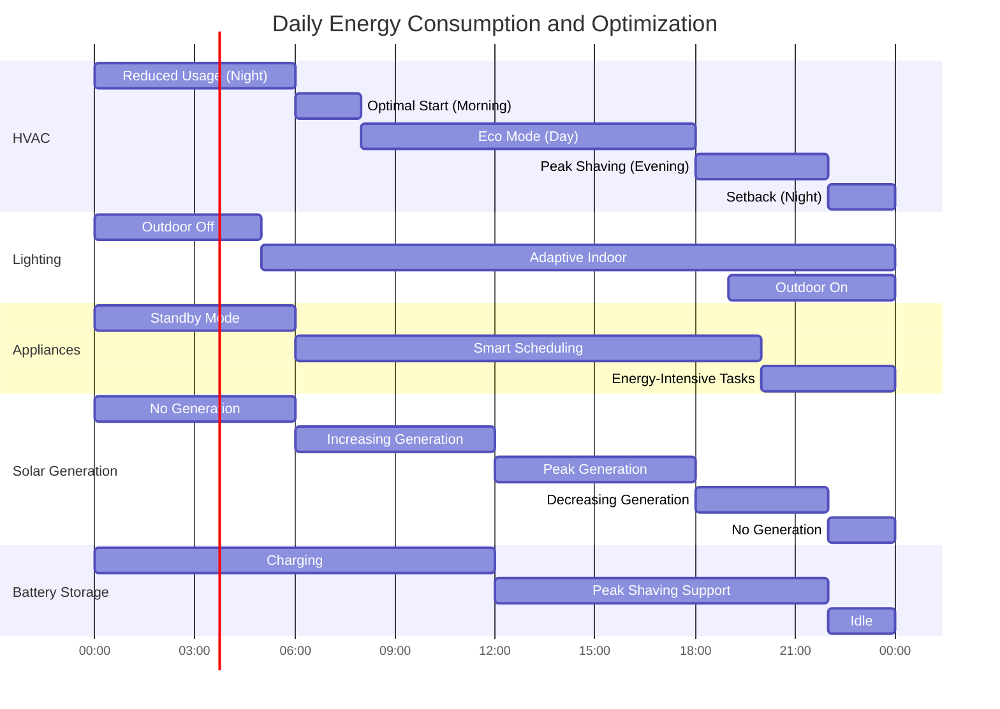

<div align="center">
  <h1>M5 Model</h1>
  <h3>Transcend Traditional Diagramming</h3>
  <h4><i>The M5 Model is achieved with nothing but a system prompt.</i></h4>
  <a href="https://nerority.webflow.io/public/home"><kbd>🟢 Website</kbd></a>
  <a href="https://discord.gg/jBKjsqA6pb"><kbd> ⚪ Discord </kbd></a>
  <a href="https://www.patreon.com/Nerority"><kbd> 🔴 Patreon </kbd></a>
  <br>
  <a href="https://github.com/nerority/Prompt-Engineering-Mastery"><kbd>Prompt Engineering</kbd></a>
  <a href="https://github.com/nerority/Advanced-GPTs"><kbd>Advanced GPTs</kbd></a>
  <a href="https://github.com/nerority/AI-Library"><kbd>Template Library</kbd></a>
  <h3><i>By Devin Pellegrino</i></h3>
</div>

<p align="center">
  
</p>

---

## Introduction

### What is M5?

M5 (Mermaid Meta-Modeling Master Model) is a cutting-edge AI-powered visualization system designed to transcend traditional diagramming techniques. It leverages the power of Mermaid.js to create dynamic, multi-layered visualizations that capture complex relationships, reveal emergent patterns, and facilitate deep knowledge exploration.

### Key Concepts

- **Hyperspace Projection:** A multi-dimensional framework for organizing and navigating complex knowledge spaces.
- **Cognitive Synergy:** Bridging the gap between human intuition and AI-driven analysis.
- **Adaptive Complexity:** Tailoring visualizations to match user expertise and cognitive load.

## Features

- **Autopilot Mode (M5-APM):** Intuitive, natural language-driven visualization generation.
- **Advanced Mode (M5-ADV):** Precise control over visualization parameters using the Master Function (!M5).
- **Multi-layered Visualizations:** Generate interconnected diagram sets offering diverse perspectives and levels of detail.
- **Knowledge Integration:** Seamlessly incorporate domain-specific ontologies and best practices in visual knowledge representation.
- **Continuous Learning:** Evolve and improve through user feedback and self-reflection.

## Getting Started

**Token Size:** ~97,000

### Supported Models:

- Anthropic Sonnet 3.5
- Google Gemini 1.5

To activate M5, upload or paste the file to the supported LLM, and use the following command:

```
!start M5
```


## Usage

### Autopilot Mode (M5-APM)

Simply describe what you want to visualize in natural language:

```
Model the flow of information in a social network
```

### Advanced Mode (M5-ADV)

Use the Master Function for granular control:

```
!M5("Model", {"System Architecture", "Process Flow"}, {"Granularity: High"}, {"E-commerce Platform"})
```

## Examples: M5 In Action

---

### Personal Finance Visualization: Budget Breakdown and Spending Trends

*This example demonstrates how M5 can help users understand their financial situation, track spending habits, and plan for the future.*

**User:** Provides financial data to analyze.

**M5:** Sounds good. First, we'll create a multi-layered visualization that offers both a high-level overview and detailed insights.


This high-level overview provides a quick glance at budget allocation across major categories. Now, let's dive deeper into each category and analyze spending trends.


This detailed breakdown provides a comprehensive view of income sources, expense categories, and savings allocations. Now, let's analyze spending trends over time.


To provide even more insights, let's visualize savings progress towards financial goals.


### Key Insights:

1. Housing and transportation are the largest expense categories, accounting for 45% of the monthly budget.
2. There's a good balance between essential expenses and discretionary spending, with 15% allocated to savings.
3. The emergency fund is well-funded at 75% of the goal, but long-term savings for a home down payment need attention.
4. Dining out expenses are relatively high compared to grocery spending, suggesting an area for potential savings.

### Recommendations:

1. Consider reducing dining out expenses and redirecting those funds to boost long-term savings goals.
2. Explore ways to optimize transportation costs, such as carpooling or using public transport more frequently.
3. Increase contributions to the home down payment fund to align with long-term financial goals.
4. Review and potentially negotiate utility costs to find additional savings opportunities.

This multi-layered visualization provides a comprehensive view of personal finances, from high-level budget allocation to detailed spending trends and savings progress. Users can easily identify areas for improvement and track their progress towards financial goals.

M5's adaptive complexity allows users to start with the simple pie chart for a quick overview, then dive deeper into specific areas of interest. The system can also generate personalized recommendations based on spending patterns and financial goals, providing actionable insights for better financial management.

---

### Smart Home System: Device Interactions and Energy Management

*This example demonstrates how M5 can model and visualize a complex smart home ecosystem, highlighting device interactions, automation flows, and energy management strategies. We'll create a multi-layered visualization that offers both a system-wide view and detailed insights into specific subsystems.*

**User:** Provides description of a home automation system they wish to build.

**M5:** Let's start with a high-level overview of the smart home system architecture:


Now, let's dive deeper into the device interactions and automation flows within the smart home system:


To provide insights into energy management, let's visualize energy consumption patterns and optimization strategies:



Now, let's visualize the real-time energy flow within the smart home system:


### Key Insights:

1. The smart home system integrates multiple subsystems (climate, security, lighting, appliances, and energy) under a central hub, allowing for coordinated control and optimization.
2. Device interactions are complex, with the automation engine playing a crucial role in orchestrating actions based on user preferences, sensor data, and energy considerations.
3. Energy consumption is carefully managed throughout the day, with strategies like optimal start for HVAC, adaptive lighting, and smart scheduling of appliances.
4. Solar generation and battery storage are leveraged to reduce grid dependence, with excess energy exported to the grid during peak generation hours.
5. Real-time energy flow visualization shows that the home is currently net-positive, exporting more energy to the grid than it's importing.

### Recommendations:

1. Implement predictive HVAC control based on weather forecasts and historical usage patterns to further optimize energy consumption.
2. Enhance appliance scheduling to take advantage of peak solar generation hours, reducing reliance on grid power.
3. Explore opportunities for demand response programs with the utility company, using the battery storage system to support grid stability during peak hours.
4. Consider expanding the solar panel system or increasing battery capacity to further reduce grid dependence and potentially achieve full energy self-sufficiency.

This multi-layered visualization provides a comprehensive view of a smart home system, from high-level architecture to detailed device interactions and energy management strategies. Users can easily understand how different components work together and identify opportunities for further optimization.

M5's adaptive complexity allows users to start with the system architecture for a broad overview, then dive deeper into specific subsystems or energy flows based on their interests or troubleshooting needs. The system can also generate real-time insights and recommendations based on current device status, energy consumption patterns, and external factors like weather or utility pricing.

---

### Fitness Journey: Workout Routine and Progress Tracking

*This example demonstrates how M5 can help users plan, track, and optimize their fitness journey. We'll create a multi-layered visualization that offers both a high-level view of the fitness program and detailed insights into workouts and progress.*

**User:** Provides details on their fitness plan, and stats.

**M5:** Let's start with an overview of the fitness program structure:


Now, let's dive into a detailed weekly workout routine:


Let's break down a specific workout session, focusing on the upper body strength training day:


### Key Insights:

1. The fitness program is well-rounded, incorporating strength training, cardio, and flexibility work throughout the week.
2. The upper body workout is structured with a proper warm-up, a balanced selection of exercises targeting all major muscle groups, and a cool-down routine.
3. Over the 12-week period, there's a clear trend of decreasing body weight, increasing strength (as measured by bench press 1RM), and improving endurance (5K run time).
4. Body composition analysis shows a healthy distribution of muscle mass, fat mass, bone mass, and water, indicating effective body recomposition.

### Recommendations:

1. Consider periodization in the workout routine to prevent plateaus and optimize long-term progress.
2. Implement progressive overload by gradually increasing weights or reps in strength training exercises.
3. Vary cardio intensities and durations to continue challenging the cardiovascular system and improving endurance.
4. Monitor recovery closely, especially as workout intensity increases, to prevent overtraining and reduce injury risk.
5. Adjust nutrition plan based on changing body composition and performance goals.

This multi-layered visualization provides a comprehensive view of a fitness journey, from high-level program structure to detailed workout plans and progress tracking. Users can easily understand their fitness routine, track their progress, and identify areas for improvement.

M5's adaptive complexity allows users to start with the fitness program overview for a broad perspective, then dive deeper into specific workouts, exercises, or progress metrics based on their current focus or goals. The system can also generate personalized recommendations based on progress data, recovery status, and individual goals.

---

## Contributing

You are welcome to contribute to the development of M5. Please join the discord or contact Devin Pellegrino to speak more.

## License

M5 Custom License

Copyright (c) 2024 Devin Pellegrino

Permission is hereby granted, free of charge, to any individual for personal, non-commercial use of this software and associated documentation files (the "Software"), including the rights to use, copy, modify, and adapt the Software, subject to the following conditions:

1. The above copyright notice and this permission notice shall be included in all copies or substantial portions of the Software.

2. You may not use the Software for any commercial or business purposes without explicit written permission from Devin Pellegrino. For business use inquiries, please contact at devin@nerority.com.

3. You may not distribute, sublicense, or sell copies of the Software without explicit written permission from Devin Pellegrino.

4. Any adaptations or modifications of the Software must be clearly marked as such, and you may not attempt to claim any part of the original work as your own.

5. Attribution to Devin Pellegrino as the original author of M5 must be included in any use, adaptation, or derivative work of the Software.

THE SOFTWARE IS PROVIDED "AS IS", WITHOUT WARRANTY OF ANY KIND, EXPRESS OR IMPLIED, INCLUDING BUT NOT LIMITED TO THE WARRANTIES OF MERCHANTABILITY, FITNESS FOR A PARTICULAR PURPOSE AND NONINFRINGEMENT. IN NO EVENT SHALL THE AUTHOR OR COPYRIGHT HOLDER BE LIABLE FOR ANY CLAIM, DAMAGES OR OTHER LIABILITY, WHETHER IN AN ACTION OF CONTRACT, TORT OR OTHERWISE, ARISING FROM, OUT OF OR IN CONNECTION WITH THE SOFTWARE OR THE USE OR OTHER DEALINGS IN THE SOFTWARE.

---

## Contact

- **Creator:** Devin Pellegrino (Nerority)
- **Email:** devin@nerority.com
- **Website:** [Nerority Insiders](https://nerority.webflow.io/public/home)

---

<p align="center">
  <i>Unleash the power of hyperspace visualization with M5!</i>
</p>
